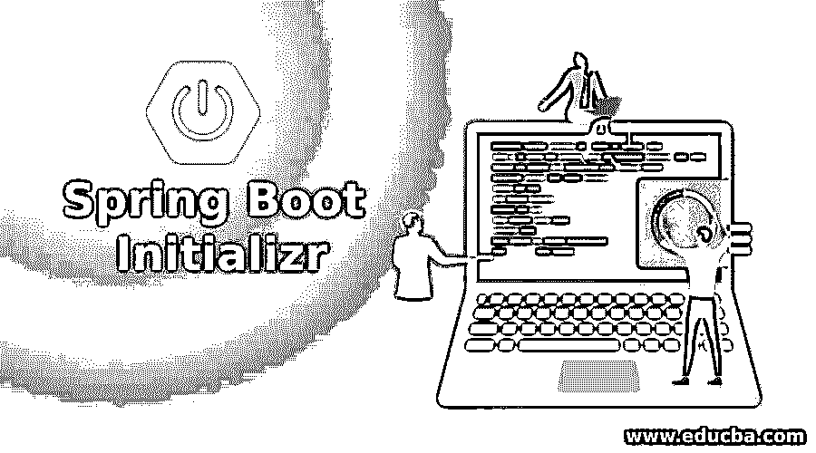
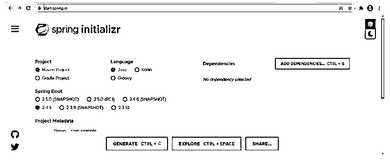

# Spring Boot 首字母缩写

> 原文：<https://www.educba.com/spring-boot-initializr/>

## 弹簧引导初始化介绍

Spring boot initializr 是一个基于网络的在线工具，它可以帮助我们创建 Spring boot 应用程序。这是非常容易使用，可以理解，非常快。它为我们提供了基本的 spring boot 应用程序所需的所有功能和选项；在 spring 中创建应用程序后，我们只需在编辑器中运行它。它将为我们下载 spring boot 应用程序的 zip 文件；我们只需要解压缩它，并将其导入到我们的本地环境中。在这里，我们将看到它的内部工作，以及我们如何使用它来获得我们的第一个 spring boot 项目。

**语法:**

<small>网页开发、编程语言、软件测试&其他</small>

它是一个在线工具，帮助我们创建 spring boot 项目；我们会看到我们需要什么来访问它，并在网上你可以访问它。

[https://start.spring.io/](https://start.spring.io/)

正如你在上面的 URL 中看到的，我们必须在我们的浏览器中输入这个并按回车键。那我们就开始吧。这里我们将看到如何开始使用 spring 初始化器来生成我们的 spring boot 应用程序；它对于初学者和有经验的开发人员都很有用，因为它节省了大量手动配置和开发 spring boot 应用程序的时间。

### Initializr 在 Spring Boot 是如何工作的？

正如我们已经知道的，现在 spring boot 初始化器被用来从头开始创建 spring boot 项目。它还帮助我们加快了开发过程，因为在 spring 框架中，我们记得我们花了很多时间来配置所需的东西，这给开发人员带来了很多问题，消耗了很多时间。但是在 spring boot 的情况下，我们可以使用 spring 初始化器在很短的时间内创建项目，比如 10 到 5 分钟。但是在使用 spring initializer 之前，我们必须在本地机器中有一些必需的东西，以便运行 spring boot 项目。在这里，我们将首先看到使用 spring initializr 从头开始创建我们的第一个 spring boot 项目所需的东西、它们的优点以及遵循的步骤。

#### 1.我们机器上需要的东西

要在我们的机器上运行 spring boot 项目，我们必须在我们的机器上安装以下必需的东西，如下所示:

*   **Java 1.8 以上:**要从 spring 初始化器运行 spring boot 项目，我们需要 Java 1.8 以上版本。因此，我们必须在我们的机器上安装 java，并在环境变量上设置所需的路径。
*   **构建工具:**为了构建 spring boot 项目，我们还应该在机器上安装任何构建工具。根据要求应该是 Maven 或 Gradle。
*   我们只需要花 15 分钟启动初始化器来创建我们的第一个 spring boot 项目。
*   我们使用的任何编辑器或 IDE。否则，我们可以直接导入或打开 Intellij idea 中的项目来运行和测试应用程序。

正如你在上面看到的，从 spring 初始化器下载后，使用 spring 初始化器运行和测试我们的 spring boot 应用程序的要点和要求。

现在我们将看到在 spring boot 应用程序的项目创建中使用 spring 初始化器的用法。

#### 2.使用

通过使用 spring initializer，我们可以轻松地生成构建、修改打包、从搜索选项中添加移除依赖项、选择 java 版本、构建工具，以及轻松快速地生成基于 [JVM 的](https://www.educba.com/what-is-jvm/)项目所需的一切。

#### 3.spring 初始化器中可用的不同模块

*   **initializr-generator:** 这个模块帮助我们生成核心项目库。
*   这个模块负责为应用程序创建文档。
*   **initializr-generator-test:**这个模块负责生成测试基础设施，这将帮助我们生成项目。
*   **initializr-service-sample:**这个模块帮助我们生成基本的定制实例。
*   **initializr-web:** 此模块帮助我们为第三方生成文积分。
*   **initializr-actuator:** 这是可选的；如果我们想获得服务器或应用程序的附加信息，我们可以包括它；它为我们提供了关于项目生成的统计数据和进一步的信息。
*   initializr-metadata: 它帮助我们为各个方面生成元数据基础设施。
*   **initializr-version-resolver:**它也是一个可选模块，帮助我们检索 POM 版本号。
*   **initializr-generator-spring:**这也是一个可选模块，帮助我们定义 spring 的约定
*   引导项目。
*   initializr-bom: 这基本上代表物料清单，帮助我们进行项目的依赖管理。

#### 4.spring 初始化器的入门步骤

形容词（adjective 的缩写）首先，我们必须在浏览器中输入下面的 URL 来使用 spring 初始化器。

网址:[https://start.spring.io/](https://start.spring.io/)

b.在这之后，我们将会看到如此多不同的选择；我们附上一张截图供参考。

碳（carbon 的缩写）首先，选择项目类型，是 maven 还是 gradle。之后，我们可以从语言选项中选择语言。

d.紧接着，我们还必须选择春季版本；我们可以根据需要选择它们。

e.在项目元数据中，我们可以提供基本的细节，比如组名、工件、名称、项目描述、基础包名、项目打包和 java 版本。

氟（fluorine 的缩写）在右边，如果我们还需要的话，我们可以输入所需的依赖项。如果您确定 web 应用程序没有忘记将 web 依赖项添加到项目中；否则，您将在运行它时得到错误。

g.最后，我们可以单击 generate 按钮来获取 zip 文件。我们可以提取和导入这个 zip 文件，或者将其打开给我们的编辑器。

### 结论

正如你所看到的，spring 初始化器对于初学者和有经验的人来说都非常容易使用。通过使用它，我们可以毫不费力地开发基本的 spring boot 项目，只需点击我们在 web 工具上看到的选项。

### 推荐文章

这是一个 Spring Boot 初始化指南。这里我们讨论一下入门以及 initializr 在 spring boot 中是如何工作的？分别是。您也可以看看以下文章，了解更多信息–

1.  [Maven 资源库 Spring](https://www.educba.com/maven-repository-spring/)
2.  [Spring Boot 开发工具](https://www.educba.com/spring-boot-devtools/)
3.  [春季 AOP](https://www.educba.com/spring-aop/)
4.  [春云组件](https://www.educba.com/spring-cloud-components/)

