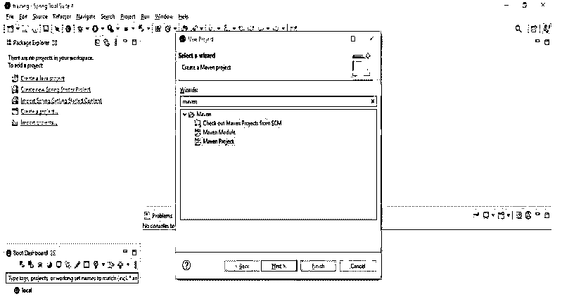
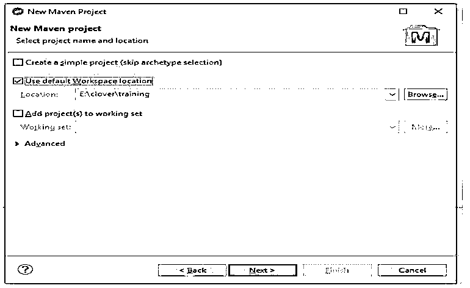
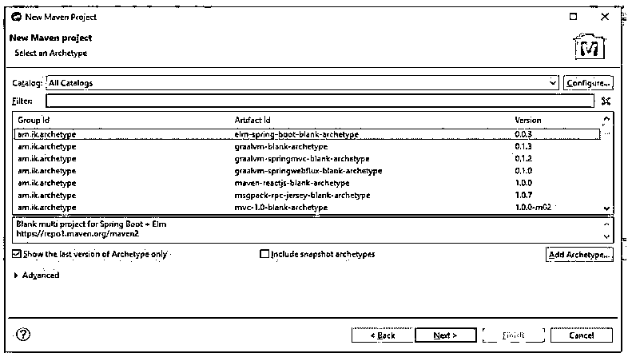
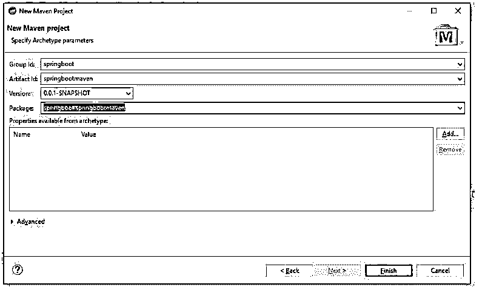
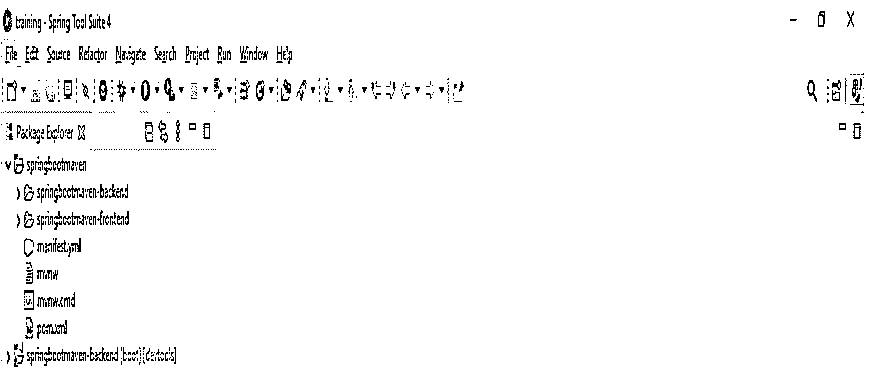
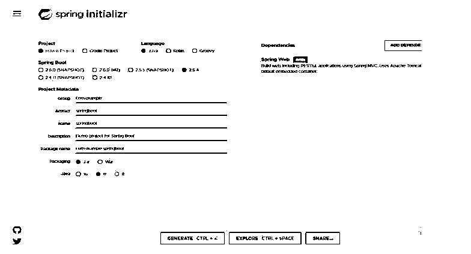
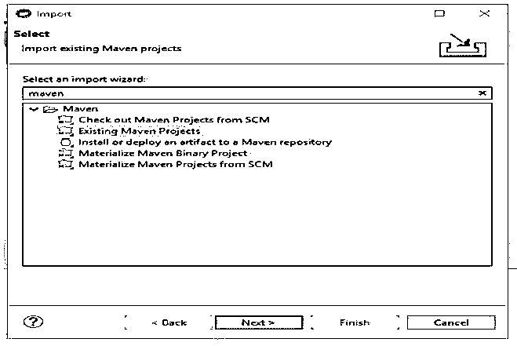
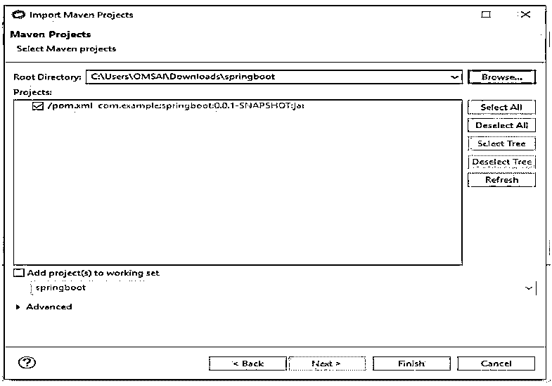
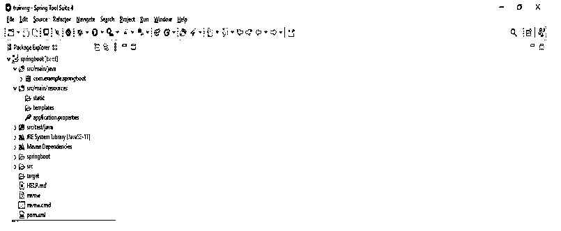

# Spring Boot·梅文

> 原文：<https://www.educba.com/spring-boot-maven/>

## Spring Boot·马文简介

Spring boot maven 将在 apache 的 maven 中提供支持，它允许我们打包可执行的 JAR 或 WAR 文档。它自动管理项目的依赖关系，我们在开发 maven 项目时不需要下载项目的依赖关系。使用 spring boot maven 项目，我们可以在本地运行我们的应用程序，也可以构建项目 EAR、JAR 或 WAR 文件。我们可以使用 spring 工具套件创建一个新的 maven 项目，也可以使用 eclipse 创建，STS 是用于 maven 项目开发的一个非常有用的工具。

### 什么是 Spring Boot·梅文？

我们不必手动下载和添加项目依赖项，它会自动添加到项目中。它会自动在 pom.xml 文件中添加项目的依赖关系。它具有用于管理传递依赖的重要特性。我们也可以使用命令行界面来运行项目，或者我们也可以使用像 spring tool suite (STS)或 eclipse 这样的 IDE 工具来运行 maven 项目。

<small>网页开发、编程语言、软件测试&其他</small>

使用它，我们无需在部署时首先构建项目，它会自动部署。它使用项目对象模块(POM)文件。这是项目中使用的配置文件。该文件包含项目依赖项、源和构建目录，还包含项目的其他详细信息。Pom.xml 文件包含以下最低要求。在添加任何与项目相关的插件或依赖项时，我们需要使用以下标签。

**Pom.xml 文件最低配置要求:**

*   **项目:**POM . XML 文件以项目部分开始。这是我们项目的根标签。
*   **模型版本:**根据 maven 版本，我们需要在 pom.xml 文件中设置模型版本。如果假设我们使用的是 maven 版本，比如 2 或 3，那么我们需要将模型版本设置为 4.0.0
*   **Groupid:** 这是我们项目使用的组织的名称。这就是我们项目的 groupid。
*   **Artifactid:** 这是使用项目开发应用程序时非常重要的标签。这是我们应用程序的唯一名称。
*   **版本:**这只不过是项目版本。

我们还需要添加另一个标签，如依赖关系，这个标签与我们的项目相关的依赖关系。我们可以使用 mvnrepository.com 搜索特定的项目、groupid、artifactid、版本和型号版本。

### Spring Boot·梅文入门

Spring boot maven 用于创建独立的和基于 web 的应用程序。使用这个项目，我们需要对我们的项目进行较少的配置。

我们需要以下软件来开发这个项目。

Spring boot 2.5.4 和 maven 要求 java 版本为 8。

它将支持如下 servlet 容器:

我们还可以使用 servlet 容器版本大于 3.1 来构建我们的 spring boot maven 项目。我们可以将它与 java 开发工具一起使用，比如 spring 的 eclipse 工具套件。Spring boot 兼容 maven 3.3 及以上版本我们不能用更少的版本来配合 spring boot 使用 maven。我们需要安装一个 maven 来使用它开发项目。

我们可以在 Linux 系统上使用下面的命令来检查 maven 版本。

**代码:**

`# mvn –v`

此外，我们可以在 Linux 系统上使用下面的命令来检查安装的 java 版本。

**代码:**

`# java –version`

要创建应用程序，我们首先需要创建 pom.xml 文件。Pom.xml 文件在开发项目时非常重要。它提供了用于在我们的类路径中添加 jar 的启动器。为了结束我们的项目，我们只需要创建一个 java 文件，默认情况下，spring boot maven 将从主 java 文件编译源代码。

### Spring Boot·梅文的例子

我们可以按如下方式创建项目:

#### 示例#1

使用 spring 工具套件创建项目。

*   下面的示例显示了如何使用 spring 工具套件创建项目，如下所示。
*   下面是创建新项目的逐步过程，如下所示。
*   要创建一个新项目，首先在文件菜单中选择新项目。选择项目菜单后，选择 maven 项目。

文件->项目-> maven 项目。

**输出:**

*   选择 maven 项目后，选择项目的工作区位置。我们正在选择项目的默认工作区位置。

*   选择工作空间后，我们需要选择我们项目的原型，如下所示。

*   在选择了原型之后，我们需要如下指定原型的标签。

**Groupid:**spring boot
T3】Artifactid:spring boot maven
**Package:**spring boot . spring boot maven

**输出:**

*   选择所有参数后，在 finish 上输入以查看创建的项目。

#### 实施例 2

使用 spring.io 创建 spring boot maven 项目。

*   下面的例子显示了如何使用 spring.io 创建项目，如下所示。
*   要使用 spring.io 创建项目，请转到指定的站点，然后输入与项目相关的详细信息。

**神器:**跳羚
**名称:**跳羚
**Java 版本:** 11

**输出:**

*   填写所有细节后，点击“生成”将创建一个新项目。下载后解压文件。提取后，使用导入项目选项打开项目。

*   然后选择项目的根目录。

*   选择根目录后，单击“完成”将创建一个新项目。

### 结论

Spring boot maven 只不过是用来自动化项目构建过程的工具。使用 project，我们可以在本地运行我们的应用程序，也可以构建项目 EAR、JAR 或 WAR 文件。STS 是一个非常有用的项目开发工具。

### 推荐文章

这是 Spring Boot·梅文的指南。这里我们分别讨论入门，入门 spring boot maven 和例子。您也可以看看以下文章，了解更多信息–

1.  [Maven 资源库 Spring](https://www.educba.com/maven-repository-spring/)
2.  [Spring Boot 开发工具](https://www.educba.com/spring-boot-devtools/)
3.  [春季 AOP](https://www.educba.com/spring-aop/)
4.  [春云组件](https://www.educba.com/spring-cloud-components/)

