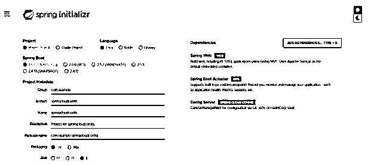
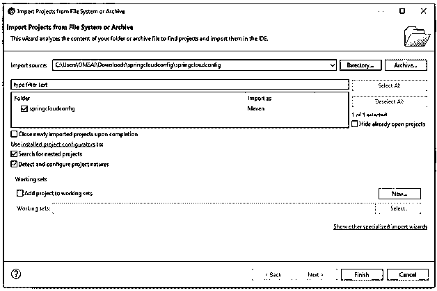
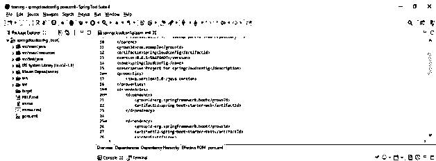
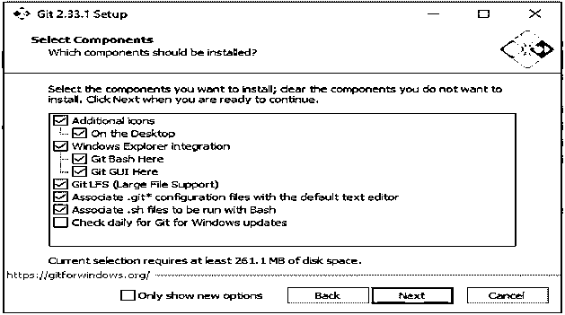
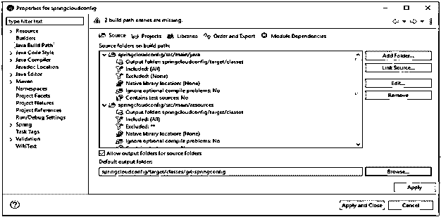

# 春季云配置

> 原文：<https://www.educba.com/spring-cloud-config/>

## Spring 云配置的定义

Spring cloud config 为分布式的服务器端和客户端系统提供外部化配置支持。使用它，我们可以在一个中心位置管理所有应用程序的外部属性。基本上，spring boot config 是客户机和服务器的概念，它们在 spring property source 和 environment 中被完全相同地映射。使用这个，环境和属性源文件非常适合应用程序。

### 什么是 spring cloud config？

*   在开发时，我们的应用程序将从开发环境进入测试环境，然后进入生产环境，我们可以使用 spring boot config 管理所有环境中的配置，它还将管理应用程序从一个环境转移到另一个环境所需的所有内容。
*   默认情况下，它是在 git 中实现的，因此它将支持标记版本环境的配置，并且可以通过管理内容来访问它。
*   使用 spring 配置很容易添加和插入实现。
*   它只不过是用于在多种环境中提供分布式配置的客户机和服务器方法。
*   配置存储在 git 版本中，可以在应用程序运行时修改。
*   通过使用应用程序支持的所有文件格式，很容易适应所有的 spring 应用程序。

### 正在创建 spring 云配置

*   首先，我们需要设置配置服务器。在创建配置服务器之后，我们需要构建客户机，用于在服务器启动时使用配置。
*   要开发一个应用程序，我们需要以下软件如下。

1) JDK 1.8 或更高版本
2) Spring 工具套件或 Intellij IDEA
3) Maven 3.2+或 gradle 4+
4) IDE

<small>网页开发、编程语言、软件测试&其他</small>

*   要启动这个应用程序，我们需要一个 git 源代码库，我们可以下载它，也可以从 git 克隆它。
*   在使用 spring initializer 创建项目模板时，我们需要选择配置客户端或配置服务器、spring web 和 spring boot actuator 依赖项。这个包会自动添加到开发应用程序所需的所有依赖包中。
*   我们可以开发常规的 spring boot 应用程序。

#### Spring 云配置快速入门

*   建立项目的第一步是使用 spring initializer 创建一个模板。
*   创建项目模板后，我们需要在应用程序的 pom.xml 文件中添加 spring cloud 配置依赖项。
*   添加依赖项后，下一步是配置服务器的实现。我们已经使用了 EnableConfigServer 和 SpringBootApplication 注释来配置服务器。
*   实现配置服务器后，下一步是将我们的项目添加到 git 存储库中，作为配置的存储。在这一步中，我们使用配置的 URL 初始化 git 存储库。
*   初始化 git 存储库后，下一步是使用服务器路径查询我们的配置更改。
*   配置完成后，我们已经实现了应用程序的客户端。我们可以用简单的步骤实现客户端。
*   在客户端实现之后，我们将在应用程序中实现加密和解密。
*   我们还可以为应用程序提供增强的安全性。

### Spring 云配置服务器

下面的示例显示了如下的服务器实现。

#### 1)为应用程序创建一个项目模板

在下面的步骤中，我们将项目组名称设置为 com。例如，工件名称为 springcloudconfig，项目名称为 springcloudconfig，选择的 java 版本为 8。

`Group – com.example
Artifact name – springcloudconfig
Name – springcloudconfig
Spring boot – 2.6.0
Project – Maven
Project Description - Project for springcloudconfig
Java – 8
Dependencies – spring web, config server, spring boot actuator
Package name - com.example.springcloudconfig`

#### 2)生成项目后，提取文件并使用 spring 工具套件打开该项目

在这一步中使用 spring 初始化器生成项目之后，我们提取 jar 文件并使用 spring 工具套件打开项目。

#### 3)使用 spring 工具套件打开项目后，检查项目及其文件

在这一步中，我们检查所有的项目模板文件。我们还需要检查 maven 依赖项和系统库。

#### 4)添加依赖包–

在这一步中，我们将所需的依赖项添加到项目中。

**代码:**

`<dependency> -- Start of dependency tag.
<groupId>org.springframework.cloud</groupId> -- Start and end of groupId tag.
<artifactId>spring-cloud-config-server</artifactId> -- Start and end of artifactId tag.
</dependency> -- End of dependency tag.`

#### 5)下载并安装 git–

#### 6)使用 git 创建新目录–

**代码:**

`# mkdir git-springconfig
# cd git-springconfig`

#### 7)初始化 git 目录–

**代码:**

`# git init`

#### 8)将 git 文件夹添加到项目中–

#### 9)编辑应用程序。属性文件

**代码:**

`limits-service.maximum = 888
limits-service.minimum = 8`

#### 10)添加用户名和电子邮件

**代码:**

`# git config --global user.email pqr@example.com
# git config --global user.name "pqr"
# git add -A`

#### 11)运行应用程序–

### 服务器使用 SSH 配置和属性

*   我们还可以在 spring cloud config 项目中使用 SSH 配置。JGit 需要 PEM 格式的 RSA 密钥。
*   要在远程存储库中使用 SSH 验证，我们需要在属性文件中分别添加用户名和密码。
*   这是一个集中式应用程序，用于管理所有与配置相关的属性。
*   要开发一个应用程序，我们需要在 pom.xml 文件中添加 spring cloud config server 依赖项。
*   我们可以使用 maven 或 gradle 语言开发我们的应用程序。为了使用 spring cloud config 开发应用程序，我们首先需要云服务，它就像是存储库版本控制的配置文件和我们的 spring 应用程序之间的中介。

### 结论

Spring cloud config 只不过是用于分布式配置的客户端和服务器方法。使用 spring cloud config，我们可以管理所有应用程序的外部属性。Spring cloud config 为分布式的服务器端和客户端系统提供了外部化配置的支持。

### 推荐文章

这是 Spring 云配置指南。这里我们分别讨论什么是 spring cloud-config，Spring cloud config Server 的定义。您也可以看看以下文章，了解更多信息–

1.  [Spring Boot 调度器](https://www.educba.com/spring-boot-scheduler/)
2.  [Spring Boot 的名字缩写](https://www.educba.com/spring-boot-initializr/)
3.  [Spring Boot·梅文](https://www.educba.com/spring-boot-maven/)
4.  [Spring Boot 缓存](https://www.educba.com/spring-boot-cache/)

