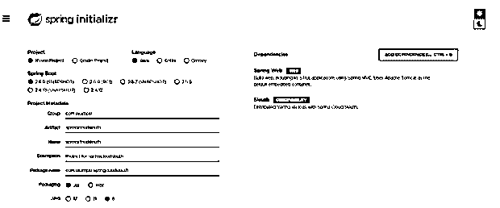
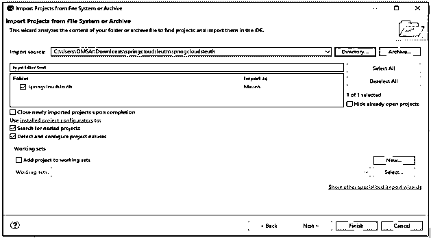
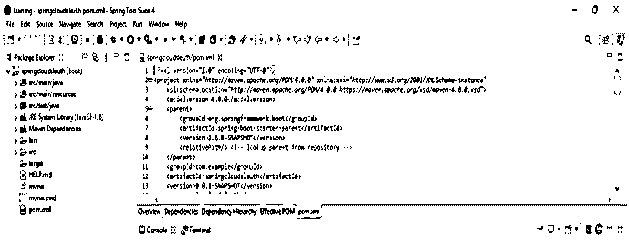
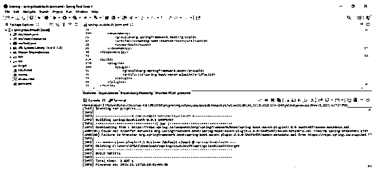
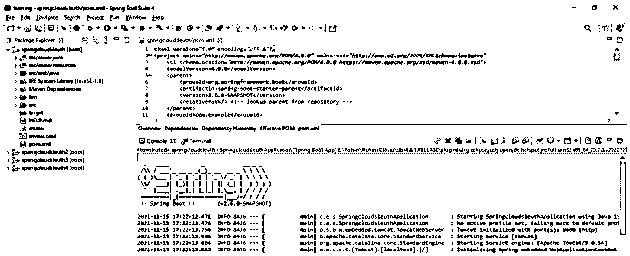
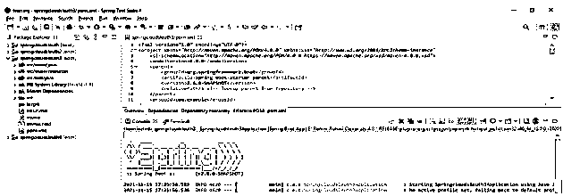
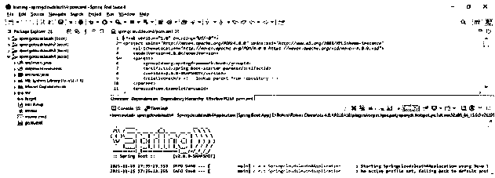

# 春云侦探

> 原文：<https://www.educba.com/spring-cloud-sleuth/>

## 《春云探案》简介

Spring cloud sleuth 为分布式跟踪提供了 spring boot 的自动配置。它将配置我们开始所需的一切。Sleuth 包括跟踪数据报告的位置，如果需要发送远程字段，我们需要如何跟踪，以及需要跟踪哪些库。它用于将轨迹添加到 slf4j mdc 中。

### 什么是春云侦探？

*   它用于跨越 id 并将跟踪添加到 slf4j mdc 中，因此我们可以使用日志聚合器从给定的跨越或跟踪中提取日志。
*   它还用于推动下面的采样决策，以实现 tracer。我们有多种方法可以在运行时改变采样决策。
*   为了实现这个项目，我们需要在 pom.xml 文件中添加 starter sleuth 依赖项。

Spring cloud sleuth 在我们的日志中增加了两种类型的 id。

<small>网页开发、编程语言、软件测试&其他</small>

1)跨度 ID

2)跟踪 ID

*   Span ID 代表工作单元，就像发送 HTTP 的请求一样。sleuth 中的 Trace ID 包含许多 span IDs，创建了一个树形结构。

调用一个微服务到其他 traces 时，ID 相同；它在整个过程中不会改变。

### 使用 Spring Cloud Sleuth 和 Zipkin

*   在 spring 中，cloud sleuth traces 使用报头传播将它从一个服务连接到另一个服务。它将使用默认的跟踪格式，如 B3。
*   我们还可以通过跳过客户端范围报告来更改抽样决策。我们可以通过将 spring sleuth web 客户端跳过模式(spring . sleuth . web . client . skip-pattern)设置为跳过路径模式来实现这一点。
*   Zipkin 是分布式追踪系统；它用于收集排除延迟问题所需的计时数据。Zipkin 特性包括数据的查找和收集。
*   当我们已经实现了多个微服务，并且我们的应用在某个时间段执行缓慢时，Zipkin 在调试时非常有用。
*   Sleuth 只不过是 spring cloud 提供的工具，用于生成服务调用、映射和头的诊断上下文、跟踪 ID 和 span ID。
*   Spring cloud sleuth 用于 ELK 和 Zipkin 等工具。Sleuth 在 Zipkin 中用于处理日志和存储索引。
*   Sleuth 出自春云家族；在将它添加到类路径中之后，它将自动在通信通道之间集成。

### 春云打造项目

下面的例子展示了构建项目。

1.  #### Create a project template of spring Cloud Build using Spring Initializer.

*   在下面的步骤中，我们提供了项目组名称 com。例如，工件名称为 springcloudsleuth，项目名称为 springcloudsleuth，选择的 java 版本为 8。
*   在下面的项目中，我们选择了 spring web 和 sleuth 依赖来实现 spring cloud build 项目。

`Group – com. example Artifact name – springcloudsleuth
Name – springcloudsleuth Spring boot – 2.6.0
Project – Maven Project Description - Project for springcloudsleuth
Java – 8 Dependencies – sleuth, spring web
Package name - com. example.springcloudsleuth`

#### 2) 生成项目后，提取文件并使用 spring 工具套件打开该项目。

在这一步中使用 spring 初始化器生成项目之后，我们提取 jar 文件并使用 spring 工具套件打开项目。

#### 3)使用 spring 工具套件打开项目后，检查项目及其文件。

在这一步中，我们检查所有的项目模板文件。我们还需要检查 maven 依赖项和系统库。

#### 4)添加依赖包。

在这一步中，我们将在构建项目中添加契约验证器依赖项。

**代码:**

`<dependency> -- Start of dependency tag.
<groupId>org.springframework.cloud</groupId> -- Start and end of groupId tag.
<artifactId>spring-cloud-starter-sleuth</artifactId> -- Start and end of artifactId tag.
</dependency> -- End of dependency tag.`

#### 5)构建项目。

### 春云探案举例

我们使用 sleuth 应用程序来配置第一个微服务。以下步骤显示了 sprig cloud sleuth 的示例，如下所示。

#### 1)为第一个微服务创建控制器

**微服务 1**

**代码:**

`@SpringBootApplication
public class micro1 {
public static void main(String[] args) {
SpringApplication.run(micro1.class, args);
}
}
@RestController
class ZipkinController{
@Autowired
RestTemplate rTemp;
@Bean
public RestTemplate getRestTemplate() {
return new RestTemplate();
}
@Bean
public springcloudsleuth alwaysSampler() {
return new springcloudsleuth();
}
@GetMapping(value="/sleuth-Zipkin")
public String zipkinService1()
{
LOG.info("spring cloud sleuth");
String response = (String) rTemp.exchange ("http://localhost:8080/zipkin",
HttpMethod.GET, null, new ParameterizedTypeReference<String>() {}).getBody ();
return "springcloudsleuth...";
}
}`

#### 2)配置应用程序.属性文件–

**代码:**

`server.port = 8080
spring.application.name = springcloudsleuth-server1`

#### 3)创建另外三个微服务并配置 application.properties 文件，使用端口 8081、8082 和 8083–

**微服务 2**

**微服务 3**

**微服务 4**

#### 4)创建和配置所有微服务后，启动所有微服务——

**启动第一个微服务:**

**启动第二个微服务:**

**启动第三个微服务:**

**启动第四个微服务:**

#### 5)打开 zipkin dashboard 并检查服务–

**带有服务访问的 Web 请求**

*   高度可定制的 web 请求视图允许我们检查来自我们所有服务的更受欢迎的 web 请求，并搜索来自定向到特定 URL 的请求。
*   服务访问的视图很容易定制，并作为更深入检查我们的服务的良好起点。
*   使用 sleuth，很容易添加实现项目所需的依赖项。
*   我们可以通过指定相似的数据格式来配置另一种报头格式。

### 结论

Spring cloud sleuth 用于跨越 ids 并将跟踪添加到 slf4j mdc 中，因此我们可以使用日志聚合器从给定的跨越或跟踪中提取日志。它将配置我们开始所需的一切。

### 推荐文章

这是一个春季云侦探指南。这里我们讨论定义，什么是 spring cloud sleuth，例子，代码和应用。您也可以看看以下文章，了解更多信息–

1.  [春云相依](https://www.educba.com/spring-cloud-dependencies/)
2.  [春云版](https://www.educba.com/spring-cloud-version/)
3.  [春云组件](https://www.educba.com/spring-cloud-components/)
4.  [春云流](https://www.educba.com/spring-cloud-stream/)

