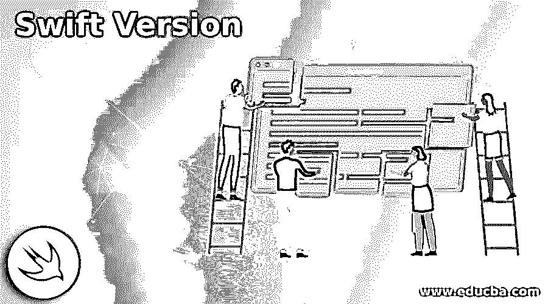

# Swift 版本

> 原文：<https://www.educba.com/swift-version/>

## Swift 版本的定义

Swift 是一种编程语言，广泛用于编写可被 macOS、watchOS、iOS 等理解的 API 和代码。Swift 编程语言在苹果设备中发挥着关键作用，随着上述设备的每次最新更新，Swift 语言版本也变得即兴。Swift 编程语言具有其他现代特征，如安全性、交互性、灵活性和趣味性，并带有不同版本的 Swift。每个版本的 Swift 代码带来了非常好的、有趣的、交互式的和非常安全的设计，因此任何具有不同 swift 版本的软件都非常快。

### 顶级 Swift 版本

Swift 有许多版本，有助于使一些用户友好的体验变得有趣和互动。不同版本的 Swift 为苹果平台带来了不同的功能和适应性，包括交互性、安全性和趣味性。内存也使用确定性引用和计数来自动维护和管理。有许多 swift 版本，如下所示:

<small>网页开发、编程语言、软件测试&其他</small>

#### Swift 1.2 (Xcode 6.3+，swiftlang-602.0.49.6)

Swift 1.2 是 Xcode 6.3 beta 的一部分，Xcode 6.3 beta 包括 Swift 编译器的增强版本，具有 swift 语言的许多新功能。它主要关注编译器的改进和增强，如稳定性和性能的提高，这反过来为在 Xcode 中使用 Swift 提供了更好的体验。编译器改进包括稳定性增强、更好的编译器诊断、增量构建和更快的可执行文件。相对于 Objective-C 和 Swift，这种语言包含了很多改进的交互。一些主要和突出的变化是:

*   **作为！带有失败的强制转换:**为了使读者容易理解代码并维护代码涉及的 as！确保转换在运行时失败的操作符。
*   **@objc 属性用于目标:** C 可以使用 Swift 中的枚举导出。
*   **可空性可以用 objective:** C 头来表示，Clang 允许用 Objective-C api 来表示所有的空指针。

#### Swift 2.1 (Xcode 7.2，swiftlang-700.1.101.19)

Swift 1.2 向 Swift 2.1 with Xcode 7.2 版本的迁移为 UI 交互性和适应性增加了许多功能和增强，包括泛型、可空性注释、内联结果、资源、辅助和更多功能。这个 Swift 版本有助于将所有功能捆绑在一起，并有助于应用程序细化，让程序员了解按需资源、位代码的使用，并根据需要编译成 64 或 32 个可执行文件。也有助于切割纳入资产分配的艺术品。

#### Swift 2.2 (Xcode 7.3，swiftlang-703.0.18.1)

Swift 2.2。使用 Xcode 7.3 主要要求 mac 应运行 OS X 版本 10.11 或更高版本，这涉及对 iOS 9.3、watchOS 2.2、OS X 版本的许多更新支持，以及许多连续的功能增强。带有 Xcode 7.3 的 Swift 2.2 版本用于提供与编译器时间、更新功能以及与 objective-C 的互操作性相关的改进的警告和诊断。它还提供代码完成功能、调试器、分析器、导航器、替代工具链等。

#### Swift 3.0 (Xcode 8.2，swiftlang-800.0.63)

带有 Xcode 8.2 的 Swift 3.0 进行了大量更改，Swift 3 和 swift 2.3 之间的主要差异也存在，这意味着 swift 3.0 语言支持 swift 2.3。和 swift 3.0，但它仍然不能与应用程序的整个代码库二进制兼容，因此需要保持一个版本，在该版本中，功能不会被弃用，而像调试、API 交互性、安全性和数据隐私等功能应该得到更多增强。Xcode 中的 Playgrounds 只能与 Swift3 一起使用，并以适当的格式使用适当的模板和文档。

#### Swift 3.1 (Xcode 8.3b2，swiftlang-802.0.31.3)

带有 Xcode 8.3b2 的 Swift 3.1 版本引入了支持 tvOS 初始支持的所有新功能。它利用了许多其他功能，这些功能对于使 swift 语言在与电视相关的操作系统方面更加健壮和灵活是必要的，由于它利用了运算符& < < = { associative _ right precedence assignment }，代码库变得清晰并易于程序员理解

用&<< =

#### Swift 4.2 (Xcode 10.0b1，swiftlang-1000.0.16.7)

Xcode 4.2 支持并添加了支持 iOS 5 的功能，以及该 Swift 版本对应用程序的许多其他增强。它有一个非常有趣的自动引用计数功能，包括一个菜单项，可以将所有目标转换为使用自动引用计数，从而转换所有 Objective-C 对象的内存管理。因此，使整个版本在内存管理方面非常安全和快速。它还利用了许多带有代码库的项目，这些代码库可以转换并使用户能够使用 Apple LLVM 编译器。此 Swift 版本中的 Xcode 进一步用于显示预览窗格或对话框，显示包含使用 ARC 的代码的所有更改。

默认编译器是使用 Xcode 4.2 和 LLVM 3.0 在 Xcode 中进行 iOS 开发的。当它用于比较时，则使用 GCC 编译器(默认 Xcode 4.0)和 LLVM-GCC 编译器(Xcode 4.1)进行编译，两者的结合有助于生成比 GCC 更好的代码生成和优化。还有更多的功能，如位置模拟器、OpenGL ES 帧捕捉等等。

#### Swift 5.1 (Xcode 11.3.1，swiftlang-1100.0.282.1)

带有 Xcode 11.3.1 的 Swift 5.1 是苹果公司发布的最新版本，作为苹果开发者工具的一部分，用于 Swift 编程。在 Xcode 4 的设计基础上，主要关注特性和改进，以提高采用新设计用户界面的核心功能的能力，以及与机器人、测试、调试和可用性持续集成的细微变化。

#### 每夜构建(swift/master，1466a5e)

这是最新的 swift 版本，仍处于探索和测试阶段，它具有一些更多的增强和即兴功能，在以前的 swift 版本上有明显的改进。

### 结论

根据 iOS、tvOS 等不同平台的不同，Swift 有很多版本，但仍在探索中，但确实使苹果平台变得非常通用和灵活。它用所有的编程范例和健壮性使所有的产品对用户和程序员来说都是可访问的和用户友好的。

### 推荐文章

这是一个 Swift 版本的指南。在这里，我们还将讨论 swift 的定义和顶级版本，以及详细的解释。您也可以看看以下文章，了解更多信息–

1.  [反应原生迅捷](https://www.educba.com/react-native-swift/)
2.  [反应原生 vs 迅捷](https://www.educba.com/react-native-vs-swift/)
3.  [Swift 运营商](https://www.educba.com/swift-operators/)
4.  [Swift vs Objective C](https://www.educba.com/swift-vs-objective-c/)

