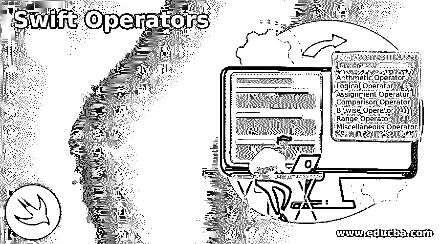

# Swift 运营商

> 原文：<https://www.educba.com/swift-operators/>

## Swift 运营商简介

运算符是帮助执行各种逻辑和数学计算的符号。Swift 支持大多数的标准 C 操作符。

它们分为三种类型:

<small>网页开发、编程语言、软件测试&其他</small>

1.  **一元运算符:**这些运算符只对单个操作数进行运算。例如，增量运算符。
2.  **二元运算符:**这些运算符对两个操作数进行运算。例如，加法运算符。
3.  **三元运算符:**这些运算符对三个操作数进行运算。比如，a？乙:丙。

### Swift 运营商

swift 中的不同运营商如下:

*   算术运算符
*   逻辑算子
*   赋值运算符
*   比较运算符
*   按位运算符
*   距离操作手
*   杂项运算符

现在让我们详细看看每种类型的运算符:

#### 1.Swift 算术运算符

这些运算符用于对操作数执行数学计算。

| **操作员** | **符号** | **解释** | **格式** |
| **加法** | + | 给定两个操作数相加 | x + y |
| **减法** | – | 从左操作数中减去右操作数。 | x y |
| **乘法运算** | * | 将两个操作数相乘 | x * y |
| **分部** | / | 将分子除以分母 | x / y |
| **模数** | % | 返回执行除法后的余数 | x % y |

**举例:**

`print(5  +  2)
print(5  -  2)
print(5  *  2)
print(5  /  2)
print(5  %  2)`

**输出:**

Seven

Three

Ten

Two

One

#### 2.Swift 逻辑运算符

这些运算符将布尔值作为输入返回布尔值。

| **操作员** | **符号** | **解释** | **格式** |
| **逻辑与** | && | 如果所有表达式都为真，则返回 true；否则返回 false | x 和 y |
| **逻辑或** | &#124;&#124; | 如果所有表达式都为假，则返回假；否则返回真 | x &#124;&#124; y |
| **逻辑非** | ! | 反转输入，即返回 true 表示 false，反之亦然 | !英语字母表的第 24 个字母 |

**举例:**

`print(true  &&  true)
print(true  &&  false)
print(true  ||  false)
print(false  ||  false)
print(! false)`

**输出:**

真实的

错误的

真实的

错误的

真实的

#### 3.快速赋值运算符

这些运算符用于为变量赋值。

| **操作员** | **符号** | **解释** | **格式** |
| **分配** | = | 将右操作数的值赋给左操作数 | x = y |
| **加法** | += | 将两个操作数相加，然后给左边的操作数赋值 | x += y |
| **减法** | -= | 从左操作数中减去右操作数，然后将值赋给左操作数 | x -= y |
| **乘法运算** | *= | 将两个操作数相乘，然后给左边的操作数赋值 | x *= y |
| **分部** | /= | 将分子除以分母，然后给左操作数赋值 | x /= y |
| **模数** | %= | 返回除法运算后的余数，然后给左操作数赋值 | x %= y |
| **按位与** | &= | 比较两个操作数的二进制值，如果两个操作数都为 1，则返回 1，否则返回 0，并给左边的操作数赋值 | x &= y |
| **按位或** | &#124;= | 比较两个操作数的二进制值，如果两个操作数都为 0，则返回 0，否则返回 1，并将值赋给左边的操作数 | x &#124;= y |
| **按位异或** | ^= | 比较两个操作数的二进制值，如果两个操作数相同，则返回 0，否则返回 1，并给左边的操作数赋值 | x ^= y |
| **左移** | <<= | 将位向左移位，并将结果赋给左操作数 | x <<= 2 |
| **右移** | >>= | 将位向右移位，并将结果赋给左操作数 | x >>= 2 |

**举例:**

`let a = 5
print (a)
var x = 6
print(x += 3)
print(x -= 3)
print(x *= 3)
print(x /= 3)
print(x %= 3)
print(x &= 3)
print(x |= 3)
print(x ^= 3)
print(x <<= 2)
print(x >>= 2)`

**输出:**

Five

Nine

Three

Eighteen

Two

Zero

Two

Seven

Five

Eight

One

#### 4.快速比较运算符

这些运算符有助于比较两个值并返回布尔值作为输出。

| **操作员** | **符号** | **解释** | **格式** |
| **等于** | == | 如果两个操作数相等，则返回 true，否则返回 false | x == y |
| **不等于** | != | 如果两个操作数不相等，则返回 true 否则返回 false | x！= y |
| **大于** | > | 如果左操作数大于右操作数，则返回 true 否则返回 false | x > y |
| **小于** | < | 如果左操作数小于右操作数，则返回 true 否则返回 false | x < y |
| **大于或等于** | >= | 如果左操作数大于或等于右操作数，则返回 true 否则返回 false | x >= y |
| **小于或等于** | <= | 如果左操作数小于或等于右操作数，则返回 true 否则返回 false | x <= y |

**举例:**

`print(5  ==  2)
print(5  !=  2)
print(5  >  2)
print(5  <  2)
print (5 >= 5)
print (5  <=  2)`

**输出:**

错误的

真实的

真实的

真实的

真实的

错误的

#### 5.Swift 按位运算符

| **操作员** | **符号** | **解释** | **格式** |
| **二进制和** | “&”号 | 按位检查操作数，如果两位都是 1，则返回 1；否则返回 0 | x & y |
| **二进制或** | &#124; | 按位检查操作数，如果两位都是 0，则返回 0；否则返回 1 | x &#124; y |
| **二进制异或** | ^ | 按位检查操作数，如果两位相同，则返回 0；否则返回 1 | x ^ y |
| **二进制非** | ~ | 返回 1 的补码，即从 1 变为 0，反之亦然 | ~x |
| **二进制左移** | << | 左操作数的位向左移位右操作数提到的位数 | x << 4 |
| **二进制右移** | >> | 左操作数的位向右移位右操作数提到的位数 | x >> 4 |

**举例:**

`var a = 8
var b = 7
print(a & b)
print(a | b)
print(a ^ b)
print(~ b)
print(a << 2)
print(a >> 2)`

**输出:**

Zero

Fifteen

Fifteen

Eight

Zero

Two

#### 6.Swift 范围运算符

这些运算符用作表示值范围的快捷方式。

| **操作员** | **符号** | **解释** | **格式** |
| **关闭范围** | (甲…乙) | 它定义了从 a 到 b 的范围，包括 a 和 b | 1…5 |
| **半开范围** | (一)..< b) | 它定义了从 a 到 b 的范围；包含 an，排除 b | 1..<5 |
| **单边范围** | 一个…..一 | 它定义了从 a 到元素末尾或从开始到 a 的范围 | 1……2 |

**举例:**

`for i in 1...4 {
print(i)}
for j in 1\. . <4 {
print(j) }
let range = ..<4
print(range.contains(2))`

**输出:**

One

Two

Three

Four

One

Two

Three

真实的

#### 7.Swift 杂项运营商

| **操作员** | **符号** | **解释** | **格式** |
| **一元加号** | + | 这将数值的符号切换为加号 | +5 |
| **一元减号** | – | 这会将数值的符号切换为减号。 | -6 |
| **三元条件** | ?: | 用于检查条件，然后相应地给出输出 | 条件？甲:乙 |

**举例:**

`var a = -3
print(+a)
print(-a)
let b = (6==6) ? “True”: “false”
print(b)`

**输出:**

-3

Three

真实的

### 推荐文章

这是 Swift 操作员指南。在这里，我们通过示例讨论了各种类型的 Swift 运营商。您也可以浏览我们推荐的其他文章，了解更多信息——

1.  [Swift vs Objective C](https://www.educba.com/swift-vs-objective-c/)
2.  [雨燕而去](https://www.educba.com/swift-vs-go/)
3.  [C 运算符](https://www.educba.com/c-operators/)
4.  [MySQL 操作符](https://www.educba.com/mysql-operators/)

