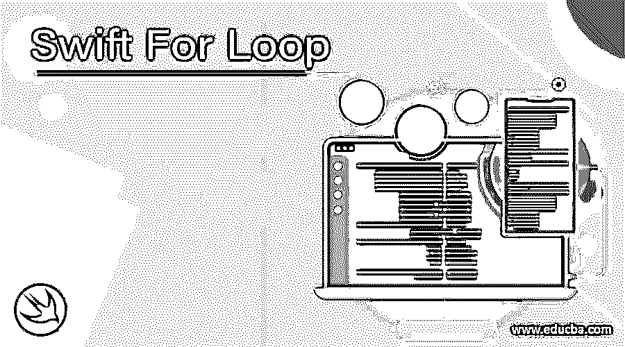
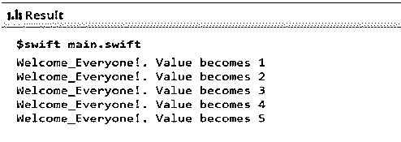
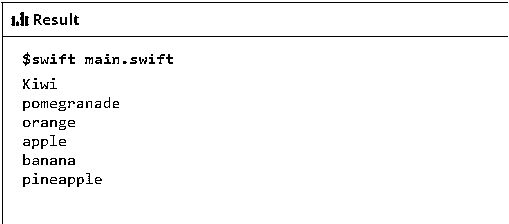
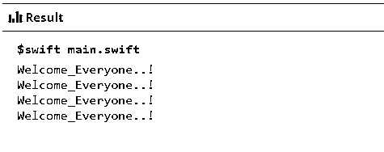
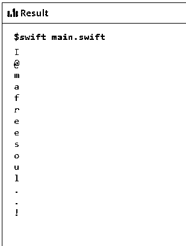
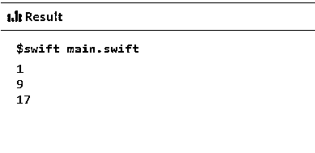
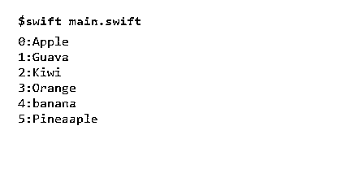

# Swift For 循环

> 原文：<https://www.educba.com/swift-for-loop/>

## Swift For 循环的定义

Swift 中的 For loop 是编程语言的一个概念，用于迭代任何代码，并使任何代码更加增强和更具表现力。有时，当情况是多余的，并且需要迭代数组或字典的列表时，swift for 循环就出现了。有时，for 循环还用于计算任何范围的数字、字符串中的字符以及迭代所需的许多其他序列，或者用于获取对集合和任何其他需要计算的数据结构进行操作所需的值。

**语法:**

<small>网页开发、编程语言、软件测试&其他</small>

每个循环和编程语言都有一个语法流，Swift for 循环也是如此。swift 中的循环是一种迭代，在程序中用于重复特定的程序块。

`for no-of-components in no-of-components
{
perform action
}`

**流程图**

内循环语句图的流程图表示，用于表示在需要进行迭代时将在 swift 编程语言中工作的功能。

**T2】**

 **让我们遍历流程图，到达列表迭代的末尾。从迭代开始，例如通过对列表中存在的任何组件或元素进行计数，然后是需要检查的某些条件，以便根据迭代得出结论。因此，如果条件得到满足，并且具有适当代码库的条件检查存在，则它将到达代码块，否则，如果它不存在，则它将退出条件循环，并且将在执行时由于条件失败而仅抛出错误和异常。

### Swift 中的 for loop 是如何工作的？

*   swift 中的 for 循环有多种迭代方式，在 swift 中使用 for 循环，在 Swift 中使用 For-In 集合迭代特定范围内的循环、数组和字典。
*   当与 while 和 do while 或 Swift 中的其他循环一起使用时，它扮演了一个完全矛盾的角色。
*   每当需要在某个固定的时间内进行任何重复的过程时，Swift 中的 For-In 循环就成了救星，并用于运行任何特定的任务一定的次数。
*   该循环遍历特定范围的元素，然后我们可以访问从 value 元素的范围中返回的那些元素。
*   列表中出现的序列在一个范围内迭代，然后为该范围内的第一个数字设置该值，该范围内的第一个数字在执行的循环中包含其他语句。
*   一旦执行了该语句，并且按照要求满足了条件，那么流程就很简单，因为它将用于更新该范围内的第二个值，并且可以用于再次执行它。
*   这个循环过程一直持续到列表和迭代的范围到达任何循环的结尾，然后一旦到达就停止循环。
*   For 循环用于计算和访问数组或列表中的元素。
*   当使用 for-in 循环的要求是周期性间隔时，stride 方法是有用的，在这种情况下，它将在特定的时间内等待并相应地迭代。
*   通过使用索引方法或 twist 以及 enumeration inbuild 函数也可以访问数组和集合，这将在示例中进一步描述。
*   for 循环中提到的所有示例都是根据 swift 中的场景和要求以及版本兼容性来使用的。

### 例子

让我们讨论 Swift For 循环的例子。

#### 示例#1

该程序表示序列的 for 循环，该循环将在列表中迭代 5 次，并将第一个元素设置到范围中，然后存储第二个数字，并同时迭代，如输出所示。

`import Foundation
import Glibc
for itrn in 1...5
{
print("Welcome_Everyone!. Value becomes \(itrn)")
}`

**输出:**

#### 实施例 2

这个程序演示了水果的种类，以访问水果种类中的所有水果，即使用 for-in 循环访问元素，如输出所示。此外，用于迭代的序列是一个字符串数组。

`import Foundation
import Glibc
let fruits_Variety = ["Kiwi", "pomegranade", "orange", "apple", "banana", "pineapple"] for fruits in fruits_Variety
{
print(fruits)
}`

**输出:**

#### 实施例 3

此程序用于丢弃在一个确定范围内存在的值，以忽略所有用于丢弃的值。在 for 之后和 in 之前附加一个下划线，以表示从输出中显示的数组中丢弃特定元素的更改。

`import Foundation
import Glibc
for _ in 1..<5
{
print("Welcome_Everyone..!")
}`

**输出:**

#### 实施例 4

这个程序用于演示如何访问字符串集合中的元素，该字符串集合用于-in 循环，如输出所示。

`import Foundation
import Glibc
for p_val in "I@mafreesoul..!"
{
print(p_val)
}`

**输出:**

#### 实施例 5

此程序用于演示 for-in 循环，在这种情况下，迭代中任何固定值的循环用于使范围中的每个值使用 stride 方法，如输出中所示。

`import Foundation
import Glibc
let periodic_inttrvl = 8
for i_time in stride(from: 1, to: 20, by: periodic_inttrvl)
{
print(i_time)
}`

**输出:**

#### 实施例 6

这个程序演示了各种水果的使用，当对访问元素的列表执行索引时，需要迭代这些水果，并使用户能够轻松地搜索适当的元素，如输出所示。

`import Foundation
import Glibc
let fruit_variety = ["Apple", "Guava", "Kiwi", "Orange", "banana", "Pineaaple"] for (indx, variety) in fruit_variety.enumerated()
{
print("\(indx):\(variety)")
}`

**输出:**

### 结论

Swift for 循环主要用于迭代数组或列表集合中的元素数量，然后用于维护顺序。在 swift for-in 循环中，很容易访问和遍历到范围的末尾，但是元素的范围很容易变化。

### 推荐文章

这是 Swift For Loop 的指南。在这里，我们讨论 Swift 中 for 循环的定义、流程图和工作原理。以及代码实现的例子。您也可以看看以下文章，了解更多信息–

1.  [Swift 版本](https://www.educba.com/swift-version/)
2.  [什么是雨燕？](https://www.educba.com/what-is-swift/)
3.  [Swift 运营商](https://www.educba.com/swift-operators/)
4.  [如何安装 Swift？](https://www.educba.com/install-swift/)

**