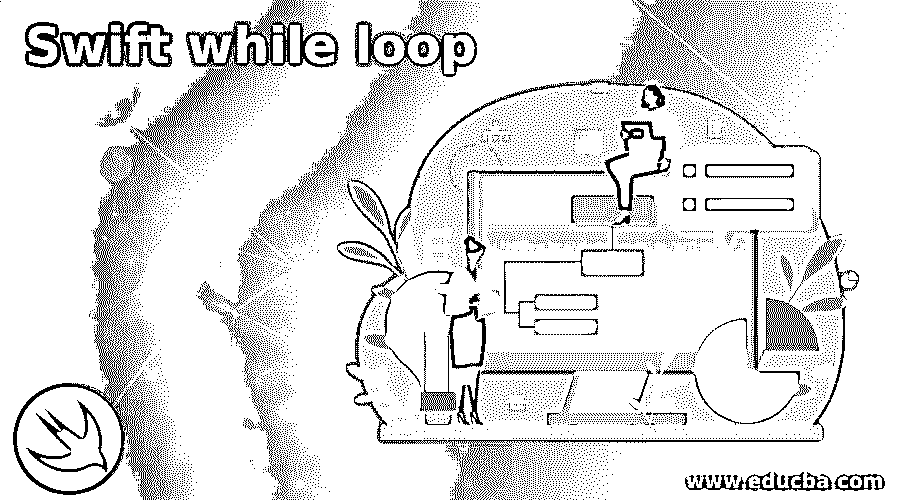
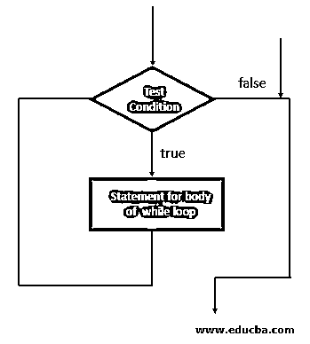
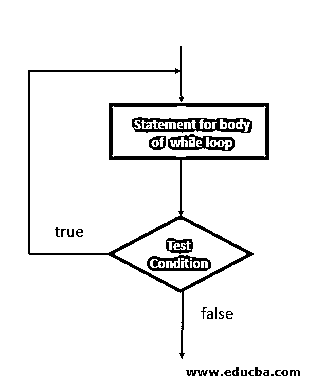
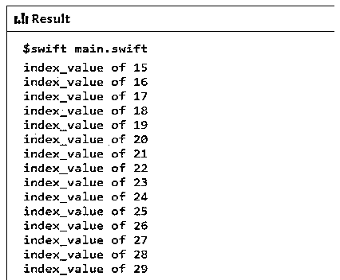
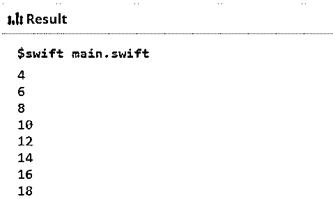
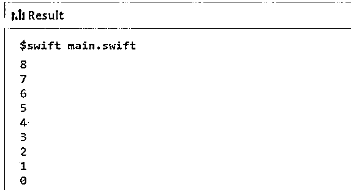
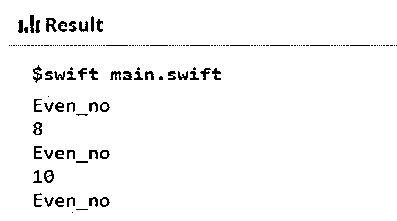
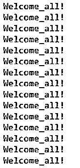

# 快速 while 循环

> 原文：<https://www.educba.com/swift-while-loop/>

## Swift while 循环简介

Swift while 循环是用于执行条件检查的循环，其循环代码也用于使循环以重复的方式工作，直到循环内的条件失败。当在第一次迭代开始遍历之前不知道迭代次数时，Swift while 循环非常有优势。Swift while 循环也有两种类型，其中第一种类型是一般 while 循环，用于在每次循环中评估其条件，另一种 while 循环是重复 while 循环，用于在循环中每次循环结束时评估其条件。

**语法:**

<small>网页开发、编程语言、软件测试&其他</small>

一般 while 循环的语法是从循环的开始处开始计算条件:

`while(condition_for_execution)
{
Statements_for_body
}`

repeat while 循环的语法是，在循环结束时开始计算条件:

`repeat
{
Statements_for_body
} while(condition_for_execution)`

### 流程图

以下是流程图:

1.While 循环流程图。

while 循环的流程图描述了在开始时评估测试条件的流程，如果条件满足 true，则循环和主体内的下一组语句将被执行，如果不满足，则意味着如果条件评估为 false，则 while 循环将被激活，并且不会继续执行整个流程图中的这组语句。

2.重复 while 循环流程图。

重复 while 循环流程图的流程是，只有在测试条件被检查一次的情况下，while 循环的语句体才会被执行，如果条件检查结果为真，则语句体内的语句会被逐个执行，然后测试表达式会被求值。该过程一直运行，直到条件被评估，否则不为真意味着评估为假，并且循环终止。

### Swift 中的 while 循环是如何工作的？

*   swift 中 while 循环的工作很容易用流程图来描述，但是真正的流程有很多事情要做，因为一切都取决于语句的执行。该流程取决于以增量方式执行代码时所验证的语句数量和条件数量。
*   swift 中的 While 循环的工作方式是，首先检查测试条件，测试条件主要是布尔表达式，然后评估测试条件是真还是假，假设评估结果为真，则在测试条件执行时检查 while 循环中的语句。它一直被评估，直到测试条件被评估为假。最后，当测试条件评估为假时，它将被终止。
*   与 swift 中的 while 循环相比，repeat while 循环发生了类似的事情，流的行为几乎没有什么不同，在 swift 中，执行以 while 循环的往复方式进行评估。在这里，循环评估每个传递到控制流的条件。重复 while 循环还有一个优点，它有助于在执行整个测试和检查表达式之前，至少执行和验证一次 while 循环。
*   只有在第一次执行之后，测试条件才会被评估为 true，然后最后主体循环中的所有语句都会被再次执行和评估。一旦循环最终终止，整个过程就会被执行并被评估为 false。
*   有时候，整个 while 循环开始以无限的方式执行，然后停止。这也有助于使整个 while 循环执行到值为 false，并被执行无限次。

### Swift while 循环示例

以下是 Swift while 循环的示例:

#### 示例#1

此程序演示了 while 循环，其中比较运算符用于验证流，根据值 30 检查索引流，直到值为 30。所有值都将被执行，否则不会打印输出中显示的其他值。

**代码:**

`import Foundation
import Glibc
var indx_1 = 15
while indx_1 < 30
{
print( "index_value of \(indx_1)")
indx_1 = indx_1 + 1
}`

**输出:**

#### 实施例 2

这个程序演示了 swift repeat while 循环，该循环用于表示带有某个值的和，该循环用于在执行条件为真时打印值，并将打印输出中显示的所有值。

**代码:**

`import Foundation
import Glibc
var sm_0 = 4
repeat
{
print(sm_0)
sm_0 = sm_0 + 2
}
while sm_0 < 20`

**输出:**

#### 实施例 3

这个程序演示了 while 循环，当 while 循环表达式大于或等于 0 时(如输出所示),取值将减 1。

**代码:**

`import Foundation
import Glibc
var i_o = 8
while i_o >= 0
{
print(i_o)
i_o -= 1
}`

**输出:**

#### 实施例 4

这个程序演示了带有 break 语句的 while 循环，按照输出中所示的操作，每当遇到第三个偶数时。

**代码:**

`import Foundation
import Glibc
var k = 8
var evn_ct = 0
while true {
if k % 2 == 0
{
print("Even_no")
evn_ct += 3
if evn_ct == 9
{
break
}
}
print(k)
k += 2
}`

**输出:**

#### 实施例 5

这个程序演示了 swift while 循环的无限循环，一旦程序没有根据条件语句正确终止，并且代码执行的主体将给出一个无限循环，就会出现这种无限循环。

**代码:**

`import Foundation
import Glibc
while (true)
{
print("Welcome_all!")
}`

**输出:**

### 结论

当涉及到在迭代中执行重复动作时，Swift while 循环相对于其他循环起着关键作用。它使遍历和条件检查语句数量的过程变得容易，并与其他条件检查兼容。如果布尔语句根据 while 循环的条件和主体被评估为 true 或 false，它也有助于轻松终止。

### 推荐文章

这是一个 Swift while 循环的指南。这里我们讨论一下引言，while loop 如何在 swift 中工作？和示例。您也可以看看以下文章，了解更多信息–

1.  [Swift 表单](https://www.educba.com/swift-forms/)
2.  [雨燕地图](https://www.educba.com/swift-map/)
3.  [Swift 运营商](https://www.educba.com/swift-operators/)
4.  [什么是雨燕？](https://www.educba.com/what-is-swift/)

