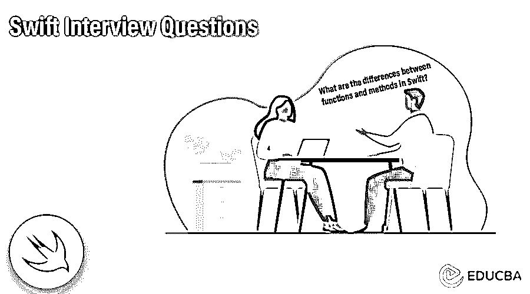

# 快速面试问题

> 原文：<https://www.educba.com/swift-interview-questions/>

## Swift 面试问答介绍

Swift 是苹果公司开发的一种功能强大的编程语言，这种编程语言简单易学。这是为苹果产品的 macOS、iOS、watchOS 和 tvOS 开发的。swift 代码被安全地设计为运行非常快，没有任何中断或任何延迟；这就是我们在苹果产品中看到的快速性能。

因此，如果您最终在 Swift 找到了梦想中的工作，但不知道如何破解 Swift 面试，以及 2022 年 Swift 面试可能会有哪些问题，那么每次面试都是不同的，工作范围也是不同的。牢记这一点，我们设计了最常见的 Swift 面试问题和答案，以帮助您在面试中取得成功。

<small>网页开发、编程语言、软件测试&其他</small>

### 五大 Swift 面试问题和答案

以下是 2022 年 swift 面试中常见的 5 个重要问题和答案:

#### 1.什么是 Swift 编程语言？

**回答:**
Swift 编程语言主要用于[为苹果产品开发软件应用](https://www.educba.com/applications-software-developer/)或操作系统。Swift 习惯于为手机、服务器、台式机或任何可以运行代码的设备编写代码。Swift 是一种快速的交互式编程语言。在 Swift 中，变量总是在使用前被初始化。对于越界错误，将检查数组索引。溢出也将被检查整数。对于选项，将显式处理零值。
Swift 中的内存管理是自动化的。如果出现任何故障，错误处理支持恢复功能。Swift 具有强大的类型推断和模式匹配功能，语法简洁。由于语法简单，任何复杂的逻辑和要求都可以轻松实现。复杂的思想可以用简洁的方式表达出来。Swift 不断推出新版本，具有一些出色的功能。

#### 2.Swift 编程语言有什么特点？

**答案:**
主要特点是安全、快速、表现力强。编写代码总是以安全的方式进行。代码中的错误在投入生产之前很容易被发现。为了更安全，它需要更严格地编写代码或使用具有许多显式声明特性的特性。Swift 已被用作 C、C++或 Objective C 等语言的替代品。Swift 编程语言的语法易于使用和编写代码。Swift 支持推断类型，以避免代码中容易出错的地方。
Swift 会自动管理内存。甚至不需要分号来终止代码行。Swift APIs 更易于阅读、使用和维护代码。附加功能包括泛型类型、集合的快速迭代、支持扩展的结构、协议和方法、函数式编程功能、控制流、强大的错误处理、元组、多个返回值。

#### 3.Swift 中的函数和方法有什么区别？

**答案:**
这是在面试中最常被问到的 Swift 面试问题。Swift 中的功能被定义为按照要求执行特定任务的独立代码。该函数将通过其名称来标识，以便在需要该任务时调用。要声明一个函数，将使用 func。可以通过调用函数名来调用函数，调用时要在函数的括号中传递一系列参数或自变量。- >将用于分隔函数参数括号，和函数返回类型。业务 e 和要查看的选定列。
Swift 中的方法通常与特定类型相关联，也称为函数。在 swift 方法中，默认情况下，第一个参数名将被赋予一个名称。一个常规的旧函数可以在全局的任何地方被调用。方法和函数总是与特定的类型相关联。枚举和结构可以定义方法，这是 C、C++、Objective C 等不同语言的主要区别。也存在属于特定类的实例方法，该类属于实例但不是全局的。实例方法也将具有与方法相同的语法。一个实例方法总是可以访问所有其他实例方法。
`Preferred
let sortedList = listItems.mergeSort() // easily discoverable
scooter.start() // a mutating method`

`Not Preferred
let sortedList = mergeSort(listItems)
start(&scooter)`

#### 4.Swift 中 let 和 var 有什么区别？

**答案:**
let 和 var 类型用于定义 Swift 编程语言中的常量和变量。Let 是用来做常数的。Var 用于创建一个变量。常量的值不需要在编译前声明。在编译时也不需要知道它。但是该值可以在任何时候赋值，但只能赋值一次。这个值可以用在很多地方。这个值可以确定一次，将在许多地方使用，因此命名为常数。

var my number = 31
my number = 31
设 myNumberConstant = 31

对于常量和变量，不需要明确说明类型。提供值后，编译器推断变量或常数的类型。类型也可以在赋值前声明，以使其清晰明了。值永远不会被显式转换为另一种类型。如果需要转换成另一种类型，那么变量需要显式的[类型转换](https://www.educba.com/what-is-type-casting/)。

let myWidth = "宽度是"
let width = 31
let width converted = my width+String(宽度)

让我们转到下一个快速面试问题。

#### 5.Swift 中有哪些集合类型？

**答案:**
Swift 编程语言提供了三种主要的集合类型，称为数组、集合和字典。这三个集合用于存储值的集合。字典不是具有键值对关联的有序集合。这三种数据类型总是很清楚与它们相关联的值和键的类型。不能将不同或错误的类型键或值插入这些集合类型中。这导致运行时不容易出错或类型检查安全。集合类型数组、集合和字典是可变的。这意味着可以根据需求或需要完成的操作来更改和修改这些值。
最佳实践是使用和创建不可变集合，而不是可变集合。这将保证运行时数据的安全。数组总是存储相同类型的数据集合。相同的值可以出现在数组中的不同索引处。这意味着此集合类型允许重复。数组可以创建为空，也可以在声明时使用默认值或一些必需的值。集合存储不同的值，不允许重复。不保证集合中的顺序。Dictionary 也不能保证插入的顺序，对于所有的键-值对列表，插入的键类型和值类型都是相同的。

### 推荐文章

这是一个快速面试问题和答案列表的指南，以便候选人可以轻松地解决这些面试问题。这是关于 Swift 面试问答最有用的文章。您也可以阅读以下文章，了解更多信息——

1.  [EIGRP 面试问题](https://www.educba.com/eigrp-interview-questions/)
2.  [SQL 加入面试问题](https://www.educba.com/sql-joins-interview-questions/)
3.  [手机测试面试问题](https://www.educba.com/mobile-testing-interview-questions/)
4.  [MS SQL 面试问题](https://www.educba.com/ms-sql-interview-questions/)

