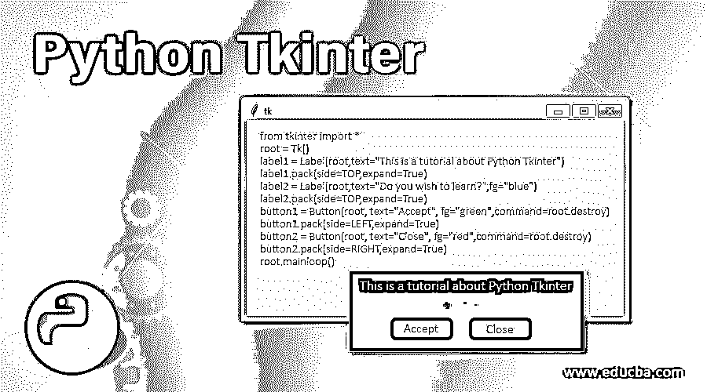
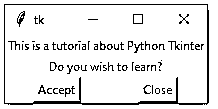
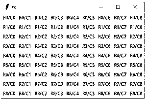
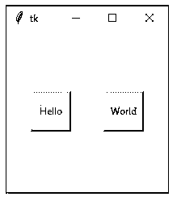

# Python Tkinter

> 原文：<https://www.educba.com/python-tkinter/>




## Python Tkinter 简介

Python Tkinter 是 Python 中支持的标准图形用户界面(GUI)。当 Tkinter 与 Python 一起使用时，它可以非常方便和快速地创建 GUI 的[。使用 Tkinter 的主要优点是它有一个面向对象的接口。任何应用程序或网站的成功取决于它与用户交互的好坏，即一个吸引人的图形界面有助于创建一个好的应用程序。Python Tkinter 为我们做到了这一点。](https://www.educba.com/what-is-gui/)

**语法:**

<small>网页开发、编程语言、软件测试&其他</small>

以下是创建 Tkinter 应用程序的步骤和语法:

*   首先，我们需要导入 Tkinter 模块。
*   其次，我们需要创建一个容器窗口。
*   然后我们向容器窗口添加任意数量的小部件。
*   最后，我们在小部件上应用事件触发器。

#在这里，我们导入 Tkinter 模块

```
import tkinter
```

#在这里，我们创建容器窗口对象

```
c = tkinter.Tk()
```

需要添加的部件数量

#这将执行应用程序，直到它被停止

```
c.mainloop()
```

### 我们为什么要用 Python Tkinter？

Python Tkinter 是为应用程序创建漂亮 GUI 的最受欢迎的包，因为它有多种方法，如 pack()、grid()和 place()用于几何管理。它有标准的属性尺寸、字体、颜色、光标、锚点和位图来提供更好的 GUI。此外，它有大量的小部件可供选择，而且是迄今为止最容易使用的。所有这些特性的组合使得 Python Tkinter 在 Python 开发人员中非常受欢迎，并成为一个很好的使用工具。

### Python Tkinter 的方法

以下是 Python Tkinter 中用于几何管理的方法:-

#### 1.包装()

在将子部件放入父部件之前，它先将子部件放入块中。

**语法:**

```
widget.pack(pack_options)
```

pack_options 的可能选项如下:

*   **展开:**为布尔值，可为真，也可为假。当它设置为 True 时，子小部件会扩展以填充父小部件的全部空间。
*   **填充:**默认值为无。其他值为 X(仅水平填充)、Y(仅垂直填充)和 both(水平和垂直填充)
*   **side:** 它决定了子部件打包时所依据的父部件的边。默认值是顶部。其他值是底部、左侧和右侧。

**举例:**

```
from tkinter import *
root = Tk()
label1 = Label(root,text="This is a tutorial about Python Tkinter")
label1.pack(side=TOP,expand=True)
label2 = Label(root,text="Do you wish to learn?",fg="blue")
label2.pack(side=TOP,expand=True)
button1 = Button(root, text="Accept", fg="green",command=root.destroy)
button1.pack(side=LEFT,expand=True)
button2 = Button(root, text="Close", fg="red",command=root.destroy)
button2.pack(side=RIGHT,expand=True)
root.mainloop()
```

**输出:**




#### 2.网格()

它先将子部件放在网格中，然后再将其放入父部件中。

**语法:**

```
widget.grid(grid_options)
```

grid_options 的可能选项如下:

*   **column:** 它决定将子小部件放入父小部件的列。默认值为 0，表示最左边的列。
*   **columnspan:** 它决定了小部件占用的列数。默认值为 1。
*   **ipadx，ipady:** 它表示子部件在父部件边框内的水平和垂直填充，以像素为单位。
*   **padx，pady:** 它表示子部件在父部件边界之外的水平和垂直填充，以像素为单位。
*   **row:** 表示放置小工具的行。
*   **rowspan:** 它决定了小工具占据的行数。默认值为 1。

**举例:**

```
from tkinter import *
root = Tk()
for r in range(9):
   for c in range(9):
       Label(root , text = 'R%s/C%s'%(r,c),
             borderwidth = 1).grid(row = r , column = c , rowspan = 1 , columnspan = 1 , padx = 3 , pady = 3)
root.mainloop()
```

**输出:**

**

** 

#### 3.地点()

它通过将小部件放在开发人员指定的特定位置来组织它们。

**语法:**

```
widget.place(place_options)
```

place_options 的可能选项如下:

*   **anchor:** 这决定了小工具的确切位置。这些值对应于指南针中可用的不同方向。可能的值为 N、S、E、W、NE、NW、SE 和 SW。默认值是左上角的 NW。
*   **bordermode:** 可能的值是 inside 和 outside。默认是在里面。
*   **高度、宽度:**以像素表示高度和重量。
*   **relheight，relwidth:** 这表示相对于父小部件的高度和宽度的高度和宽度。这是一个介于 0.0 和 1.0 之间的浮点数
*   **relx，rey:** 这表示子部件相对于父部件的偏移量。它是一个介于 0.0 和 1.0 之间的浮点数
*   **x，y:** 这表示子部件的垂直和水平偏移，单位为像素。

**举例:**

```
from tkinter import *
root = Tk()
button1 = Button(root, text ="Hello" , fg="blue")
button1.pack(side = TOP)
button1.place(anchor = E , relheight = 0.25 , relwidth = 0.25 , relx = 0.4 , rely = 0.5)
button2 = Button(root, text = "World" , fg = "green")
button2.pack(side = BOTTOM)
button2.place(anchor = W , relheight = 0.25 , relwidth = 0.25 , relx=0.6 , rely= 0.5)
root.mainloop()
```

**输出:**




### 结论

终于是时候结束这篇关于 Python Tkinter 的文章了。在本文中，我们简要讨论了 Python Tkinter 的基础知识。我们已经提到了为什么使用 Python Tkinter，并且已经看到了使用它的语法。最后但同样重要的是，我们看到了 Python Tkinter 中使用的过程以及示例。所以下次你决定创建一个用户友好的界面时，记得使用 Python Tkinter。

### 推荐文章

这是 Python Tkinter 的指南。这里我们用语法和例子讨论 Python Tkinter 的简介和不同的方法。您也可以看看以下文章，了解更多信息–

1.  [Python 特性](https://www.educba.com/python-features/)
2.  [Python 反串](https://www.educba.com/python-reverse-string/)
3.  [t 内部检查按钮](https://www.educba.com/tkinter-checkbutton/)
4.  [Tkinter 滚动条](https://www.educba.com/tkinter-scrollbar/)