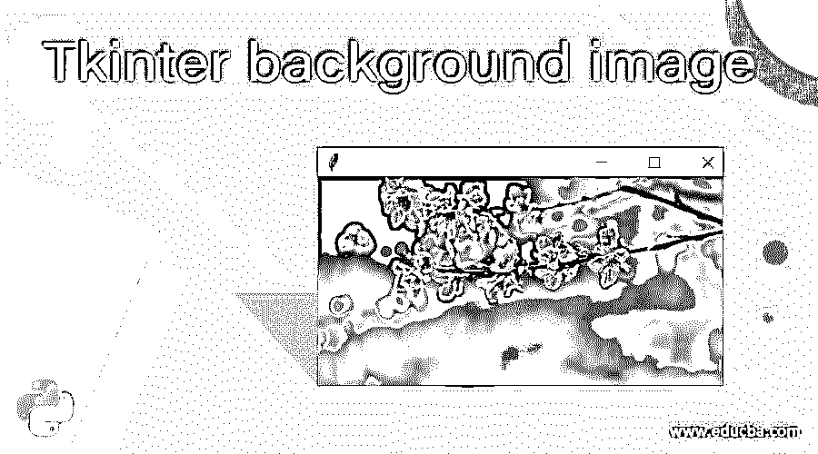
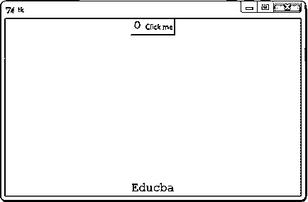

# t 中间背景图像

> 原文：<https://www.educba.com/tkinter-background-image/>




## Tkinter 背景图像介绍

在 Tkinter 中，背景图像是在 Tkinter 窗口的背景中设置的图像，或者我们可以说是根或父或主窗口。因此，我们可以将 Tkinter 窗口的背景图像设置定义为使用诸如 background 或 bg 之类的属性来设置背景图像或颜色，从而将图像设置到父窗口。一般来说，Tkinter 提供了一种使用 PhotoImage()函数添加或设置背景图像的方法，方法是传递图像的文件名或图像的源路径。该方法可用于设置任何小部件的背景图像，并且不需要导入任何额外的模块。

### 如何在 Tkinter 中设置背景图片？

在这篇文章中，我们将讨论如何设置背景图像，因为这也是创建一个有吸引力的图形用户界面最需要的属性，这些图像用于设计网站标志、动画、背景和前景图像等。在 Tkinter 中，有一个函数用于设置窗口、按钮或任何小部件的背景图像。在 Tkinter 中，和在设置字体一样，有一个单独的设置背景图像的模块叫做 Python image library (PIL)，函数是 PhotoImage()；此函数使用图像文件名或要设置为背景图像的图像的源路径作为参数。

<small>网页开发、编程语言、软件测试&其他</small>

在这篇文章中，我们将看到如何设置背景图片。但是我们要注意，要给整个窗口设置一个背景图像；我们不能仅仅使用这个函数将图像设置为整个背景，而不仅仅是照片区域，这可以使用 canvas 小部件来完成。在本文中，我们将看到在程序中使用 PhotoImage()函数来设置背景图像，这比使用 Python 图像库(PIL)模块要容易得多。

还有另一种方法是使用 canvas 小部件在背景中设置图像，这是主要推荐的方法，因为它用于绘制图形、创建图形等。它提供了一个方法 create_image()，但是这个方法不能直接使用，所以当我们使用 canvas 时，我们必须使用 PhotoImage()对象，这个方法只支持 ppm 或 PGM 文件的图像。

现在让我们看看 PhotoImage()函数的语法，以及该函数在下一节中作为输入接受的参数。

**语法:**

```
PhotoImage(Filename or source path of where the file is saved)
```

**参数:**

**Filename:** 此参数是必需的参数，用于指定文件的文件名或路径位置。

该函数只返回作为参数传递的图像，以便在按钮、窗口等小部件上显示。

该功能用于设置背景图像；另外，现在让我们看一个例子来演示它。该功能只能支持 PPM/PGM/GIF 等。格式图像，但如果我们希望我们的应用程序支持所有类型的图像格式，那么有一个 Python 库用于这样的图像，我们必须导入 Python 图像库(PIL ),它可以将其他格式的图像转换为图像对象。如前所述，我们还可以使用 canvas 小部件来设置背景图像。

### Tkinter 背景图像示例

以下是 Tkinter 背景图像的示例

#### 示例#1

在这个例子中，我们将看到如何在不使用任何图像模块或画布的情况下，只使用 PhotoImage()函数来设置背景图像。

**代码:**

```
from Tkinter import *
import Tkinter as tk
master = tk.Tk()
bgimg= tk.PhotoImage(file = "Tulips.ppm")
#Specify the file name present in the same directory or else
#specify the proper path for retrieving the image to set it as background image.
limg= Label(master, i=bgimg)
limg.pack()
master.mainloop()
```

**输出:**


在上面的程序中，我们可以看到我们拍摄了一个普通的样本图像“Tulips.ppm”，它保存在 Python 软件的同一个目录中，这个图像作为参数传递给 PhotoImage()函数。在上面的程序中，我们试图将一个图像设置为父窗口的背景图像，输出如上面的截图所示。在这个截屏中，图像适合于带有标签小部件的整个窗口，标签小部件完全被这个图像覆盖。

#### 实施例 2

现在让我们看看如何在下面的程序中设置按钮的背景图像和按钮的文本。

**代码:**

```
from Tkinter import *
import ttk
master = Tk()
master.geometry("500x300")
Label(master, text = 'Educba', font =(
'Courier', 15)).pack(side = BOTTOM)
img = PhotoImage(file = "circle.ppm")
Button(master, text = 'Click me', image = img,compound = LEFT).pack(side = TOP)
master.mainloop()
```

**输出:**




在上面的程序中，我们可以看到我们正在使用 ttk 模块来定义标签小部件，我们还导入了 Tkinter，我们导入了所有内容，因为它既有按钮小部件，也有 PhotoImage()函数。因此，在上面的程序中，我们可以看到，当我们定义或声明按钮时，我们可以通过使用按钮小部件中的图像选项来设置按钮的背景图像。

输出可以在上面的截图中看到。在上面的程序中，我们可以看到要在父窗口上显示的文本被声明在底部，因为在标签小部件中，我们已经将文本选项侧值声明为“底部”。我们还看到显示在按钮上的图像也将选项复合值声明为“左侧”,因此我们可以看到按钮左侧的圆形图像，它位于写在按钮上的文本之前。

### 结论

本文的结论是，为了在 Tkinter 中设置背景图像，该模块提供了一个名为 PhotoImage()的函数，它将图像文件名或源路径作为参数，并返回图像对象。在本文中，我们看到了如何在第一个示例中使用这个图像并设置背景图像，然后我们还看到了如何在带有示例和相应输出的按钮上设置背景图像。在本文中，我们还讨论了如何使用 PIL 模块，canvas 的 create_image()函数，来设置背景图像。

### 推荐文章

这是 Tkinter 背景图像的指南。在这里，我们用例子来讨论如何在 Tkinter 中设置背景图像。您也可以看看以下文章，了解更多信息–

1.  [t inter 选项菜单](https://www.educba.com/tkinter-optionmenu/)
2.  tkinter font
3.  [Tkinter 文本](https://www.educba.com/tkinter-text/)
4.  [Tkinter 滚动条](https://www.educba.com/tkinter-scrollbar/)


