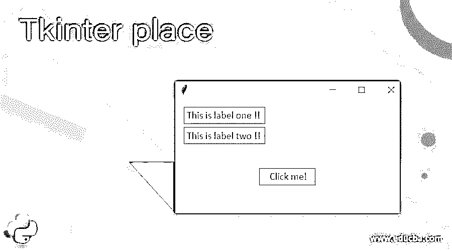

# Tkinter place

> 原文：<https://www.educba.com/tkinter-place/>




## Tkinter place 简介

Tkinter 是用来在 python 中创建 GUI 的，是我们拥有的最常用的库。通过使用它，我们可以非常容易和快速地创建一个 GUI。顾名思义，它用于为 GUI 组件指定位置。Tkinter 有很多布局管理器的地方就是其中之一。通过使用位置，我们可以指定窗口的大小或位置。这是 Tkinter 模块中的一个几何管理器位置小部件。

**语法**

<small>网页开发、编程语言、软件测试&其他</small>

为了利用这个地方，我们首先需要将 Tkinter 包导入到我们的程序中。我们可以用它来放置按钮、标签和许多其他 GUI 东西，以便将它们正确地放置到窗口中。现在我们将看到在我们的程序中使用它的语法；

**举例:**

```
place(relx = val, rely = val, anchor = VAL)
```

为了使用它，我们需要在里面传递三个参数。它们被命名为 relax、rely 和 anchor，用于在屏幕上放置我们的小部件。我们可以在 Tkinter 模块中可用的任何小部件上调用这个方法来为用户开发 GUI。让我们看一个练习语法来更好地理解它，见下文；

```
button1.place(relx =1, rely =1, anchor = N)
```

这里我们在 button 小部件上调用这个方法，并在这里放置变量 1、1 和 N，分别用来放松、依赖和锚定。

### Tkinter 中的 place 方法是如何工作的？

到目前为止，我们知道我们使用一个地方来放置窗口上的小部件。它可以是窗口上的相对或绝对位置。我们在 Tkinter 中有三种不同的布局，分别命名为 place、pack 和 grid。这三者都是基于不同的定位。地方是基于绝对定位的；我们将在下面详细讨论绝对定位；

绝对定位:这可以称为固定定位，而不是相对定位。假设我们有一些不同大小的窗口，这些窗口将我们所有的小部件封装在过去的正确位置。但是假设我们想在将来调整窗口的大小，那么无论窗口大小如何，窗口小部件都不会移动。此外，每个部件的大小将以像素为单位。这意味着应用程序的外观和感觉将因平台而异，正如我们在许多 web 应用程序中看到的那样，它在 chrome、firefox 和其他浏览器上看起来是不同的。这里的情况也是一样，在 Mac、Linux 和 windows 上的 GUI 会有所不同，等等。通过使用这个，我们可以在窗口上放置小部件，如标签、按钮、文本等。现在我们将看到一个如何使用它的例子，以及它是如何在窗口上放置小部件的。我们将看到一个简单的例子，初学者可能会觉得不稳定，如下所示；

**举例:**

```
from tkinter import *
parent = Tk()
parent.geometry("150x150")
button1 = Button(parent, text = "Hi I am button! Click me to start!!")
button1.place(relx = 1, relay =1, anchor = N)
mainloop()
```

在上面的代码行中，我们为用户创建了一个 GUI，并向他们显示了一个按钮。place 入门的第一件事是将 Tkinter 模块导入到程序中，以便正确使用它的所有方法和小部件；它将帮助我们以尽可能简单的方式更快地创建 GUI。导入完成后，我们使用 Tkinter 对象在这里创建一个窗口，并为窗口指定一个大小，这里是 150 像素。之后，我们使用可用的按钮部件创建一个按钮，并在其中传递参数。它采用的一个参数是父对象，即这里的 Tkinter。之后，我们将文本分配给将显示在按钮上的按钮。此外，我们可以通过单击名为 events 的按钮来调用或触发一些事件。紧接着，我们在这里调用 place 方法，通过初始化所有变量来给出这个按钮在窗口上的位置。最后，我们调用 mainloop()来初始化窗口。

### 构造器

正如我们已经看到的，这需要不同的参数，如高度、锚、relx、rely 等等。我们将在下面更详细地讨论这些参数；

下面是其构造函数的语法，见下文；

```
place(relx = val, rely = val, anchor = VAL)
```

*   **高度:**通过使用该参数，我们可以用像素指定高度。
*   **宽度:**通过使用该参数，我们可以以像素为单位指定宽度。
*   **anchor:** 通过使用这个参数，我们可以指定 GUI 组件的原始位置，或者我们可以说窗口上的 widget。它提供了许多不同的选项来定位小部件，如 S、W、E、N、SW、WE、EN。这个位置将指示拐角，并且它还有一个默认位置是 NW。
*   **松弛:**该参数表示 0.0 之间的水平偏移。到 1.0。
*   **继电器:**该参数代表 0.0 之间的垂直偏移。到 1.0。
*   Y: 这是以像素为单位的垂直偏移量。
*   **X:** 这是以像素为单位的水平偏移。

### 方法

我们有一些可用的方法，可以用在如下的地方:

*   pack (): 这个方法用于在垂直和水平框中格式化或定位我们的 GUI 部件。
*   **grid ():** 顾名思义，它可以处理列表数据，并被定义为设法以二维方式显示小部件的方法。

### Tkinter place 示例

在本例中，我们创建了两个标签，一个显示在窗口的中心，另一个显示在窗口的左上角。

**举例:**

```
from tkinter import *
parent = Tk()
master.geometry("300x300")
#label one creating
l = Label(parent, text = "This is label one !!")
l.place(relx = 1, rely = 1, anchor = NW)
#label two creating
l = Label(parent, text = "This is label two !!")
l.place(relx = 1, rely = 1, anchor = CENTER)
mainloop()
```

**输出:**


### 结论

通过使用这个 place 方法，我们可以将小部件放在 GUI 窗口上。绕过它的构造函数的各种参数，我们可以把它们放在右边、左边、上边和下边。此外，我们也可以将它们放在窗户的角落。但是要使用它，我们需要将 Tkinter 模块导入我们的应用程序。

### 推荐文章

这是去 Tkinter place 的指南。在这里，我们将讨论如何在 Tkinter 中使用 place 方法，以及构造函数、方法和示例。您也可以看看以下文章，了解更多信息–

1.  tkinter bind
2.  [Tkinter 组合框](https://www.educba.com/tkinter-combobox/)
3.  之后的 [Tkinter](https://www.educba.com/tkinter-after/)
4.  tkinter grid


