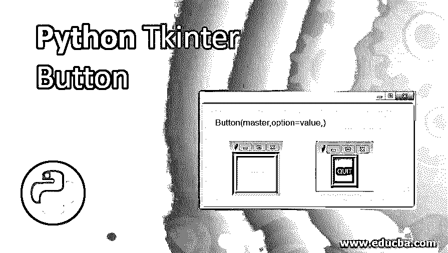
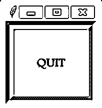
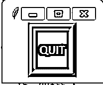

# Python Tkinter 按钮

> 原文：<https://www.educba.com/python-tkinter-button/>




## Python Tkinter 按钮介绍

Python Tkinter button 是 Python 中最常用的图形用户界面之一，用于设计 GUI 中的按钮。这里，Tkinter 中的按钮小部件用于在正在开发的 GUI 界面中构建各种类型的按钮。

**语法:**

<small>网页开发、编程语言、软件测试&其他</small>

`Button(master,option=value,)`

### Python Tkinter 按钮的属性

以下是属性列表:

| **选项** | **描述** |
| 活动背景 | 单击按钮时按钮背景区域的颜色。 |
| 活动前景 | 单击按钮时按钮中文本的颜色。 |
| 弹底引信（base detonating 的缩写） | 按钮的边框宽度 |
| 锥齿轮 | 按钮的初始背景色。 |
| 命令 | 点击按钮时需要进行的操作。 |
| 细粒 | 放置在按钮上的文本标签的颜色。 |
| 字体 | 按钮标签中使用的文本字体。 |
| 高度 | 表示所用按钮的高度。 |
| 高亮颜色 | 焦点高亮颜色 |
| 图像 | 如果按钮中需要使用图像来代替文本。 |
| 证明合法 | 文本需要如何在按钮中对齐，它是否需要左对齐或右对齐，否则在中心。 |
| 衬垫 | 标签和按钮左右两侧的按钮角之间的空白区域。 |
| pady | 标签和按钮角之间的空白区域位于按钮区域的上方和下方。 |
| 减轻 | 提到需要使用的边界的种类，一些通常的值是凹陷、凹槽、凸起和脊。 |
| 状态 | 当鼠标在它上面时需要设置的选项。

*   Disable: gray button
*   Activate: button

保持激活 |
| 强调 | 用于给按钮中的标签文本加下划线，当值为-1 时，不加下划线，而当值为非负数时，文本中相应的字符将加下划线。 |
| 宽度 | 提到按钮的宽度。 |
| 包装长度 | 允许文本标签换行。 |

### Python Tkinter 按钮示例

以下是 Tkinter 的一些例子:

#### 示例#1

**代码:**

```
import tkinter as tk
Object creation for tkinter
parent = tk.Tk()
button = tk.Button(text="QUIT",
                   bd=10,
                   bg="grey",
                   fg="red",
                   command=quit,
                   activeforeground="Orange",
                   activebackground="blue",
                   font="Andalus",
                   height=2,
                   highlightcolor="purple",
                   justify="right",
                   padx=10,
                   pady=10,
                   relief="groove",
                   )
pack geometry manager for organizing a widget before palcing them into the parent widget.
possible options "Fill" [X=HORIZONTAL,Y=VERTICAL,BOTH]
                 "side" [LEFT,RIGHT,TOP,UP]
                 "expand" [YES,NO]
button.pack(fill=tk.BOTH,side=tk.LEFT,expand=tk.YES)
kick the program
parent.mainloop() 
```

**输出:**




**说明:**

为了使用 tkinter 实现 GUI 功能，需要安装 tkinter 库。可以使用 pip 或任何其他标准 python 安装技术来安装它。程序从引用名为 tk 的 tkinter 库的导入开始。tkinter 类的对象是以父类的名称创建的。接下来，用列出的属性值声明一个按钮变量，

*   边框宽度:10
*   背景色:灰色
*   前景色:红色，
*   操作命令:退出
*   活动前景色:橙色
*   活动背景色:蓝色
*   字体:Andalus
*   高度:2
*   高光颜色:紫色
*   对齐的理由:右
*   x 轴的填充:10
*   y 轴的填充:10
*   浮雕值:凹槽

启动上面给出的参数会相应地生成一个按钮；由于生成的按钮是一个小部件，所以使用 pack 命令将它打包到父小部件中。从技术上讲，pack 命令是以方法 pack()的形式出现的。将此方法应用于变量按钮会在基本小部件上启动一个具有上述属性的小部件。这里使用的基本小部件可以是面板或任何其他图形用户界面。在封装按钮变量时，pack()方法与三个主要参数相关联。

它们如下:

*   填充:X =水平，Y =垂直，两者
*   侧面:左、右、上、上
*   展开:是，否

最后，触发 Tkinter 对象的 mainloop()函数，以设置 GUI 创建程序并执行。我们可以注意到一个活动按钮被放置在一个复杂的 GUI 面板上，在程序执行时被提示。

#### 实施例 2

**代码:**

```
import tkinter as tk
Object creation for tkinter
parent = tk.Tk()
button = tk.Button(text="QUIT",
                   bd=10,
                   bg="black",
                   fg="white",
                   command=quit,
                   activeforeground="Orange",
                   activebackground="blue",
                   font="calibri",
                   height=2,
                   highlightcolor="purple",
                   justify="left",
                   padx=2,
                   pady=2,
                   relief="ridge",
                   )
pack geometry manager for organizing a widget before palcing them into the parent widget.
button.pack()
kick the program
parent.mainloop() 
```

**输出:**




**说明:**

这个程序在功能上与上面的非常相似，但是已经创建的小部件的属性在这里被广泛地修改了。首先，让我们讨论一下与这个按钮部件密切相关的各种显示属性，

*   边框宽度:10
*   背景色:黑色
*   前景色:白色，
*   操作命令:退出
*   活动前景色:橙色
*   活动背景色:蓝色
*   字体:calibri
*   高度:2
*   高光颜色:紫色
*   对齐方式:左对齐
*   x 轴的填充:2
*   y 轴的填充:2
*   起伏值:山脊

同样，这里启动上述参数会像前面一样相应地创建一个按钮，这里还会更精确地对小部件进行打包，以表明应用程序被认为是在没有打包操作的情况下被销毁的。因此，打包是一个默认的操作，但是在不同的术语中，打包是通过放置零个参数来实现的。尽管如此，在不同的术语中，打包是通过放置零参数来实现的。这意味着打包过程的所有参数值都通过其默认关联进行结算。

最后，触发 Tkinter 对象的 mainloop()函数，以设置 GUI 创建程序并执行。我们可以注意到一个活动按钮被放置在一个复杂的 GUI 面板上，在程序执行时被提示。

### 结论

Tkinter 为图形用户界面设计提供了一些很酷的选项，并且详细介绍了按钮设计和执行的主要形式。

### 推荐文章

这是一个 Python Tkinter 按钮的指南。这里我们讨论 python Tkinter 按钮的介绍，以及相应的语法、属性和相应的例子。您也可以浏览我们推荐的其他文章，了解更多信息——

1.  [Python Slice Stringint](https://www.educba.com/python-slice-string/)
2.  [Python 开关案例](https://www.educba.com/python-switch-case/)
3.  [Python 上下文库](https://www.educba.com/python-contextlib/)
4.  [Tkinter Widgets](https://www.educba.com/tkinter-widgets/)