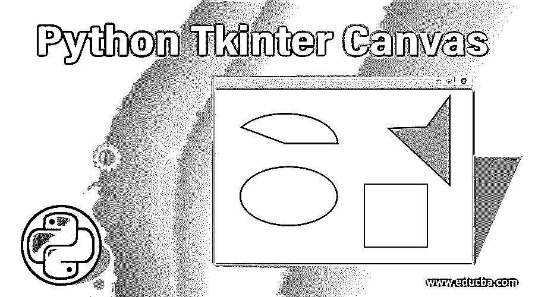
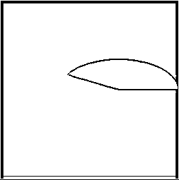
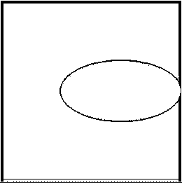
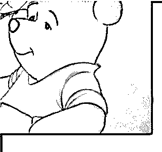
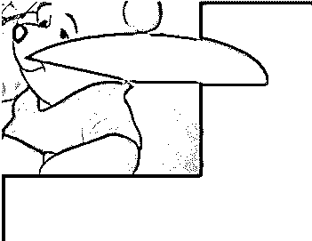
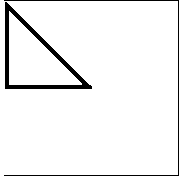
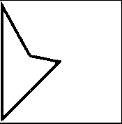
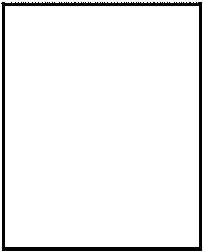

# Python Tkinter 画布

> 原文：<https://www.educba.com/python-tkinter-canvas/>




## Python Tkinter Canvas 简介

Python Tkinter 是一个标准的包，其中 canvas 是一个类，它可以帮助人们借助它提供的许多功能来创建不同的形状。在这里，形状可以是简单的部件、文本框，也可以是任何复杂的布局。Tkinter 有助于轻松而强大地构建 GUI 应用程序。坐标、颜色、宽度等灵活的属性。，帮助非常容易地创建任何项目。

****语法:****

<small>网页开发、编程语言、软件测试&其他</small>

下面是创建任何小部件的语法:

```
w = Canvas ( Master, option=value, ... )
```

*   **主窗口:**“主窗口”是父窗口，窗口小部件需要在这里被吸收。
*   **选项:**“选项”是与所使用的小工具相关的各种参数。

### Python Tkinter 画布示例

以下是 Python Tkinter Canvas 的不同示例。

#### 示例#1

****代号:****

```
import tkinter
top = tkinter.Tk()
Can = tkinter.Canvas(top, bg="red", height=300, width=300)
coord = 100, 100, 300, 200
arc = Can.create_arc(coord, start=0, extent=150, fill="grey")
Can.pack()
top.mainloop()
```

****输出:****




**解释:**可以看出，画布是如何首先被用来创建一个矩形框的。这个画布有一个属性集，比如画布的背景颜色、高度和宽度。现在，因为我们有了一个背景集，我们把任何部件放在上面，就像这里我们放了 arc 一样。Arc 已经设置了某些属性，如颜色和坐标。这里 x1，y1 是(100，100) & x2，y2 是(300，200)。类似地，我们可以在同一种画布上创建任何小部件。

#### 实施例 2

****代号:****

```
import tkinter
top = tkinter.Tk()
Can = tkinter.Canvas(top, bg="red", height=300, width=300)
oval = Can.create_oval(100, 100, 300, 200, fill="grey")
Can.pack()
top.mainloop()
```

**输出:**




**解释:**椭圆形小部件是在同一种画布上创建的。通过这种方式，可以创建矩形、弧形、线条、文本等小部件。这里的 Can.pack()是 Can 里面的两个属性:fill 和 expand 如下图:

```
Can.pack(fill=tkinter.BOTH,expand = 1)
```

Tkinter。BOTH 指的是管理器赋予小部件的灵活性，如果需要的话，可以进行水平和垂直扩展。“扩展”可以取值 0 或 1。如果 expand = 1，这意味着它告诉管理器为小部件框分配额外的空间，以便在父窗口中容纳小部件。现在让我们看看如何在画布上嵌入任何图像。

#### 实施例 3

**代码:**

```
import tkinter
top = tkinter.Toplevel()
Can = tkinter.Canvas(top, bg="blue", height=500, width=500)
imagename = tkinter.PhotoImage(file = "C:/Users/giphy.gif")
image = Can.create_image(50, 50, image=imagename)
Can.pack()
top.mainloop()
```

**输出:**




**解释:**正如人们注意到的，我们有了具有高度、宽度和背景颜色的画布 reddy。tkinter 包装的哪个照片图像帮助我们将我们的图像作为一个项目保存在它上面。我们将图像名“giphy.gif”保存在位置“C:/Users/”。这个位置在照片图像中被引用，然后被放置在画布上。

#### 示例 4–画布中的多个项目

**代码:**

```
#Tkinter
import tkinter
top = tkinter.Toplevel()
Can = tkinter.Canvas(top, bg="blue", height=500, width=500)
imagename = tkinter.PhotoImage(file = "C:/Users/i505860/OneDrive - SAP SE/Documents/My Folder/Personnel/EDUCBA(Mumbai)/2020_Articles/Feb/giphy.gif")
image = Can.create_image(50, 50, image=imagename)
coord = 10, 50, 400, 200
arc = Can.create_arc(coord, start=0, extent=150, fill="red")
Can.pack(fill=tkinter.BOTH,expand = 1)
top.mainloop()
```

**输出:**




**解释:**当你在画布上放置两件物品时。一个压在另一个上面。如上图，图像“giphy.gif”上方有一条弧线。

#### 示例 5–创建多边形

**代码:**

```
from tkinter import *
canvas_w = 200
canvas_h =200
python_green = "#476042"
master = Tk()
Can = Canvas(master, 
           width=canvas_w, 
           height=canvas_h)
Can.pack()
points = [0,0,100,100, 0, 100]
Can.create_polygon(points, outline=python_green, 
            fill='red', width=3)
mainloop()
```

**输出:**




**解释:**可以注意到，多边形是在画布上用红色创建的，创建在点:(0，0)，(100，100)，(0，100)之间。(0，0)总是从左上角开始。赋予多边形的点数越多，就可以创建越多的定制多边形。如下图所示:

#### 示例 6–增加点数

**代码:**

```
from tkinter import *
canvas_w = 200
canvas_h =200
python_green = “#476042”
master = Tk()
Can = Canvas(master, 
           width=canvas_w, 
           height=canvas_h)
Can.pack()
points = points = [0, 0, 0, 200, 100, 100, 50, 90]
Can.create_polygon(points, outline=python_green, 
            fill=’green’, width=3)
mainloop()
```

**输出:**




**说明:**我们手动给点，创建多边形。然而，这种方法非常繁琐和耗时。

#### 示例# 7–删除小部件

有多种方法可以从画布中删除小部件。

**代码:**

```
import tkinter
top = tkinter.Toplevel()
Can = tkinter.Canvas(top, bg="blue", height=500, width=500)
imagename = tkinter.PhotoImage(file = "C:/Users/giphy.gif")
image = Can.create_image(50, 50, image=imagename)
Can.delete(image)
Can.pack()
top.mainloop()
```

**输出:**




**解释:**如果有人注意到，“Can.delete(image)”帮助将“giphy.gif”从画布中移除。如果存在多个图像，并且想要移除画布上的所有图像。一个简单的代码是:

```
Can.delete(ALL)
```

### 结论

正如我们在上面看到的，Canvas 是来自包 Tkinter 的一个类，它帮助在它上面保存项目。它提供了一个图形化工具，可以在画布上创建对象，如直线、弧线、椭圆、图像和其他小部件。一旦很好地掌握了基本的小部件，甚至可以探索定制的小部件。把模型概化，以应用的形式呈现出来，是一个人能想到的最好的办法。因此，了解 Tkinter Canvas 及其小部件将极大地提高您的 python 水平。

### 推荐文章

这是一个 Python Tkinter Canvas 的指南。在这里，我们分别讨论基本概念以及不同的示例和代码实现。您也可以阅读以下文章，了解更多信息——

1.  [t 帧间帧](https://www.educba.com/tkinter-frame/)
2.  [标签帧间](https://www.educba.com/tkinter-labelframe/)
3.  [Tkinter 列表框](https://www.educba.com/tkinter-listbox/)
4.  [Python Tkinter](https://www.educba.com/python-tkinter/)