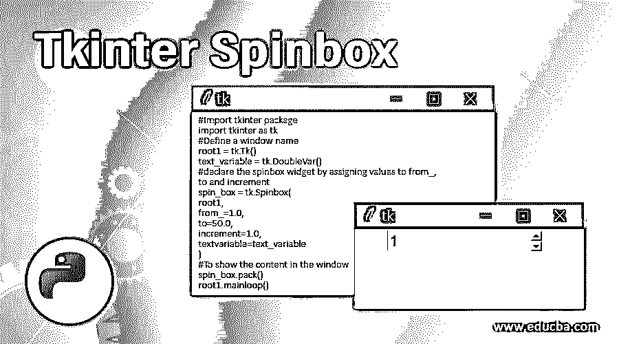
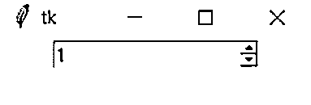

# Tkinter 旋转盒

> 原文：<https://www.educba.com/tkinter-spinbox/>




## Tkinter Spinbox 简介

Tkinter Spinbox 小部件是 Entry 小部件的替代产品。它可以用来代替普通输入，用户只能从有限的值中进行选择。当有固定数量的值，并且我们想要选择这些值时，我们使用一个 spinbox 小部件，这是一个标准的 Tkinter entry 小部件变体。它非常像一个普通的小部件，只是它可以指定允许的值，可以是范围或元组。这个 spinbox 小部件仅在 python 以上的版本中可用。

**Tkinter spin box 的语法:**

<small>网页开发、编程语言、软件测试&其他</small>

```
w = Spinbox(master, option,..)
```

其中 master 表示父窗口，option 是可用于小部件的选项列表，options 是用逗号分隔的键值对。

### Tkinter Spinbox 小部件

小部件最常用的选项列表包括:

*   **活动背景:**该选项代表当鼠标放在滑块和箭头上时它们的颜色。

*   **bg:** 该选项代表当鼠标不在滑块和箭头上时的颜色。

*   **bd:** 槽被围绕槽的整个周长的三维边界覆盖，该选项代表其宽度。它还代表箭头和滑块上三维效果的宽度。默认情况下，槽的周边没有边框，箭头和滑块有两个像素的边框。

*   **命令:**该选项在滚动条移动时调用该过程。

*   **字体:**表示小工具中使用的字体。

*   **fg:** 这代表 spinbox 中文本的颜色。

*   **光标:**当移动器出现在滚动条上时，此选项出现。

*   **disabledbackground:** 每当小工具被禁用时，该选项代表要使用的背景颜色。

*   **disabledforeground:** 每当小工具被禁用时，该选项代表要使用的文本颜色。

*   **格式:**该选项表示字符串格式，没有默认值。

*   **from:** 该选项代表可用于限制微调框范围的最小值。

*   **justify:** 该选项的默认值为 LEFT。

*   ****repeatDelay** :** 该选项和重复间隔控制自动重复按钮，两个值都可以用毫秒表示。

*   **重复间隔:**该选项和重复延迟控制自动重复按钮，两个值都可以用毫秒表示。

*   **状态:**该选项可以是正常、禁用或只读。此选项的默认值是 NORMAL。

*   **文本变量:**该选项文本变量没有默认值。

*   **to:** 该选项代表可用于限制微调框范围的最小值。

*   **验证:**该选项代表验证的方式。该选项的默认值为无。

*   **validateCommand:** 该选项代表验证的回调。该选项没有默认值。

*   **values:** 该选项表示小部件元组中包含的有效值。此选项可以覆盖“从”、“到”和“增量”。

*   **vcmd:** 该选项代表验证的回调。该选项没有默认值。

*   **换行:**如果条件为真，则上下按钮换行。

*   **浮雕:**凹陷是浮雕的默认值。

*   **宽度:**该选项代表小工具中字符的宽度。默认值为 20。

*   该选项允许用户水平滚动 spinbox。

### Tkinter Spinbox 的方法

有几种方法可以在 spinbox 对象上实现，它们是:

*   **Delete(startindex[，endindex]):** 当必须删除某个特定字符或某个范围的字符时，我们使用了这种方法。

*   **get(startindex[，endindex]):** 当必须返回一个特定的字符或一个字符范围时，我们使用了这个方法。

*   **identify(x，y):** 给定位置，可以使用这种方法来标识小部件元素。

*   **index(index):** 根据给定的索引，使用此方法返回索引的绝对值。

*   **插入(索引，[，字符串]..):**索引的指定位置是使用此方法插入字符串的位置。

*   **invoke(element):** 使用这个方法调用 spinbox 的按钮。

*   这个方法有助于清除选择。

*   **selection_get():** 使用此方法返回选定的文本。如果当前没有选择，此方法将引发异常。

*   **selection('range '，start，end):** 使用此方法选择代表起始值和结束值的索引之间的文本。

*   **selection('to '，index):** 使用此方法选择给定索引和选择锚点之间的文本。
*   **selection('from '，index):** 给定的索引指定了选择锚点必须指向的位置。选择锚点最初设置为零。

### Tkinter Spinbox 示例

以下是 Tkinter Spinbox 的示例:

Python 程序使用 Tkinter Spinbox 从 1 到 60 的数字列表中进行选择，数字的增量为 1。

**代码:**

```
#Import tkinter package
import tkinter as tk
#Define a window name
root1 = tk.Tk()
text_variable = tk.DoubleVar()
#declare the spinbox widget by assigning values to from_, to and increment
spin_box = tk.Spinbox(
    root1,
    from_=1.0,
    to=50.0,
    increment=1.0,
    textvariable=text_variable
)
#To show the content in the window
spin_box.pack()
root1.mainloop()
```

**输出:**




在上面的代码中，我们首先导入 Tkinter 包和库，然后通过给它命名来定义一个窗口。在我们的例子中，我们称之为 tk。在我们的例子中，我们试图保持固定的值必须是浮点数或双精度数；因此，我们声明一个变量，并将其赋给 double。然后，我们用 from_，to 值定义 spinbox 小部件。在我们的示例中，我们允许用户从值 1.0 到 50.0 的范围内进行选择，每次用户单击向上的箭头，值就会增加 1，上面的输出快照中也显示了同样的情况。打包功能用于显示窗口中的内容。

### 结论

本文学习了 Tkinter spinbox，Tkinter spinbox 的语法属性、方法和示例。它可以用来创建我们自己的 GUI 以及 Tkinter 提供的其他小部件。

### 推荐文章

这是 Tkinter Spinbox 的指南。在这里，我们讨论 Tkinter Spinbox 小部件、方法、示例及其代码实现的简要概述。您也可以浏览我们推荐的其他文章，了解更多信息——

1.  [Tkinter 列表框](https://www.educba.com/tkinter-listbox/)
2.  [t 内部检查按钮](https://www.educba.com/tkinter-checkbutton/)
3.  [Tkinter 文本](https://www.educba.com/tkinter-text/)
4.  tkinter grid