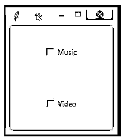
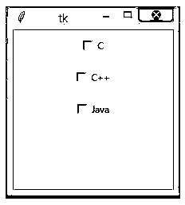

# t 内部检查按钮

> 原文：<https://www.educba.com/tkinter-checkbutton/>


## Tkinter Checkbutton 简介

包含图像或文本的 Tkinter check button(GUI–图形用户界面)有助于跟踪提供给应用程序的选项/选择，也有助于通过向用户提供许多/多个选择来实施开/关选择，以便在所有选项/选择中选择一个。

**语法:**

<small>网页开发、编程语言、软件测试&其他</small>

```
W = checkbutton ( master, option/options = value/values, …. )
```

**属性:**

*   **主:**这个主术语将代表父窗口。
*   **选项/选项:**该选项/选项术语将列出小工具最常用的选项。用作由逗号分隔的值/键-值对的所有选项。

### 带描述的选项列表

下面是选项列表及其说明。

**1。activebackground:** 当光标在 checkbutton 上时，这将有助于背景颜色。

**2。activeforeground** :当光标在 checkbutton 上时，这将有助于获得前景色。

**3。BG:**Tkinter check 按钮的这个选项将有助于在指示器和标签后面显示正常的背景颜色。

**4。位图:**该选项有助于在复选按钮上显示单色图像。

**5。bd:**Tkinter check button 的 BD 选项将有助于获取指示器周围的边框大小，默认情况下是 2 像素大小。

**6。命令:**Tkinter checkbutton 的“命令”选项将有助于每次用户想要改变 check button 状态时调用的过程。

**7。光标:**“光标”选项将帮助您为光标(点/箭头等)命名..).在此之后，当鼠标光标在 checkbutton 上时，您可以获得不同的模式，如 name/other。

**8。disabled foreground:**“disabled foreground”选项将帮助我们获得用于呈现禁用的 checkbutton 文本的前景色。默认情况下，默认前景色是点画版本。

**9。字体:**“字体”选项帮助我们使用该选项获取文本。

10。fg:“fg”选项是用来渲染文本的颜色。

**11。height:**Tkinter checkbutton 的“height”选项将有助于在 check button 上获得许多文本行，默认情况下，它的值为“1”。

**12。当复选按钮聚焦时，Tkinter 选项的“highlightcolor”选项将帮助获得高亮焦点的颜色。**

13。image:“image”选项有助于在按钮上显示图形图像。

**14。justify:** 仅当文本包含多行/多行时，Tkinter checkbutton 的“justify”选项才会对我们有所帮助；这个选项只控制文本如何对齐，如左对齐、右对齐或居中对齐。

15。off value:“off value”选项将帮助使与 checkbutton 值关联的控制变量通常为 0。您也可以在设置值的帮助下将其设置为关闭状态的替代值。

16。onvalue:Tkinter checkbutton 的“on value”选项将设置控制变量值，默认情况下与 check button 关联的值为 1。与 Offvalue 选项一样，这里也可以通过将值传递给 onvalue，将值设置为您希望的替代值。

**17。padx:**“padx”选项将帮助我们知道 checkbutton 的左右两边需要多少空间。默认情况下，空间的大小只有 1 个像素。

18。pady:“pady”选项将有助于了解 checkbutton 和 text 的上方和下方需要多少空间。默认情况下，空间值的大小只有 1 个像素。

**19。relief:**“relief”选项的默认值是 relief=FLAT，checkbutton 不能从背景中突出。您可以将此选项设置为所有其他样式。

20。select color:“select color”选项将有助于设置 checkbutton 的颜色，但默认情况下，它将是红色的(selectcolor = "red ")。

**21。选择图像:**Tkinter checkbutton 的“选择图像”选项有助于为 check button 设置图像。如果使用“选择图像”选项设置，图像将出现在复选按钮上。

**22 state:**“state”选项默认为 state = normal，但用户可以使用它作为 state = disabled，使其变灰失控，使其无响应。如果光标在 checkbutton 上，那么状态是活动的。

**23。text:**“text”选项将有助于在 checkbutton 旁边显示标签。您可以使用“\n”术语显示多行/多行文本。

**24 下划线:**“下划线”选项的默认值为-1，但最重要的是，字符不会加下划线。通过将文本中字符的索引选项(从值 0 开始)设置为该字符的下划线。

**25。变量:**这个选项有助于跟踪 checkbutton 的当前状态。通常，变量将是一个 IntVar，0 表示清除，1 表示设置，但您可以看到上面的 onvalue 和 off value 选项。

**26。width:** 该选项默认情况下，checkbutton 的宽度由显示的图像/文本大小决定。你也可以选择设置&的字符数，这样复选按钮将有足够的空间容纳更多的字符。

**27。wrap length:**“wrap length”选项有换行的行。人们可以很容易地将这个选项设置为许多字符数，所有的行将被分成许多不再是数字的片段。

### 方法

使用 Tkinter 的 checkbuttons 调用的方法很少。看看下面这些:

*   **Deselect():** 用于关闭程序中的 Tkinter check 按钮。
*   **Flash():** 用于闪烁 checkbutton，介于正常颜色和活动颜色之间。
*   **Invoke():** 用于与 Tkinter checkbutton 关联的方法调用
*   **Select():** 它有助于在程序中打开 Tkinter checkbutton 实现。
*   **Toggle():** 在不同类型的 checkbuttons 之间切换很有帮助。

### **Tkinter**检查按钮示例

以下是 Tkinter Checkbutton 的示例:

#### 示例#1

下面的程序将使用下面选项部分提到的一些选项显示两个复选按钮。C11 和 C21 是检查按钮，用它们的选项(创建检查按钮的函数、文本、变量类型、开和关值、高度和宽度选项)来创建检查按钮。导入选项将从 python 库中导入 Tkinter checkbutton，通过使用 from 函数，Tkinter 将导入 Tkinter 库的所有函数。

**代码:**

```
from tkinter import *
import tkinter
top1 = tkinter.Tk()
CheckVar11 = IntVar()
CheckVar21 = IntVar()
C11 = Checkbutton(top1, text = "Music", variable = CheckVar11, \
                 onvalue = 1, offvalue = 0, height=5, \
                 width = 20)
C21 = Checkbutton(top1, text = "Video", variable = CheckVar21, \
                 onvalue = 1, offvalue = 0, height=5, \
                 width = 20)
C11.pack()
C21.pack()
top1.mainloop()
```

**输出:**




#### 示例 **#2**

下面的例子将像上面的 Tkinter checkbutton 实现的例子一样执行，只是名称和功能不同，大部分相同，但有一点不同。下面的例子将打印 3 个文本名称，如 c，c++，java。使用 Tkinter 的几何功能将整个尺寸设置为“200X200”。之后，将变量赋值为 intvar，然后使用选项实现复选按钮，然后使用 pack()函数显示。

**代码:**

```
from tkinter import *
top1 = Tk()
top1.geometry("200x200")
checkvar11 = IntVar()
checkvar21 = IntVar()
checkvar31 = IntVar()
chkbtn11 = Checkbutton(top1, text = "C", variable = checkvar11, onvalue = 1, offvalue = 0, height = 2, width = 10)
chkbtn21 = Checkbutton(top1, text = "C++", variable = checkvar21, onvalue = 1, offvalue = 0, height = 2, width = 10)
chkbtn31 = Checkbutton(top1, text = "Java", variable = checkvar31, onvalue = 1, offvalue = 0, height = 2, width = 10)
chkbtn11.pack()
chkbtn21.pack()
chkbtn31.pack()
top1.mainloop()
```

**输出:**




### 推荐文章

这是 Tkinter Checkbutton 的指南。这里我们讨论 Tkinter Checkbutton 的基本概念、选项列表、描述、方法和示例。您也可以看看以下文章，了解更多信息–

1.  [Tkinter 滚动条](https://www.educba.com/tkinter-scrollbar/)
2.  [Tkinter 文本](https://www.educba.com/tkinter-text/)
3.  tkinter grid
4.  [Tkinter Widgets](https://www.educba.com/tkinter-widgets/)