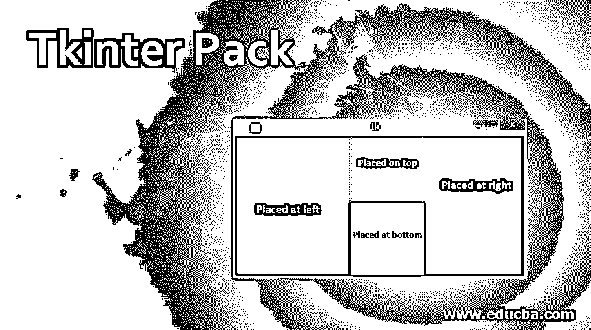
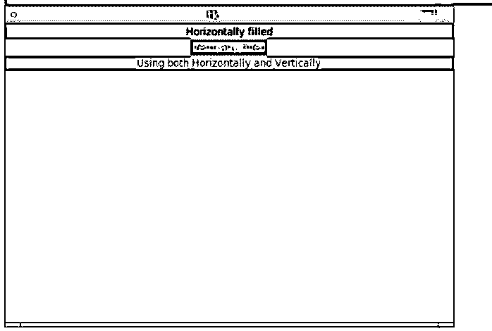
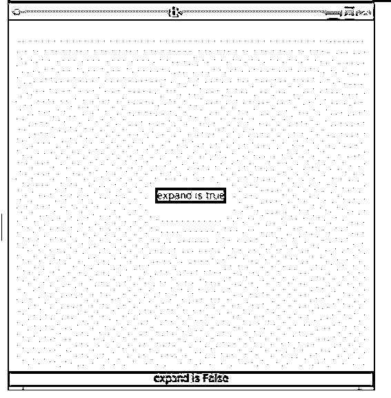
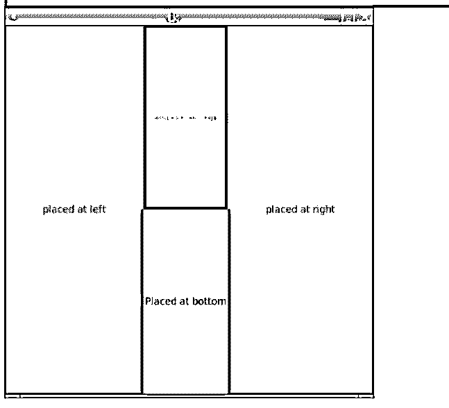

# Tkinter Pack

> 原文：<https://www.educba.com/tkinter-pack/>




## Tkinter Pack 简介

为了用 Python 设计任何 GUI 应用程序，我们有一个 Tkinter 包。所以在这个 [GUI](https://www.educba.com/what-is-gui/) 应用程序中，有不同的小部件需要放置或组织。小部件的组织由布局管理器或几何管理器完成。在 Python 中，Tkinter 提供了三种不同的几何管理器，如网格、打包和位置管理器。在本文中，我们将讨论 Tkinter 中用于组织小部件的包管理器或方法。包管理器将微件放在父窗口或微件的水平和垂直框或块中。这个管理器用于在窗口小部件需要放在框架内时处理窗口小部件，或者将窗口小部件放置在彼此之上或者并排放置。

### 包装管理器的工作示例

Tkinter 提供了一个几何管理器包，它的使用比 grid manager 有限，但是这个包管理器在将这些部件放入根窗口或主窗口或部件之前，会将这些部件组织在盒子或块中。我们必须注意，在使用这个管理器之前，必须导入 Tkinter 包。

<small>网页开发、编程语言、软件测试&其他</small>

**语法:**

`widget.pack(options)`

**选项:**包装经理有几个选项:

#### 1.充满

当小部件需要填充到与父小部件相同的大小时，或者默认情况下需要一些最小的空间来填充时，使用这个选项。它还具有默认的属性，如“无”，X 表示水平填充，Y 表示垂直填充，或者 X 和 Y 都表示水平和垂直填充。

##### **举例:**

```
import tkinter as tk
root = tk.Tk()
root.geometry("600x400")
box_1 = tk.Label(root, text="Horizontally filled", bg="green")
box_1.pack(fill="x")
box_2 = tk.Label(root, text="Vertically filled", bg="blue")
box_2.pack(fill="y")
box_3 = tk.Label(root, text="Using both Horizontally and Vertically", bg="red")
box_3.pack(fill= "both")
root.mainloop() 
```

**输出:**




在上面的代码中，我们演示了 fill 选项与所有属性的使用，为了水平填充这个框，它被声明为“x ”,颜色为绿色。为了垂直填充，它被声明为“y ”,颜色为蓝色，占用了该行的所有垂直空间，最后，填充选项被声明为“both ”,颜色为红色，因此我们可以看到块水平增长。从输出的显示方式可以看出。

#### 2.发展

这用于为给定的小部件分配空间，有两个属性是或否和真或假。如果属性为 YES 或 TRUE，则小部件会扩展以填充除父小部件使用的空间之外的任何空间。在上面的选项中,“填充”用于确定分配给小部件的空间消耗，而“扩展”仅分配给给定的小部件更多的空间

##### 示例:

```
import tkinter as tk
root = tk.Tk()
root.geometry("500x500")
box_1 = tk.Label(root, text="expand is true", bg="green")
box_1.pack(expand=True)
box_2 = tk.Label(root, text="expand is False", bg="red")
box_2.pack(fill="x",expand=False)
root.mainloop() 
```

**输出:**




在上面的代码中，这将演示一个属性为 True 或 False 的扩展选项。在代码中，可以看到绿色的框是用来扩展的，并且设置为 true，因此，它只扩展了小部件的大小，如果 expand option 为 false，那么它将被水平填充，因为 fill option 属性为“x ”,不被扩展。

#### 3.侧面

当我们想把小部件放在父小部件的哪一边时，使用这个选项。它有顶部或底部、左侧或右侧等属性。默认情况下，该选项采用 TOP 属性。

##### 示例:

```
import tkinter as tk
root = tk.Tk()
root.geometry("500x500")
box_1 = tk.Label(root, text="placed at left", bg="green")
box_1.pack(side="left", expand=True, fill="both")
box_2 = tk.Label(root, text="placed at right", bg="red")
box_2.pack(side="right", expand=True, fill="both")
box_3 = tk.Label(root, text="placed on top", bg="blue")
box_3.pack(side="top", expand=True, fill="both")
box_4 = tk.Label(root, text="Placed at bottom", bg="yellow")
box_4.pack(side="bottom", expand=True, fill="both")
root.mainloop() 
```

**输出:**




上面的例子演示了侧边选项及其属性 LEFT、RIGHT、TOP 和 BOTTOM。因此，在上面的代码中，您可以看到绿色框被放置或打包在父窗口小部件的左侧，红色框被放置在右侧，蓝色框被放置在顶部，黄色框被放置在父窗口小部件的底部，正如我们在上面的输出中所看到的。

在大多数情况下，用户在设计 GUI 应用程序时使用网格几何管理器，而不是包管理器，因为网格将小部件放在网格内，而包将小部件沿着块或框的侧面放置。当需要创建一些非常复杂的布局时，通常会用到 note pack，但是很难完全理解它，所以很多用户更喜欢网格管理器。一件重要的事情是，我们不能在一个父应用程序中同时使用网格和 pack 来创建应用程序，无论该应用程序是否工作，但它会进入一个无限循环，因为每个经理都试图放置小部件，就像一个经理会改变或调整大小，而其他经理会注意到它并调整它的大小，所以这造成了混乱。因此，网格几何管理器比包管理器更灵活。

### 结论

在本文中，我们看到了如何使用 Python 中的 Tkinter 包创建 GUI 应用程序。Tkinter 提供了三种不同的几何体管理器，如栅格、打包和放置。在这里，我们讨论了 pack()管理器。Pack() geometry manager 用于水平或垂直分配或组织块中的小部件。该管理器提供了填充、扩展和并排三种不同的选项。所有这些选项都在上面的文章中用例子和它们的属性进行了解释。

### 推荐文章

这是 Tkinter Pack 的指南。在这里，我们讨论了包管理器的介绍和工作，以及不同的例子和它的代码实现。您也可以阅读以下文章，了解更多信息——

1.  [t 内部检查按钮](https://www.educba.com/tkinter-checkbutton/)
2.  [Tkinter 旋转盒](https://www.educba.com/tkinter-spinbox/)
3.  [标签帧间](https://www.educba.com/tkinter-labelframe/)
4.  [t 帧间帧](https://www.educba.com/tkinter-frame/)


