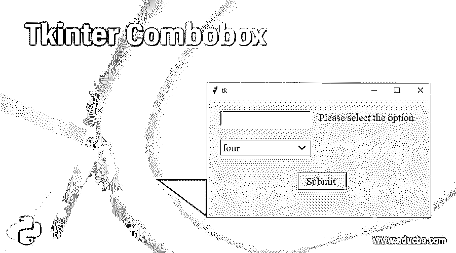
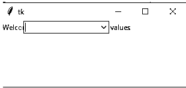

# Tkinter 组合框

> 原文：<https://www.educba.com/tkinter-combobox/>




## Tkinter 组合框简介

Tkinter 组合框是 Tkinter 库中的一个 UI 小部件，用于选择下拉列表列中的值，也是条目和下拉小部件的组合之一。这些下拉条目是可替换的，如果用户没有选择框中的值，它会自动获取并在屏幕上查看默认值。Tkinter 模块使用标准库函数，Tk 接口也是 最常用于所有基于 GUI 的小部件，当用户在字段中搜索特定值时，组合框选择选项箭头会自动向下滚动。

**语法:**

<small>网页开发、编程语言、软件测试&其他</small>

Tkinter 模块是最强大的基于 GUI 的小部件，它有 Tk 接口，还有 python 中最先进的库方法。它有更多的全局方法，因此 Combobox()也是一个小部件和全球化方法，它可以直接用于应用程序的特定功能和行为。它有自己的语法和默认参数。

```
import tkinter as tk
from tkinter import ttk
variable name=Tk()
ttk.Label(window, text=””, …)
variable name=ttk.Combobox(variable name, width=, text= )
variable name.mainloop()
```

上面的代码是 Combobox Tkinter 库的基本语法。我们已经调用了标签，文本框等用户界面项目的要求，我们将继续进一步加强应用程序。

### Tkinter 中 Combobox 如何工作？

Tkinter 模块在库中有一组不同的小部件。这个包有一组内置函数，用于覆盖 web 应用程序中的 UI 部分。它拥有最具交互性和最先进的库，可以计算时间，速度和天气计算，一些科学计算等功能，即使一些基于人工智能的功能也包含在这些小工具中。UI 小部件有按钮，视图，滚动框，列表框，组合框等，大部分按钮将被覆盖在 UI 部分，以导航网页或应用程序。一旦我们点击了按钮，它就会运行并运行后端区域代码，这些代码可以覆盖用户定义的逻辑。当我们使用这些组合框列表时，用户可以选择输入值，这些输入使用下拉选项向下滚动，箭头符号将用于下拉值区域的左侧，菜单正在选择并显示选项。如果用户没有选择任何值，它将根据前端和后端的代码逻辑采用默认值。

如果用户再次选择组合列表框的任何值，如果用户需要，该值将是可替换的。Combobox 有一组不同的参数将被传递，像字体系列、大小、粗细、颜色等属性。这些类型的属性将被传递给 Combobox()。此外，Tkinter 有一个默认字体，它可以通过选项的 tuple 侧进行更多的指定。Tkinter 组合框使用事件绑定特性，而我们使用组合框回调函数绑定，这些数据绑定将使用组合框虚拟事件调用。这些事件将在用户选择下拉列表框中的值时供用户使用。当我们使用这些事件时，这些事件会被传递给特定的函数，比如回调函数。组合框有另一个选项叫做<comboboxselected>选项，当我们在脚本中使用回调函数时，它被用来绑定虚拟事件。组合框中的值列表可以动态生成，并使用名为 post 命令的选项和命令进行更新。在执行应用程序中的下拉值列表之前，它会执行预定义的功能。</comboboxselected>

组合框元素包含默认的文本框字段，这些框元素是可编辑的，通常在预定义状态下使用。此外，在正常状态之前，组合框有两种不同的状态 1 .只读和 2 .禁用。只读状态用于文本字段区域，通常不可编辑，用户将只选择下拉列表框中的值。在默认状态下，组合框是灰色的，用户交互在这些状态下是不可能的，但当我们使用只读状态时，用户友好的性质，但在默认状态下是不可能的。

### 例子

让我们讨论 Tkinter 组合框的例子。

#### 示例 1

```
from tkinter import *  
import tkinter as tk
from tkinter import ttk
user = Tk()  
uname = Label(user,text = "uname").grid(row =1, column = 1)  
un= Entry(user).grid(row = 0, column = 0)  
passw = Label(user,text = "pass").grid(row = 1, column = 1)  
ps = Entry(user).grid(row = 1, column = 1)  
result = Button(user, text = "submit").grid(row = 3, column = 3)  
comb = tk.Label(user,
                    text = "Please select the option")
comb.grid(column=2, row=1)

example = ttk.Combobox(user, 
                            values=[
                                    "first", 
                                    "second",
                                    "third",
                                    "four"])
print(dict(example))  
example.grid(column=2, row=2)
example.current(3)
user.mainloop() 
```

**输出:**


#### 示例 2

```
import tkinter as tk
from tkinter import ttk
def demo(events):
     print("Please select the new events from the list")   
first = tk.Tk() 
first.geometry('310x110')
def month():
    example["values"] = ["first",
                        "second",
                        "third",
                        "four"
                           ]
lists = tk.Label(first,
                    text = "Welcome User please select list of values")
lists.grid(column=5, row=5)
example = ttk.Combobox(first, 
                            values=[
                                    "first", 
                                    "second",
                                    "third",
                                    "four"],
                            postcommand=month)
example.grid(column=5, row=5)
first.mainloop()
```

**输出:**




#### 示例 3

```
from tkinter import *
from tkinter import *  
import tkinter as tk
from tkinter import ttk
user = Tk()  
uname = Label(user,text = "uname", background = 'violet', foreground ="violet",  
          font = ("Times New Roman", 13)).grid(row =1, column = 1)  
un= Entry(user).grid(row = 0, column = 0)  
passw = Label(user,text = "pass", background = 'blue', foreground ="blue",  
          font = ("Times New Roman", 13)).grid(row = 1, column = 1)  
ps = Entry(user).grid(row = 1, column = 1)  
result = Button(user, text = "submit").grid(row = 3, column = 3)  
comb = tk.Label(user,
                    text = "Please select the option",background = 'pink', foreground ="pink",  
          font = ("Times New Roman", 17))
comb.grid(column=2, row=1)

example = ttk.Combobox(user, 
                            values=[
                                    "first", 
                                    "second",
                                    "third",
                                    "four"])
print(dict(example))  
example.grid(column=2, row=2)
example.current(3)
user.mainloop()
```

**输出:**


### 结论

在结论部分，组合框的上述概念和示例是 python 应用程序的基础和用法。它可以变化，这取决于用户的要求，如果应用程序连接到数据库，它会根据用户选择的选项动态地改变。所以它是 python 中 Tkinter 库的一个用户友好的小部件。

### 推荐文章

这是 Tkinter 组合框的指南。在这里，我们讨论 Tkinter 组合框的定义和工作，以及示例和代码实现。您也可以看看以下文章，了解更多信息–

1.  tkinter menu button
2.  [Tkinter 滚动条](https://www.educba.com/tkinter-scrollbar/)
3.  [Tkinter 文本](https://www.educba.com/tkinter-text/)
4.  [Python Tkinter 条目](https://www.educba.com/python-tkinter-entry/)