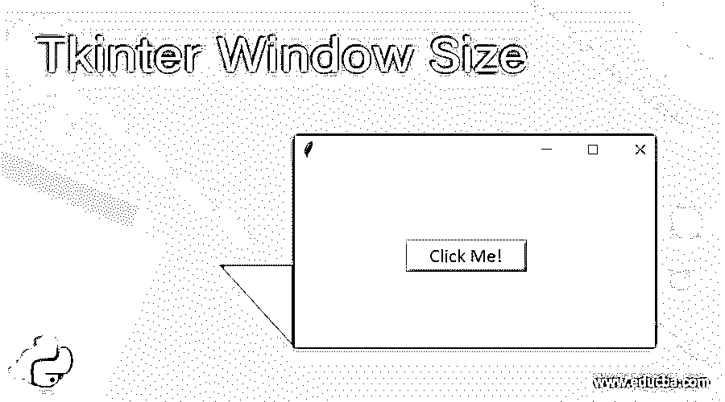
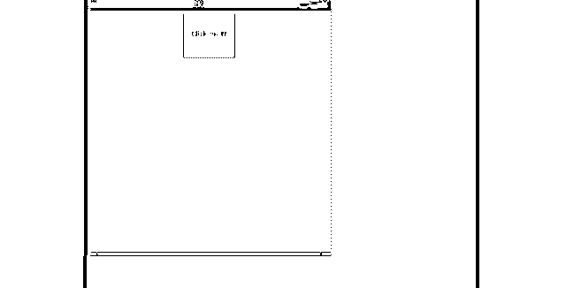

# t 中间窗口大小

> 原文：<https://www.educba.com/tkinter-window-size/>




## Tkinter 窗口大小介绍

窗户是装食物的容器，我们可以在上面放置其他食物。如果我们想给我们的窗口大小，我们可以使用几何方法。窗口只不过是 Tkinter 的对象，我们可以为我们的窗口分配不同的大小。这个大小将以像素为单位，并将水平和垂直大小参数作为字符串值。我们也可以使用 minsize 方法来给我们的窗口指定大小。

**语法:**

<small>网页开发、编程语言、软件测试&其他</small>

我们可以使用 geometry 方法或 minsize 方法来设置 Tkinter 窗口的大小。在这里，我们需要指定高度、宽度或值作为字符串。为了更好地理解，请参见下面的语法；

**例如:**

```
parent.geometry("value")
```

在上面的语法中，我们在父对象上调用这个几何方法，父对象在这里是一个 Tkinter 对象。我们可以通过在大小之间使用“x”运算符，在此方法中以字符串的形式分配大小值。

`parent.minsize(width=value, height=value)`

这是我们可以用来调整窗口大小的另一种方法。在这个方法中，我们给出了两个参数，分别是宽度和高度，如下所示。让我们来看一个练习语法，以便更好地理解。

1)

```
parent.geometry("100x100")
```

2)

```
parent.minsize(width=100, height=100)
```

这样，我们可以在 Tkinter 中创建窗口时在程序中使用它。

### 窗口大小在 Tkinter 中是如何工作的？

现在我们知道，我们可以通过在 Tkinter 中使用几何方法和中型方法来提供窗口的大小。但是为了使用这两种方法，我们需要将 Tkinter 模块导入到我们的程序中，因为我们只能通过使用 Tkinter 对象来调用它。

这两种方法都直接或间接地将高度和宽度作为参数。现在我们将看到一个例子来更好地理解它，以及它们实际上是如何在内部工作的，见下文；

**举例:**

```
from tkinter import *
parent = Tk()
parent.minsize(width=100, height=100)
parent.geometry("100x100")
parent.mainloop()
```

在上面的例子中，我们使用两种方法来调整窗口的大小。首先，我们需要将 Tkinter 模块导入到我们的程序中，因为我们知道这是用来在 python 中创建 GUI 的。为了导入这个模块，我们使用 import 关键字，后跟库名。

*   **参见:**来自 Tkinter import *

在这之后，我们将创建 Tkinter 对象，在这里我们称之为父对象。在这个父对象上，我们可以调用这两个方法。我们将在下面详细讨论这一点；

*   **geometry ():** 我们可以通过使用 Tkinter 对象‘parent’来调用这个方法。它只接受一个参数，这将是一个由“x”运算符分隔的字符串值。间接的，我们可以说它以不同的格式获取高度和宽度。这里我们指定 100×100 作为窗口的大小。
*   这个方法也被用来调整我们的窗口大小。它需要两个参数宽度和高度。这里我们在 Tkinter 对象上调用这个方法，因为它只能被它的对象访问。第一个参数是宽度，第二个参数是高度。

最后，我们调用 mainloop()方法，这个方法用于初始化 Tkinter 中的窗口。这个方法也在 Tkinter 对象上调用。这一点非常重要，否则我们将无法看到窗口。

### 构造器

这里没有构造函数，因为它们本身就是一个在 Tkinter 对象上调用的方法。创建对象时，我们没有使用参数构造函数，而是调用这个方法。这两种方法都使用下面的构造函数，然后我们可以使用或调用它们。

1)

```
parent = Tk();
```

### 方法

方法通常用于获取变量的当前值。如果您想查看或获取窗口的当前大小，那么我们可以调用 Tkinter 中可用的方法。这种方法将帮助我们获得窗口的宽度和高度。

#### 1) winfo_screenwidth():

这个方法用于获取窗口的当前宽度。这个方法可以通过使用 Tkinter 对象来调用，所以首先创建它的对象。让我们看一个初学者在编程时使用它的简单例子；

**举例:**

```
import tkinter as tk
parent = tk.Tk()
width1 = parent.winfo_screenwidth()
```

#### 2) winfo_screenheight():

这个方法用于获取窗口的当前高度。这个方法可以通过使用 Tkinter 对象来调用，所以首先创建它的对象。让我们看一个初学者在编程时使用它的简单例子；

**举例:**

```
import tkinter as tk
parent = tk.Tk()
height1 = parent.winfo_screenheight()
```

使用这些方法时需要记住的一些要点；

*   几何方法只接受一个参数作为窗口大小的输入。
*   Minsize 方法使用两个参数来指定窗口的宽度和高度。

### 例子

让我们讨论 Tkinter 窗口大小的例子。

#### 示例 1:使用几何方法

在这个例子中，我们使用几何方法在 Tkinter 中给我们的窗口分配尺寸，然后我们在它上面附加按钮部件。

**代码:**

```
from tkinter import *
def showval(): print (sli1.get())
parent = Tk()
#geometry method called here
parent.geometry("500x500")
#button creation
button = Button(parent, text = 'Click me !!', bg='yellow',  fg = 'blue', height = 5, width = 10)
button.pack()
#initiizing window
mainloop()
```

**输出:**


#### 示例 2:使用 Minsize 方法

在这个例子中，我们使用 minsize 方法在 tkinter 中为我们的窗口分配大小，然后在其上附加按钮小部件。此外，我们还为按钮分配了一些属性，如颜色、高度等。

**代码:**

```
from tkinter import *
def showval(): print (sli1.get())
parent = Tk()
#geometry
parent.minsize(width=500, height=500)
#button creation
button = Button(parent, text = 'Click me !!', bg='yellow',fg = 'blue', height = 5, width = 10)
button.pack()
mainloop()
```

**输出:**




### 结论

通过使用这些方法，我们可以很容易地调整 GUI 窗口的大小，它是 Tkiker 中的主要容器。在那里我们放置了所有其他的东西，比如按钮、标签、复选框和其他事件。屏幕上的所有其他小部件将根据窗口的大小进行调整，这也是独立于平台的。

### 推荐文章

这是 Tkinter 窗口大小的指南。这里我们讨论 Tkinter 窗口大小的定义，窗口大小在 Tkinter 中是如何工作的？为了更好地理解，提供了示例代码。您也可以看看以下文章，了解更多信息–

1.  之后的 [Tkinter](https://www.educba.com/tkinter-after/)
2.  [Tkinter 组合框](https://www.educba.com/tkinter-combobox/)
3.  tkinter grid
4.  tkinter menu button