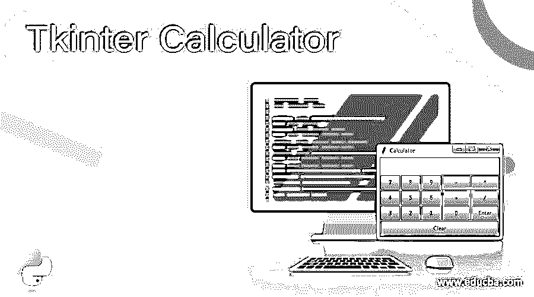
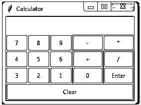

# Tkinter 计算器

> 原文：<https://www.educba.com/tkinter-calculator/>




## Tkinter 计算器的定义

Tkinter 计算器是一个简单的图形用户界面计算器，使用 Tkinter 模块开发。Python 提供了许多开发各种 GUI 应用程序的方法。Tkinter 模块是开发 GUI 应用程序最有用和最简单的方法之一，因为 Tkinter 在 Linux 和 Windows 平台上都可以很好地工作。在本文中，我们将看到如何使用 Tkinter 模块开发一个简单的 GUI 计算器。

**开发 Tkinter 计算器的先决条件:**

<small>网络开发、编程语言、软件测试&其他</small>

为了使用 Tkinter 创建一个简单的图形用户界面计算器，我们需要以下先决条件。

*   Tkinter
*   london academy of music and dramatic art 伦敦音乐戏剧艺术学院

### 如何创建一个简单的 GUI Tkinter 计算器？

为了创建一个简单的 GUI，请执行以下步骤。

*   导入 Tkinter 模块
*   创建主用户界面。(计算器的窗口)
*   将小部件添加到用户界面
*   为小部件应用事件触发器

### 我们可以用 Tkinter 计算器做什么？

我们可以执行以下基本算术运算。

*   添加
*   减法
*   分开
*   增加

### 创建 Tkinter 计算器的步骤

让我们看看如何一步一步地创建一个 GUI 计算器

*   #### Create GUI interface

#用于创建 GUI Tkinter 计算器的 Python 代码。

```
# import tkinter package
from tkinter import *
# create a GUI user interface
if __name__ == "__main__":
giu_face = Tk()
```

#设置 GUI 界面的背景颜色。

```
giu_face.configure(background="red")
# set the title for GUI interface
giu_face.title("Simple Calculator")
```

#设置 GUI 窗口界面的大小。

```
giu_face.geometry("370x180")
giu_face.mainloop()
exp = ""
```

*   #### function to update exp 【T1] in the text input box

```
def pres(number):
global exp
# string concatenation
exp = exp + str(number)
# using set method to update the expression
equation.set(exp)
```

*   **计算极限表达式的代码**

`def pres():
try:
global exp`

*   **使用 Eval 函数计算给定的 Exp，并将结果转换为字符串**

```
# using eval function to calculate expression
total_value = str(eval(exp))
equation.set(total_value)
exp = ""
using except block to handle errors if generated
# using except block to handle generated errors
except:
equation.set(" error ")
exp = ""
```

*   **清除计算器内容的功能**

```
def clearng():
global exp
exp = ""
equation.set("")
equation = StrVar()
```

*   **为操作**创建用于键入文本的输入框的功能

```
exp_field = Ent(gui, text_variable=equation)
```

*   **使用网格法将微件分配到各自的位置。**

```
exp_field.grid(columnspan = 5)
equation.set('enter your value’)
```

*   **创建用于输入数字的按钮**

#创建按钮并将它们放置在窗口内。

```
bton1 = Button(giu_face, text =' 1 ', font="lucida 20 bold",
command = lambda: input_val(1), height = 1, width = 7)
bton1.grid(row = 2, column = 0, ipady = 4 , ipadx = 2)
bton2 = Button(giu_face, text = ' 2 ', font="lucida 20 bold",
command = lambda: input_val(2), height = 1, width = 7)
bton2.grid(row = 2, column = 1, ipady = 4 , ipadx = 2)
bton3 = Button(giu_face, text = ' 3 ', font="lucida 20 bold",
command = lambda: input_val(3), height = 1, width = 7)
bton3.grid(row = 2, column = 2, ipady = 4 , ipadx = 2)
bton4 = Button(giu_face, text = ' 4 ', font="lucida 20 bold",
command = lambda: input_val(4), height = 1, width = 7)
bton4.grid(row = 3, column = 0, ipady = 4 , ipadx = 2)
bton5 = Button(giu_face, text = ' 5 ', font="lucida 20 bold",
command = lambda: input_val(5), height = 1, width = 7)
bton5.grid(row = 3, column = 1, ipady = 4 , ipadx = 2)
bton6 = Button(giu_face, text = ' 6 ', font="lucida 20 bold",
command = lambda: input_val(6), height = 1, width = 7)
bton6.grid(row = 3, column = 2, ipady = 4 , ipadx = 2)
bton7 = Button(giu_face, text = ' 7 ', font="lucida 20 bold",,
command = lambda: input_val(7), height = 1, width = 7)
bton7.grid(row = 4, column = 0, ipady = 4 , ipadx = 2)
bton8 = Button(giu_face, text = ' 8 ', font="lucida 20 bold",
command = lambda: input_val(8), height = 1, width = 7)
bton8.grid(row = 4, column = 1, ipady = 4 , ipadx = 2)
bton9 = Button(giu_face, text = ' 9 ', font="lucida 20 bold",
command = lambda: input_val(9), height = 1, width = 7)
bton9.grid(row = 4, column = 2, ipady = 4 , ipadx = 2)
bton10 = Button(giu_face, text = ' 0 ', font="lucida 20 bold",
command = lambda: input_val(0), height = 1, width = 7)
bton10.grid(row = 5, column = 0, ipady = 4 , ipadx = 2)
plus = Button(giu_face, text=' + ', font="lucida 20 bold",
command = lambda: input_val("+"), height=1, width=7)
plus.grid(row = 2, column = 3, ipady = 4 , ipadx = 2)
minus = Button(giu_face, text = ' - ', font="lucida 20 bold",
command = lambda: input_val("-"), height = 1, width = 7)
minus.grid(row = 3, column = 3, ipady = 4 , ipadx = 2)
multiply = Button(giu_face, text = ' * ', font="lucida 20 bold",
command = lambda: input_val("*"), height = 1, width = 7)
multiply.grid(row = 4, column = 3, ipady = 4 , ipadx = 2)
divide = Button(giu_face, text=' / ', font="lucida 20 bold",
command = lambda: input_val("/"), height = 1, width = 7)
divide.grid(row = 5, column = 3, ipady = 4 , ipadx = 2)
equal = Button(giu_face, text=' = ', font="lucida 20 bold",
command = input_val, height = 1, width = 7)
equal.grid(row = 5, column = 2, ipady = 4 , ipadx = 2)
clearng = Button(giu_face, text = 'clearng', font="lucida 20 bold",
command = clearng, height = 1, width = 7)
clearng.grid(row = 5, column = '1', ipady = 4 , ipadx = 2)
Decimal = Button(giu_face, text='.', font="lucida 20 bold",
command = lambda: input_val('.'), height = 1, width = 7)
Decimal.grid(row = 6, column = 0, ipady = 4 , ipadx = 2)
giu_face.mainloop()
```

**输出:**




### 结论

在本文中，我们讨论了如何创建一个简单的 GUI Tkinter 计算器，并使用各种示例在其中执行简单的算术运算。Tkinter 模块在 python 中被认为是非常重要的，因为它非常容易创建许多 GUI 应用程序。在 Linux 或 Ubuntu 机器上你需要单独下载 Tkinter 并安装它。但是在 windows 操作系统中，它在 anaconda 包中很容易获得。我们希望这篇文章能有所帮助。谢谢你。

### 推荐文章

这是一个 Tkinter 计算器的指南。这里我们讨论一下定义，如何创建一个简单的 GUI Tkinter 计算器？为了更好地理解，提供了示例代码。您也可以看看以下文章，了解更多信息–

1.  [Tkinter 笔记本](https://www.educba.com/tkinter-notebook/)
2.  [Tkinter PhotoImage](https://www.educba.com/tkinter-photoimage/)
3.  [Tkinter 组合框](https://www.educba.com/tkinter-combobox/)
4.  tkinter font