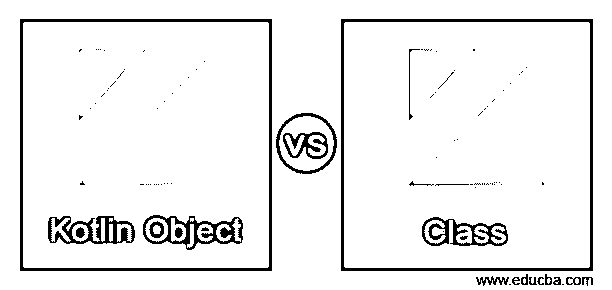

# Kotlin 对象 vs 类

> 原文：<https://www.educba.com/kotlin-object-vs-class/>




## Kotlin 对象与类的区别

Kotlin object vs class 在功能应用程序中得到支持，该应用程序被开发成 Kotlin。对象和类是每一种面向对象编程语言中的基本概念，因为我们知道 kotlin 支持面向对象和函数式编程语言。在提供面向对象编程支持的同时，kotlin 将支持继承、对象类和封装。对象和类在 kotlin 中非常重要。

基本上，kotlin 是统计类型语言；kotlin 内置于 java 中，因此它将从 java 中继承所有与对象相关的 java 概念。在 kotlin 中，类只不过是运行时显示的实体的蓝图。kotlin 对象只不过是一个状态，它包含了状态行为。在 kotlin 中，我们是通过使用类体和类头来声明类的，用花括号括起来；java 中也有同样的功能。当在 kotlin 中定义任何类时，我们使用 class 关键字，然后需要定义类名。我们需要为整个项目定义一个唯一的类名。

<small>网页开发、编程语言、软件测试&其他</small>

使用 kotlin 时，同一项目中不接受重复的类名。在 kotlin 中，不同类型的类是可用的，比如嵌套类和内部类。因为我们从同一个类中创建了几个对象，同样在 kotlin 中，我们可以使用一个类创建多个对象。在创建了类和对象之后，我们可以自由地包含类的成员和函数。在 kotlin 中，我们可以通过使用不同的关键字来控制类成员变量的可见性。Kotlin 几乎支持 JVM，因此 kotlin 将在顶层引入对象的概念。而 kotlin 中的 class 将描述我们需要时实例化的结构，并允许我们在许多情况下需要时实例化。在 kotlin 中，对象将表示单一的静态实例。

### 科特林的对象是什么？

这个特性在打包和单例对象的多种技术中非常有用。在 kotlin 中，object 对于共享类的公共属性非常有用和重要。kotlin 的对象是通过使用 kotlin 的类创建的。此外，它将以成员函数和数据成员的形式共享由类定义的公共行为和属性。我们可以通过使用()运算符。下面的语法显示了如下声明的类对象。在下面的例子中，var 和 val 用于声明在 kotlin 对象中使用的变量。通过使用 var 和 val，我们声明了指定的变量。通过使用类，我们正在创建对象。

**语法:**

```
var name_of_var = name_of_class()
val name_of_var = name_of_class()
```

以下示例显示了 kotlin 对象，如下所示。在下面的例子中，我们正在创建 kotlin 和它的对象，我们从这个对象中访问类的数据。

**代码:**

```
class student
{
private var stud_name: String = "ABC"
fun printMe ()
{
print ("Stud name:-" + stud_name)
   }
}
fun main(args: Array<String>) {
val stud = student()
stud.printMe ()
}
```

**输出:**


### 是什么阶层？

类是对象的蓝图，它定义了用于创建所需对象的模板。在科特林，类是构建模块；类别是使用关键字当做类别来定义的。下面的语法显示了如何用 kotlin 创建一个类，如下所示。kotlin 的类声明类似于 java，由花括号包围的类体和类头组成。

**语法:**

```
class name_of_class
{
    …..
}
```

默认情况下，kotlin 的类是公共的。我们可以通过使用不同的修饰符来控制类的可见性。下面的例子显示了 kotlin 的类如下。

**举例:**

**代码:**

```
fun main(args: Array<String>)
{
val stud = student.school()
print (stud.foo())
   }
class student {
   class school {
     fun foo() = "Student name ABC"
  }
}
```

**输出:**


### Kotlin 对象与类的直接比较(信息图)

以下是 Kotlin 对象与类之间的 11 大区别:


### Kotlin 对象与类的主要区别

让我们看看 Kotlin 对象和类之间的主要区别:

*   kotlin 对象中的类包含类似的属性。在上课的时候，使用 kotlin，我们需要在创建对象之前定义一些。当创建一个类时，我们需要定义类名、类头和类体。头和类体在类声明中是可选的。如果假设花括号里什么都没有，那么这个类的主体就被省略了。
*   对象是面向对象编程的基本单位，它将代表现实生活中包含行为和状态的实体。基本上，在 kotlin 中，对象用于从类中访问成员函数属性。使用 kotlin 语言时，我们可以从一个类中创建多个对象。
*   在 kotlin 中，每个类都包含其特定的名称。kotlin 类中的类头由该类的构造函数和参数组成。类的主体用花括号括起来。如果假设我们想提供一个类名作为构造函数，那么我们只需要在类名后面写 constructor 关键字。
*   kotlin 对象中的状态将代表对象属性。它也反映了物体的属性。行为将表示对象方法。它也反映了对象对其他对象的响应。对象标识将给出与另一个对象交互的对象的唯一名称。

### Kotlin 对象与类比较表

让我们讨论一下 Kotlin 对象与类之间的顶级比较:

| **Sr 号** | **科特林物体** | **科特林类** |
| One | Kotlin 在开发应用程序时支持类对象。 | Kotlin 在开发应用程序时支持不同类型的类。 |
| Two | Kotlin 对象类似于 java 中的对象。 | Kotlin 类类似于 java 中的对象。 |
| Three | 我们可以从一个类中创建多个对象。 | 我们可以在一段代码中创建多个嵌套类。 |
| Four | 在 kotlin 中，我们使用对象声明来创建单例类。 | 我们使用一个类来创建多个对象。 |
| Five | 在 kotlin 语言中，对象只包含一种类型。 | Kotlin 类包含多种类型。 |
| Six | Kotlin 对象包含一个由该类创建的对象。 | 我们用 kotlin 语言创建了 singleton 类。 |
| Seven | Kotlin 编译器将把单例对象翻译成类。 | Kotlin 类在我们的代码中声明后不被翻译。 |
| Eight | 我们可以在一个类中创建独特的对象。 | 为了创建类，我们需要定义一个惟一的名称。 |
| Nine | 我们可以从具体的类中实例化对象。 | 在 kotlin 中，我们不能实例化类。 |
| Ten | 我们不能通过使用 kotlin 中的 class 来继承对象。 | 我们可以通过使用继承从父类继承这个类。 |
| Eleven | 对象是一个非常重要的概念。 | 使用 kotlin 时，类是一个非常重要的概念。 |

### 结论

在 kotlin 中，类只不过是运行时显示的实体的蓝图。对象和类是每一种面向对象编程语言中非常基本的概念。Kotlin 对象 vs 类是在功能应用程序中支持的，它被开发成 kotlin。

### 推荐文章

这是科特林对象与类的指南。在这里，我们用信息图和一个比较表来讨论 Kotlin 对象和类的主要区别。您也可以阅读以下文章来了解更多信息—

1.  [科特林 vs 斯卡拉](https://www.educba.com/kotlin-vs-scala/)
2.  [锅炉 vs 斯威夫特](https://www.educba.com/kotlin-vs-swift/)
3.  [Java vs Kotlin](https://www.educba.com/java-vs-kotlin/)
4.  [颤振 vs 科特林](https://www.educba.com/flutter-vs-kotlin/)


