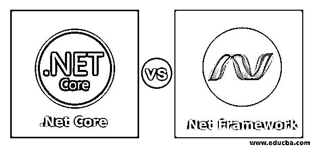
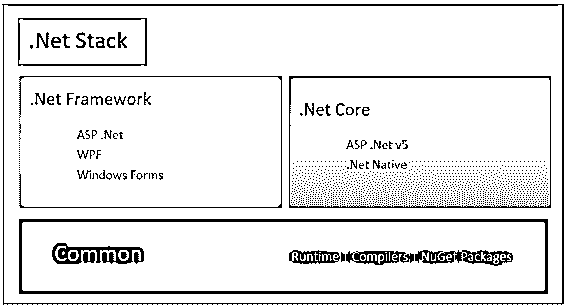

# .Net 核心与. Net 框架

> 原文：<https://www.educba.com/dot-net-core-vs-dot-net-framework/>

## 之间的区别。网芯和。Net 框架

.Net Framework 是由科技巨头微软设计和维护的软件开发框架。它基于 Windows，主要在 Windows 设备上运行。它用于开发独立的桌面和 web 应用程序。该框架提供了开发应用程序的所有基本要求——UI、数据库连接、服务、API 等。.另一方面，Net Core 是一个平台，而不是一个成熟的框架。简单来说，。Net Core 是。Net 框架。更准确地说，是。Net 框架。

你可能想知道有什么需要提出来。Net Core，当它只是。Net 框架。.Net core 对其运行方式进行了一些根本性的改变。首先也是最重要的，它更加模块化。这有助于您创建只包含所需库的应用程序，而没有额外的负担。第二，是真正的跨平台。这使得它成为未来开发平台的选择。

<small>网页开发、编程语言、软件测试&其他</small>

### 之间的正面比较。网芯和。Net 框架(信息图表)

以下是之间的 8 大区别。Net 核心与. Net 框架

### 之间的主要区别。网芯和。Net 框架

让我们来讨论一下。Net Core 与. Net Framework:

.Net Framework 是由科技巨头微软设计和维护的软件开发框架。它基于 Windows，主要在 Windows 设备上运行。它用于开发独立的桌面和 web 应用程序。该框架提供了开发应用程序的所有基本要求——UI、数据库连接、服务、API 等。

.Net Core 是一个开源开发平台，由微软和。网络社区。.Net Core 的设计考虑了各种需求和目的，侧重于 Web 开发、Windows Phone 开发和 Windows 应用商店应用程序开发。

它们共享一组公共库，这对任何应用程序的运行都是必不可少的。这些包括运行时库、编译器库、数据类型等。这些公共库包含所有基本内容的定义。这很难改变，因此是所有的基础。Net 堆栈框架。

接下来，。Net Core 的设计考虑到了未来的需求。它是跨平台兼容的、轻量级的、没有额外负担的小捆绑包，并且随着时间的推移易于升级。.Net Framework 更侧重于提供一个完整的包来使用和创建应用程序，从而减轻了开发人员为找到合适的库而头疼的问题。

### 何时使用。Net Core /。Net 框架？

下一个想到的问题是什么时候真正使用。Net 框架以及何时使用。网芯。

简单地说，如果您的应用程序必须从头开始构建，请选择。Net 核心，因为它是未来的设计。但是，如果它已经存在，并且您计划迁移到。Net 核心，你必须分析所有使用的库和是否。Net Core 支持不支持。此外，如果您的应用程序在。Net Framework，而且没有重大的升级计划，迁移到。网芯。

### .Net Core 与. Net Framework 对比表

让我们讨论一下。Net Core 与. Net Framework:

| **比较的基础** | **。Net 框架** | **。网络核心** |
| **平台或框架** | .Net 框架是一个成熟的开发框架。该框架提供了开发应用程序的所有基本要求——UI、数据库连接、服务、API 等。 | .Net Core 是一个平台，在这个平台上有 ASP。Net 核心和通用 Windows 平台，它们利用并扩展了。网芯。 |
| **开源** | .Net 框架不是开源的。它更像是一个社区开发的软件项目。 | .Net Core 是开源的。 |
| **跨平台** | 虽然。Net Framework 是为所有操作系统开发软件和应用程序而设计的，但它最终偏向于 Windows。因此，。Net 框架主要用于开发基于 Windows 的应用程序。 | .Net Core 遵循“构建一次，随处运行”的原则。因此，它是跨平台的。它支持 Windows、MacOS 和 Linux 平台。您可以在任何平台上构建应用程序，并在另一个平台上运行它。 |
| **应用类型** | .Net 框架用于构建桌面和 Web 应用程序。Windows 窗体和 WPF 应用程序得到了很好的支持。 | .Net Core 更侧重于 Web、Windows Mobile 和 Windows Store 应用程序。目前，它不支持桌面应用程序开发。 |
| **包装和运输** | .Net Framework 是作为一个整体打包的。所有的库都捆绑在一起，一起发货。即使您的应用程序不需要任何库，它仍然是软件包的一部分。 | .Net Core 是作为一组 NuGet 包交付的。它已经被分解、模块化，并作为几个 NuGet 包发布。虽然公共运行时库仍然是捆绑包的一部分，但是开发者可以根据需要有选择地包含其他库。这使得。网芯非常轻便。没有额外的行李。 |
| **支持微服务** | .Net Framework 不支持用不同语言创建和部署微服务。 | .Net Core 有对微服务的支持。.Net Core 允许混合各种技术，这些技术可以针对每个微服务进行最小化。 |
| **支持 WCF/休息服务** | .当涉及到 WCF 服务时，Net Framework 是一个很好的选择。它还支持 REST 服务。 | .Net Core 不支持 WCF 服务。您总是需要创建一个 REST API。 |
| CLI 工具 | .Net Framework 对于命令行界面来说太重了。一些开发人员更喜欢使用 CLI 而不是 IDE。 | .Net Core 支持适用于所有平台的非常轻量级的 CLI。也可以选择切换到 IDE。 |

### 结论

你可能想知道有什么需要提出来。Net Core，当它只是。Net 框架。.Net core 对其运行方式进行了一些根本性的改变。首先也是最重要的，它更加模块化。这有助于您创建只包含所需库的应用程序，而没有额外的负担。第二，是真正的跨平台。这使得它成为未来开发平台的选择。

### 推荐文章

这是一个指南。Net 核心与. Net 框架。这里我们还讨论了。Net Core 与. Net Framework 的主要区别在于信息图和比较表。您也可以浏览我们推荐的其他文章，了解更多信息——

1.  [首席财务官与控制器](https://www.educba.com/cfo-vs-controller/)
2.  [Hadoop vs Hive](https://www.educba.com/hadoop-vs-hive/)
3.  [Scrum vs 瀑布](https://www.educba.com/scrum-vs-waterfall/)
4.  [角度与自举](https://www.educba.com/angular-vs-bootstrap/)

