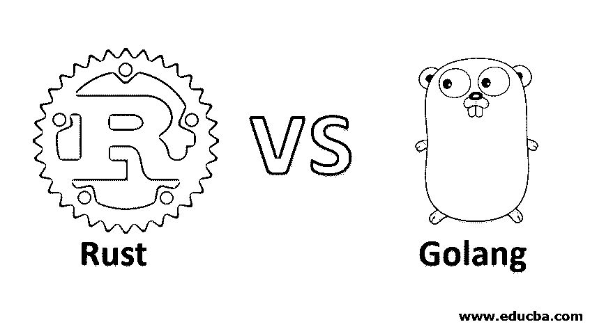

# 安息吧，高梁

> 原文：<https://www.educba.com/rust-vs-golang/>




## 铁锈和戈朗的区别

在这篇文章中，我们将讨论一个 Rust vs Golang 的大纲。Rust 是具有静态内存管理的语言，而 Golang 是具有高效垃圾收集器的语言。如果我开始比较这两种语言，我可以写好几页。Rust 的语法类似于 C++，它是为适当的并发性而开发的。格雷顿·霍尔在 2010 年 7 月患上了锈病。Rust 更快，在 Rust 中也保证了更高的性能。Golang 是由 Griesemer、Rob Pike 和 Ken Thompson 在谷歌开发的。Golang 的语法和 C 类似，在结构类型和垃圾收集方面做了改进。它是一种开源编程语言。

### Rust 编程语言

Rust 是 2010 年用更安全的脚本从 C++开发出来的。这种语言是开源的。与 C++或 C 语言相比，Rust 具有高性能的图形。Rust 有很多花括号，根本不需要缩进。在 Rust 中，内存管理是通过 RAII 约定完成的。Rust 编译器可以从上下文或语法中推断出变量、参数、函数的类型。现在，类型状态从铁锈中移除，这是通过品牌模式实现的。

<small>网页开发、编程语言、软件测试&其他</small>

Rust 中有一个构建器模式，允许将对象的当前状态描述为该对象的类型。Rust 没有已定义的类，但是它支持类型结构和实现。在 Rust 中更新版本时有许多变化。这个原因使得 Rust 在开发者中不太受欢迎。Rust 支持继承和多态。Rust 中没有自动垃圾收集。安全 Rust 和不安全 Rust 使用户选择 Rust 语言编程，使他们的开发更加安全。Rust 作为一种低级脚本语言。

**语法:**

```
fn main () {
println! ("Hello World!");
}
```

println！是这个程序中的宏。

### Golang(编程语言)

该语言开发于 2010 年，更容易使用，并发性更强。语法很像 C，编译器是用 C++写的。虽然 Golang 不是动态语言，但它支持采用模式的环境。Golang 有让它创建依赖关系的包。Golang 的 IDEs 包括 Go playground、reply 等等。Golang 是一种开源编程语言。Golang 最初的目标是云软件。然而，它也有助于构建复杂的软件。Golang 适合系统编程。

考虑到语法和工作环境，Golang 的本质类似于动态语言。Golang 有在线软件包文档。Golang 有许多像 C 一样的内置类型，也有指针。表达式分为类型化和非类型化。类别概念在 Golang 中不可用。取代类概念的特性是嵌入和接口。嵌入提供了组合和接口来提供运行时多态性。Golang 是结构型的。Golang 的每个包都有一个合适的路径。并发性是 Golang 的一个主要特性，因为它是一个轻量级的过程，可以使用不同的库、通道等等。Gofmt 工具标准化缩进、间距和其他细节。Golang 仍然在每个版本中被标准化。

**语法:**

```
package main
import <sup>"</sup>fmt"
func main () {
fmt.Println ("Hello World")
```

这个程序用 Golang 打印 Hello World。

### Rust 和 Golang 的正面对比(信息图)

以下是 Rust 和 Golang 的 21 大对比 **:**


### Rust 和 Golang 的主要区别

让我们来讨论一下 Rust 和 Golang 的一些主要区别

*   Rust 被称为安全的并发编程语言，而 Golang 被称为静态类型的编译编程语言。
*   Golang 比 Rust 容易。但由于代码环境安全可靠，Rust 对开发者来说编码有点困难。
*   Rust 有适当的并发，Golang 有很好的并发支持。
*   与 Golang 相比，生锈的速度更快。
*   Rust 有静态内存管理，而 Golang 有高效的垃圾收集器。
*   我们将无法在多个平台上编写 Rust 代码，但我们可以将 Golang 称为跨平台。
*   多线程在两种语言中都可以有效地完成，但是 Golang 用简单的代码就可以轻松完成。
*   在 Rust 中，错误检查是在编译器的帮助下完成的，而在 Golang 中，错误检查选项是提供给开发人员的。
*   在 Python 中我们有很多库，而在 Rust 中，我们没有多少。
*   内存安全在 Rust 里这么好，在 Python 里就不行了。

### Rust 与 Golang 对比表

下表总结了 Rust 与 Golang 的对比 **:**

| **生锈** | **Golang** |
| 与 Golang 相比，生锈的速度更快。 | Golang 并没有更快。 |
| Rust 没有垃圾收集器。 | Golang 有一个垃圾收集器。 |
| Rust 使用抽象而不是类。 | Golang 使用接口而不是类。 |
| 与 Golang 相比，Rust 在软件开发方面并不出色。 | Golang 适合企业软件开发。 |
| Rust 迫使开发人员在安全的环境中编码。 | Golang 并不强迫开发者编写安全的代码。 |
| 由于编译器的原因，错误处理很复杂。 | 错误处理由开发人员承担风险。 |
| 与 Golang 相比，Rust 的性能更好。 | 在 Golang 的表现不是很好。 |
| 可读性不好。 | 与 Rust 相比，可读性更好。 |
| Rust 的使用仅限于少数资源。 | Golang 的用途更广，有许多应用程序正在使用。 |
| Rust 使用编译器来运行程序。 | Golang 的编译不好。 |
| Rust 不擅长网络交流。 | Golang 有助于网络的低效沟通。 |
| Rust 有一个通用代码。 | Golang 没有泛型。 |
| Rust 没有同步机制。 | Golang 有一个同步机制。 |
| Rust 是一种高级语言。 | 与其他语言相比，Golang 并不优越。 |
| Rust 程序已经。rs 分机。 | Golang 程序有一个. go 扩展名。 |
| Rust 是在 Mozilla 创建的。 | Golang 是谷歌创造的。 |
| Rust 可以与许多其他语言互操作。 | Golang 只能与几种语言互操作。 |
| Rust，截至目前，还没有用于机器学习和数据科学。 | 由于其丰富的库，Golang 可用于机器学习和张量流项目。 |
| Rust 使用匹配语句。 | Golang 使用 switch 语句。 |
| Rust 使用 range 来迭代数字。 | Golang 使用 for 循环来迭代数字。 |
| 铁锈更有功能性。 | Golang 没那么实用。 |

### 结论

Rust 和 Golang 擅长在不安全的环境下创建微服务框架和应用。这两种语言都是为了提高 C++的性能而创建的。所以我们可以称这些语言为现代语言，因为它们是在 21 世纪发展起来的。我们可以称之为帮助并行计算的流行语言。

### 推荐文章

这是 Rust vs Golang 的攻略。在这里，我们还将讨论信息图和比较表的主要区别。您也可以看看以下文章，了解更多信息–

1.  [超载 vs 越权](https://www.educba.com/overloading-vs-overriding/)
2.  [微处理器 vs 微控制器](https://www.educba.com/microprocessor-vs-microcontroller/)
3.  [吉拉 vs Github](https://www.educba.com/jira-vs-github/)


