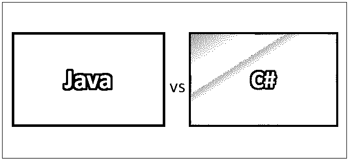

# Java vs C#

> 原文：<https://www.educba.com/java-vs-c-sharp/>

## Java 与 C#的区别

[Java 是一种](https://www.educba.com/what-is-java/)面向对象的通用编程语言，基于类。开发人员可以使用 Java 的原则——“一次编写，随处运行”。Java 源程序被 Java 编译器的[转换成字节码，然后这个编译后的字节码可以在任何兼容 JRE (Java 运行时环境)的操作系统上执行。C#是一种面向对象的、函数式的、通用的、面向组件的编程语言。C#用于构建各种应用程序；它特别擅长构建 Windows 桌面应用程序和游戏。Web 开发也可以用 C#高效地完成，而且它在](https://www.educba.com/best-java-compilers/)[移动开发](https://www.educba.com/mobile-apps-development-tools/)中越来越受欢迎。

### Java 语言(一种计算机语言，尤用于创建网站)

*   詹姆斯·高斯林最初在太阳微系统公司开发 Java。Java 的大部分语法源自 C++ ，它也是基于类和面向对象的。Java 以 JDK (Java 开发工具包)的形式发布，它包括运行 Java 程序所需的各种组件；然而，并不是所有的 [JDK](https://www.educba.com/install-jdk/) 的组件都必须运行 Java。最新版本是 Java 10，2018 年 3 月发布。
*   一旦用 Java 写出来，源代码可以在任何平台上运行，这是最大的好处之一。只是必须在需要的操作系统上安装合适的 JRE，操作系统可以从 Java 的官网下载。Java 是可移植的，这意味着为任何平台编写的程序必须在硬件和操作系统的组合上类似地运行。
*   编译器会将 Java 源代码转换成字节码，而在 JRE (Java 运行时环境)中创建的 JVM (Java 虚拟机)会将字节码转换成机器码。Java 对并发性、网络和 GUI(图形用户界面)有广泛的支持。

### C#

*   C#是微软用它的。NET 项目，由安德斯·海尔斯伯格领导一个开发团队。C#的最新版本是 7.2，发布于 2017 年，同时发布的还有 visual studio 2017 版本 15.5。因此，对于任何希望从事网页和游戏开发的程序员来说，这是一个极好的选择。有各种各样的跨平台工具支持用 C#编写的应用程序，这些应用程序可以在手机和桌面上使用。
*   C#附带了多种特性；因此，它很容易学会。许多复杂的任务都被这种语言抽象掉了，所以在开发应用程序或游戏的逻辑时，人们不必担心内存管理和垃圾收集等问题。它是一种更容易阅读的高级语言。
*   C#是一种静态类型的语言，所以编写的源代码在变成应用程序之前要经过彻底的检查。C#是一种复杂的学习语言，掌握它比像 Python 这样的语言需要更多的时间。希望用 C#构建高级程序的人需要学习大量的代码。在微软的大力支持下，它自创建以来发展迅速。

### Java 和 C#的直接比较(信息图表)

以下是 Java 和 C#性能的 8 大对比:

<small>网页开发、编程语言、软件测试&其他</small>

### Java 和 C#的主要区别

以下几点解释了 Java 和 C#性能之间的主要差异:

1.  Java 是构建复杂的基于 web 的高并发应用程序的绝佳选择，而 C#则是游戏开发和移动开发的理想选择。
2.  Java 需要 Java 开发工具包，它包括一个 Java 编译器，并运行一个时间环境来在任何机器上运行 Java，而 C#库是与. NET framework 和 IDE 一起提供的，如 Visual Studio。
3.  用 Java 编写的源代码被编译成字节码，然后字节码被转换成机器代码，可以在任何平台上运行，而用 C#时，代码被解释成字节码(MSIL ),后者由 CLR 编译，JIT 编译器将 MSIL 转换成本机机器代码。
4.  Java 被设计为在 JRE (Java 运行时环境)上执行，而 C#被设计为在 CLR(公共语言运行时)上执行。
5.  Java 主要用于在开源生态系统中构建复杂的应用程序，而 C#主要用于为微软平台开发应用程序。
6.  Java 在检查异常和未检查异常之间提供了明显的区别，而 C#方法本质上很简单，只选择一种类型的异常。
7.  Java 默认启用多态性，而 C#则必须调用基类中的“virtual”关键字和派生类中的“override”关键字。
8.  Java 库生态系统是巨大的，并且有很好的文档记录，这进一步有助于以适当的速度开发功能，而 C#库在微软生态系统内工作，与 Java 相比是有限的。
9.  Java 传统上有一个提供开源库的庞大社区，因此任何需求都可以通过这些库来满足，而来自微软社区的免费高质量库支持对 C#来说是一个不利因素。
10.  Java 中的泛型功能支持是编译器辅助的，使用擦除实现，而 C#通过将泛型集成到 CLI 中更进一步，并允许类型信息在运行时可用。

### Java 和 C#对照表

下面是 Java 和 C#性能的对比表。

| **BASIS FOR****比较** | **Java** | **C#** |
| **范式** | 基于类，一种源于 C++的面向对象的语言 | 面向对象、面向组件、函数式、强类型 |
| **应用** | 复杂的基于 web 的高度并发的应用程序 | Web 和游戏开发，流行于移动开发 |
| **项目** | 适合复杂的基于 web 的并发项目 | 最适合游戏开发项目 |
| **用途** | 消息传递、web 应用程序、高并发应用程序 | [游戏，移动开发，](https://www.educba.com/uses-of-c-sharp/)虚拟现实 |
| **安装** | 需要 JDK (Java 开发工具包)才能运行 Java | .NET 框架提供了一个巨大的 C#代码库 |
| **范围** | 主导服务器端交互 | 具有良好编程基础的服务器端语言 |
| **跨平台** | Java 的字节码对于跨平台是非常高效的 | 与 Java 相比，C#需要在这个特性上有所改进 |
| **工具** | Eclipse、NetBeans、IntelliJ IDEA | Visual Studio，MonoDevelop，#develop |

### 结论

Java 有一个更大更好的生态系统；它的社区在不断发展，创造出新的库、框架，甚至工具。基于 JVM 的新语言也在涌现，如 Scala、Groovy 等。也是谷歌为 Android 开发的主要语言，Android 是最大的[移动操作系统](https://www.educba.com/applications-software-developer/)。另一方面，C#主要用于。NET 框架、Mono 和 CLI 的其他实现。使用 C#构建的应用程序可以在微软生态系统上高效工作；但是，这个特性正在用最新的工具和库进行升级。

Java 和 C#有如此多的差异和相似之处，选择哪种语言进行开发在很大程度上取决于平台。人们可以比较 Java 和 c#的不同方面，并问 Java 比 C#做得更好，反之亦然？归根结底，这是基于应用程序平台、开发人员使用语言的便利性、更适合的库和需求等方面的决定。

Java 和 C#都是高度面向对象的语言，提供了各种特性。说到底，Java vs C#都是工具；当一个工具适合正在完成的任务时，它是最好的，当被一个好的开发人员使用时，它是优秀的。这是基于易用性、应用要求以及平台支持和维护的决定。

### 推荐文章

这是 Java 与 C#性能差异的有用指南。在这里，我们讨论了 Java 与 C#性能的直接比较、关键差异以及信息图和比较表。您也可以阅读以下文章，了解更多信息——

1.  [Python](https://www.educba.com/java-vs-python/)T2】vs Java
2.  [Java vs JavaScript](https://www.educba.com/java-vs-javascript/)
3.  [Java 堆 vs 栈](https://www.educba.com/java-heap-vs-stack/)
4.  [C++ vs Java](https://www.educba.com/c-plus-plus-vs-java/)

