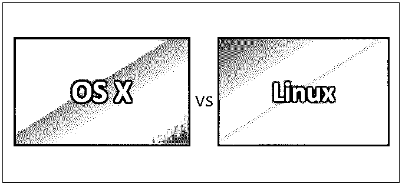

# OS X vs Linux

> 原文：<https://www.educba.com/os-x-vs-linux/>

## OS X 与 Linux 的区别

OS X 是最新版本的 Mac 操作系统，充满了苹果 Mac Book 中可用的硬件交互等许多高级功能；这使得它与 Linux 有一点不同。Mac OS 拥有非常吸引人的用户界面和易用的工作风格，另一方面，Linux 以其命令行界面而闻名，更受欢迎的是对商业世界非常有用的开源许可。Linux 有一个非常强大的社区，有不同用途的各种操作系统。Linux 类似于 T2 的 UNIX，但不完全是 UNIX。

### OS X 和 Linux 的正面比较(信息图)

以下是 OS X 和 Linux 的 9 大对比:

<small>网页开发、编程语言、软件测试&其他</small>

### OS X 和 Linux 的主要区别

以下是 OS X 和 Linux 语言之间的一些主要区别:

1.  Linux 给你自由定制它的代码，使它符合你的需要，而 OS X 代码不可用于代码定制。
2.  当你使用 Linux 时，你不受监视；另一方面，OS X 在某种程度上监视你的活动。所以你的秘密在 Linux 下是安全的。
3.  在 OS X，用户只有一个桌面环境，但你可以选择 Linux 提供的各种桌面界面。

*   KDE Plasma 5
*   肉桂色
*   交配
*   一致
*   Xfce 你好
*   LXQt
*   万神殿

4.  Linux 操作系统本质上非常稳定，因为它没有 bug(这并不意味着 Linux 没有 bug，但一些第三方工具通常会导致 Linux 中的问题)，而 OS X 则定期更新，使其没有 bug 并保持稳定。

5.  Linux 能够从其他操作系统文件系统读取数据(如果之前它与 OS X 或其他[操作系统](https://www.educba.com/features-of-operating-system/)关联，它可以读取您的硬盘)，而 OS X 不能从其他文件系统读取文件。

6.  Linux 中的更新是实时的(这意味着你可以在更新进行的同时并行工作)，而在 OS X，你需要通过重启来处理多个步骤。

7.  Linux 在你使用它的时候不会强制你付钱，你可以自由付费或者不付费，而且意思是 [Linux 是免费的](https://www.educba.com/advantage-of-linux/)，但是 OS X 就不一样了。

### OS X 和 Linux 对照表

下面是要点列表，描述 OS X 和 Linux 之间的比较。

| **BASIS FOR****比较** | **OS X** | **Linux** |
| **开发商** | 由苹果公司开发 | Linus Torvalds(主要开发人员)和全球开发人员社区。 |
| **执照** | 需要购买许可证 | 开源 |
| **设备兼容性** | 它只支持那些只由苹果公司开发的设备，但可以通过黑客攻击在其他设备上运行。 | 许多设备都支持 Linux，从低配置设备到超级计算机，Linux 都非常兼容。 |
| **定制** | 有受限和有限的选项可用。 | 完全可定制的许多选项。如果你知道 Linux 脚本，你可以根据你的需要来制作。 |
| **内核** | 基于 UNIX | 不完全是 UNIX，但像 UNIX |
| **由**支持 | 苹果公司。 | 全球开发者社区 |
| **人性化** | 非常方便用户 | 与 OS X 相比，不够用户友好。 |
| **成本** |  

需要支付一大笔钱来使用这个操作系统。

 | 免费使用，用户不必付费。 |
| **用途** | 仅在由苹果公司开发的那些设备或应用中。 | 信不信由你，但你无论如何都要使用运行 Linux 的设备。 |

### 结论

当公司或用户想要在 OS X 和 Linux 之间做出选择时，OS X 和 Linux 是今天讨论的一个非常热门的话题，但是事情并不是非黑即白的。在一个企业中，世界成本是影响选择的因素，因为保持低成本以最大化利润是主要关注点。

如果你仔细比较 OS X 和 Linux，你会发现 OS X 是为苹果公司生产的设备而设计的。而 Linux 既适用于低配置设备，也适用于高配置设备，如超级计算机和 web 服务器。

Linux 对商业世界的主要优势之一是 Linux 的开放源码性质，这促进了多用途工作的进一步实验和开发；例如，为移动设备赢得[人气的 Android OS，就是基于 Linux 内核的。虽然 OS X 是苹果公司的专利，所以无论他们创造什么，你都必须参与其中；他们不会专门为你定制这样的需求，但如果他们会这样做，你将不得不为你的定制付出很高的代价。](https://www.educba.com/mobile-marketing-association/)

OS X 很受喜欢娱乐和非常吸引人的图形的人的欢迎。Linux 也充满了图形，但它仍然落后于 OS X。尽管非常昂贵，但 OS X 支持的设备非常受欢迎，原因很明显，因为 Linux 有点棘手，甚至你需要很少的技术知识来操作它以探索更多。因为 OS X 是专门为不处理技术事务的用户设计的。

那么谁会赢得这场辩论呢？我们可以说，对于非技术用户来说，OS X 总是一个不错的选择。尽管如此，如果你有点经济并有一些技术专长，那么你会选择 Linux，因为在即将到来的一年里，它将更加用户友好，我可能会击败 OS X。尽管如此，最近 OS X 在普通人中很受欢迎，而 Linux 在商界和技术人员中很受欢迎。

### 推荐文章

这是 OS X 和 Linux 之间差异的有用指南。我们已经讨论了 OS X 和 Linux 的直接比较、主要差异、信息图和比较表。您也可以阅读以下文章，了解更多信息——

1.  [Linux vs Ubuntu](https://www.educba.com/linux-vs-ubuntu/)
2.  [Linux vs Mac](https://www.educba.com/linux-vs-mac/)
3.  [Linux vs Solaris](https://www.educba.com/linux-vs-solaris/)
4.  [Linux vs Windows 10](https://www.educba.com/linux-vs-windows-10/)

