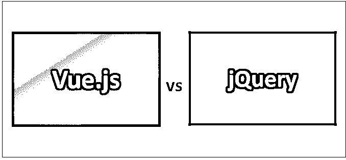

# vue . js vs jQuery 检视. js vs jquery

> 原文:# t0]https://www . educba . com/vista-js-vs-jquery/

## Vue.js 与 jQuery 的区别

Vue.js 是一个 [JavaScript 框架](https://www.educba.com/javascript-interview-questions/)，用于构建用户界面。它是开源的。当使用其他 JavaScript 库时，它也用作集成工具。它本质上是递增适应的。Vue 还被用作 web 应用程序框架，可以支持单页面应用程序。 [jQuery 是跨平台的 JavaScript 库](https://www.educba.com/jquery-alternatives/)。它旨在简化 HTML 的客户端[脚本。它也是开源的。许多分析表明，它是使用最多、部署最广泛的 JavaScript 库。](https://www.educba.com/web-templates-html/)

在本文中，我们将对 Vue.js 和 jQuery 进行比较，了解它们的独特性和差异，并总结在什么情况下应该使用哪一个。

<small>网页开发、编程语言、软件测试&其他</small>

### Vue.js 和 jQuery 的面对面比较(信息图表)

下面是 Vue.js 和 jQuery 的 13 大区别:

### Vue.js 和 jQuery 的主要区别

下面是描述 Vue.js 和 jQuery 之间区别的要点列表:

*   Vue 创建于 2014 年，是跨平台的，Vue 主要用于做组件、声明式 UI、热编码、时间旅行调试等前端开发思路。更平易近人。
*   jQuery 语法旨在轻松导航文档，如选择 DOM 元素、创建动画、处理事件和开发 Ajax 应用程序。它还可以用来在 JavaScript 库之上创建插件。
*   从性能、重要性和学习曲线来看，Vue 可以超越 [Angular 和 React](https://www.educba.com/angular-vs-react/) 。
*   Vue 由一个独立的 JavaScript 社区领导
*   Vue 的可伸缩性非常好，而且足够简单，可以像 jQuery 一样方便地使用
*   Vue 用于管理完整的客户端和服务器端 DOM 以及完整的导航
*   js 和 Angular 是一样的，React 就像 jQuery 和普通 JS 一样。
*   jQuery 简单、快速、优雅、简单，与 HTML 截然不同，有数以千计的插件等。
*   使用 HTML 进行设计，使用 [CSS 进行布局](https://www.educba.com/css3-interview-questions/)并使用 jQuery 进行动作相关的工作，有一种巨大的方法可以通过分离不同的角色来开发应用程序，而不会混淆。[用一个单独的 HTML](https://www.educba.com/html-interview-questions/) ，人们可以设计出不同的界面。
*   js 比 jQuery 更容易学——就这么简单。
*   jQuery 提供的是简洁，而不是简化——这通常是用户的一种误解。
*   jQuery 解决了旧浏览器的许多问题。除此之外，它没有提供多少封装 DOM API 或 JavaScript 的复杂性。
*   对于熟悉 DOM API 和 JavaScript 的人来说，jQuery 更容易编写，但是对于初学者来说就不一样了。
*   一个初学者可以用 Vue 构建一个简单的 web 应用程序，并且通过查看它的代码来理解更多的工作原理，而不是用 jQuery 构建同样的东西。

### Vue 已经处理了许多关于 jQuery 的挑战和问题

1.  有了 Vue，就不需要担心 DOM ready 回调 hijinks，复杂性的挑战已经被封装了。Vue 的生命周期挂钩允许在需要时进行更精细的控制。
2.  在数据属性计数器和呈现它的 DOM 节点之间建立了一个简单的链接。不需要 mental DOM，它可以在页面上看到，并且它可以保证更新计数器不会由于不正确的节点选择而以意想不到的方式产生任何 DOM 问题。
3.  在 Vue 中，不需要查找不明确的 API 方法。不同的功能在 Vue 构造函数对象中被仔细地组织和分层，或者直接应用于模板中的 DOM 元素节点。这是通过给他们更多的上下文来理解的指令来完成的。

### Vue.js 和 jQuery 对照表

下面是 Vue.js 和 jQuery 最上面的对照表。

| **视图。js〔t1〕** | **jQuery** |
| 这很简单，也很容易开始 | 它是跨平台的 |
| 它有很好的文档。 | 它具有 DOM 操作功能 |
| 它的组件很棒。 | 权力是它的 USP。 |
| 简单是最好的。 | 开放源码 |
| 可以认为是简化的角度 JS。 | 它有插件的力量。 |
| 它是被动的。 | 这很容易。 |
| 它的 API 很直观。 | 它是最受欢迎的。 |
| 因为它的简单性和功能性，改变了数百万开发人员的前端和编码生活。 | 它具有强大的功能，使任何应用程序的魅力。 |
| 是用 JavaScript 写的。 | 它处理 [HTML5](https://www.educba.com/what-is-html5/) 。 |
| 配置流畅。 | 它非常轻便。 |
| 对于前端开发来说，这是一个很好的替代方案。 | 有时 API 不一致。实时事件非常复杂，大小太大，并且它鼓励将 DOM 作为主要对象。 |
| Vue 使用声明性呈现将数据呈现给 DOM。 | jQuery 具有强大的事件处理和触发定制事件的能力。 |
| 组件系统是 Vue 中的一个重要概念。这是一种抽象，它允许我们构建由小型的、自包含的、多次可重用的组件组成的大规模应用程序 | jQuery 在这方面比较落后。 |

### 结论

通过上面 Vue.js 与 jQuery 的讨论，很明显 Vue 在任何方面都比 jQuery 更容易、更好。上面的讨论对使用 Vue.js 和 jQuery 的用例以及相同示例的实现提供了一些重要的启示。我们已经看到，用 Vue 编写示例比用 jQuery 要容易得多，如果几个月后再次访问用 jQuery 编写的相同应用程序，作者很难理解哪个部分在做什么功能。Vue 就不是这样了。

为了能够使用 jQuery 构建 Vue.js 应用程序，理解代码中每个组件所做的工作是很重要的，否则仍然可以成功地运行应用程序，但是很难弄清楚哪个部分在做什么工作，调试这个问题将成为一个挑战。

关于 Vue.js vs jQuery 的这个讨论，建议前端开发者先从学习 Vue 开始，然后逐步走向 jQuery。今天，即使是最好的和最大的公司也在他们的应用程序中使用 Vue。

还有许多类似的技术与 Vue 或 jQuery 重叠或竞争，比如 angular 或 react。各有优缺点和用户群。

jQuery 存在的时间越长，就越成熟。它在 GitHub 和 Stack Overflow 上有更多的追随者。jQuery 的开发者社区规模很大。此外，它有更多的客户端使用基于 jQuery 的应用程序。

### 推荐文章

这是 Vue.js 和 jQuery 之间主要区别的指南。在这里，我们讨论了 Vue.js 与 jQuery 的直接比较、关键差异以及信息图和比较表。您也可以看看以下文章——

1.  [角度与敲除-简化了](https://www.educba.com/angular-vs-knockout/)之间的比较
2.  [角度与自举的重要差异](https://www.educba.com/angular-vs-bootstrap/)
3.  [JQuery 与 JavaScript 的区别](https://www.educba.com/javascript-vs-jquery/)
4.  [树莓派 vs Arduino](https://www.educba.com/raspberry-pi-vs-arduino/)
5.  [Angular vs JQuery](https://www.educba.com/angular-vs-jquery/)
6.  [Vue.js vs Angular:差异](https://www.educba.com/vue-js-vs-angular/)
7.  [Vue。JS vs React。JS:有什么不同](https://www.educba.com/react-js-vs-vue-js/)

