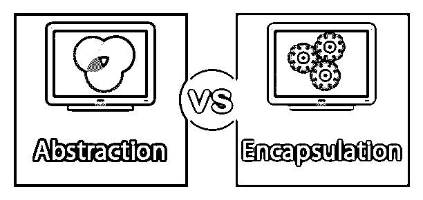

# 抽象与封装

> 原文：<https://www.educba.com/abstraction-vs-encapsulation/>

## 抽象和封装的区别

抽象 vs 封装是基本的面向对象编程(OOP)概念，它允许在代码和程序中实现真实的对象。它们非常不同，因为它们是相辅相成的。虽然他们在技术上是密不可分的，但从字面上看，他们没有任何共同之处。几乎所有的封装都是抽象的，因为它们都掩盖了一些东西，但有相当多的差异。

### 什么是抽象？

抽象是一个基本的 [OOP 概念](https://www.educba.com/what-is-oop/),它只关注一个对象的相关数据，并掩盖所有不相关的细节，这些细节可以或不可以用于一般或专门的行为。它掩盖了背景细节，突出了必要的元素，以降低复杂性，提高效率。它有助于简化领域模型的表示。抽象更多的是关于想法而不是事件。它通过向用户提供功能来掩盖设计层面的细节。抽象也可以称为结果对象。

<small>网页开发、编程语言、软件测试&其他</small>

**我们来举个例子。**

所以让我们将摩托车考虑在内。一名机械师正试图修理你的摩托车，或者说，你的摩托车的某一部分。您是用户，您不想知道您的摩托车的具体情况或实际损坏的部分。你不在乎；你只是想让你的摩托车保持原样，而不用担心细节。你通过分离实现部分告诉机械师你想要什么；这就叫抽象。你做的最重要的事情是修理你的摩托车，而不是关注细节。

### 什么是封装？

OOP 封装的另一个概念是将数据和功能绑定到一个组件中，同时限制对某些组件的访问。封装将提高应用程序的可维护性。这将为用户使用该系统提供很大的灵活性。这使得[整个编码过程](https://www.educba.com/what-is-coding/)更加容易，因为你只对不同类不做的事情感兴趣。这是 OOP 的主要基本概念之一，将数据和数据包装成一个单元。它通过保护数据不受外界影响，赋予数据基本的完整性。它以简单的方式向外界隐藏了额外的信息。

**我们来举个例子。**

只有你需要知道设备的行为，而不必担心实现细节，如键盘有什么传感器，它是否是无线的等等。每个细节都描述了鼠标，但不管细节如何，它只是一个键盘。你只有一个键盘接口，在这种情况下是鼠标指针，我们称之为封装。

### 抽象和封装的直接比较(信息图)

下面是抽象和封装之间的 6 大区别

### 抽象和封装的主要区别

让我们讨论一下抽象和封装之间的一些主要区别:

抽象和封装的主要区别在于，问题是在设计层通过抽象解决的，而在应用程序层通过封装解决的。抽象包括在提供最重要的信息时隐藏不想要的信息，而封装意味着在一个设备中隐藏代码和信息。

抽象允许你关注项目做什么而不是它如何做，而封装意味着对象如何工作的内部细节。如果您对内部信息保密，您可以在以后用更好的技术修改它。抽象侧重于外部观察，例如，移动汽车，而封装侧重于内部工作或内部观察。

在 Java 中，通过[接口和抽象类](https://www.educba.com/java-interface-vs-abstract-class/)支持抽象，并且使用例如公共、私有和安全访问修改系统支持封装。这是 Java 和 OOP 中封装和抽象的分离。回想一下，抽象解决了设计层面的问题，封装解决了执行层面的问题。这两者对于 OOP 程序员来说都是非常重要的，但是有时候很难解释清楚。正如我之前所说，编写代码和阅读他人的代码是学习和掌握面向对象编程的一些最好的方法。

抽象是借助接口(一个抽象类)隐藏实现，而封装是借助 getters 和 setters 隐藏数据。

### 抽象与封装的比较表

下面是抽象和封装之间最重要的比较:

| **抽象** | **封装** |
| 抽象作用于设计层面。 | 封装工作在应用层。 |
| 实现抽象来隐藏不必要的数据并提取相关数据。 | 封装是一种将代码和数据隐藏在一起的机制，以防止外部世界或误用。 |
| 它强调的是物体的功能，而不是物体是如何工作的 | 它专注于物体如何工作的内部细节。稍后可以对设置进行修改。 |
| 抽象着重于外部观察，例如，移动汽车。 | 封装侧重于内部工作或内部观察，例如汽车的生产。 |
| Java 通过接口和抽象类支持抽象。 | 使用例如公共、私有和安全访问修改系统来支持封装。 |
| 简而言之，抽象就是在接口和抽象类的帮助下隐藏实现。 | 简而言之，封装就是在 getters 和 setters 的帮助下隐藏数据。 |

### 结论

在本文中，我们已经看到了什么是抽象和封装，以及它们之间的区别。虽然两者都是隐藏数据的 OOP 思想，但它们彼此之间有很大的不同。它屏蔽了背景信息，突出了关键信息点，从而降低了复杂性，提高了有效性。有了新的需求，封装的代码非常灵活，很容易更改。

### 推荐文章

这是抽象和封装之间最大区别的指南。在这里，我们还将讨论信息图和比较表的主要区别。您也可以看看以下文章，了解更多信息–

1.  [什么是 C++](https://www.educba.com/what-is-c-plus-plus/)
2.  [CSS vs JavaScript](https://www.educba.com/css-vs-javascript/)
3.  [C vs Python](https://www.educba.com/c-vs-python/)
4.  [PHP 中的封装](https://www.educba.com/encapsulation-in-php/)

