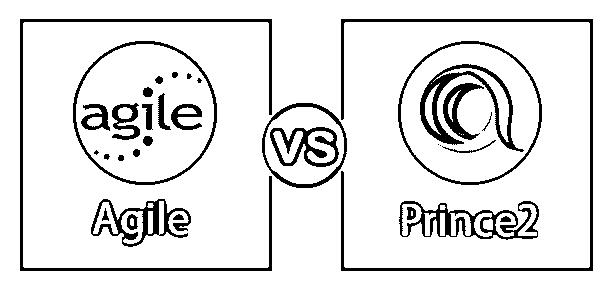
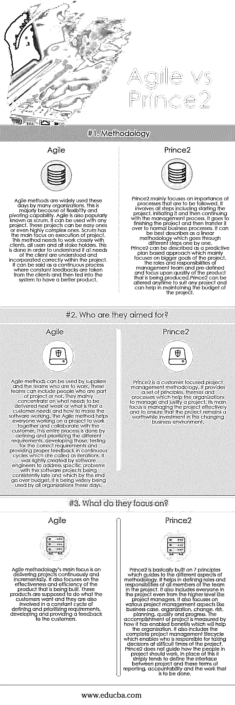

# 敏捷 vs Prince2

> 原文：<https://www.educba.com/agile-vs-prince2/>

## 敏捷与 Prince2 的区别

在任何项目中，都有许多要使用的框架。很难选择这些框架中的一个。当要做决定时，有点困难和挑战。目前最流行的两个框架是 Agile vs Prince2。敏捷是一种[软件开发方法](https://www.educba.com/software-development-vs-web-development/)，它通过使用迭代来帮助构建软件，迭代可能从 1 周到 4 周不等，以便开发过程始终与所有业务需求保持一致。Prince2 代表受控环境中的项目。这种方法有助于为团队的不同成员确定和分配角色。

### 敏捷与 Prince2 的直接对比(信息图表)

下面是敏捷和公主 2 的三大区别

<small>项目进度与管理，项目管理软件&其他</small>

### 敏捷与 Prince2 的主要区别

敏捷 vs Prince2 都是市场上的热门选择；让我们讨论一下敏捷和 Prince2 之间的一些主要区别

*   敏捷和 Prince2 都是[项目管理方法](https://www.educba.com/project-management-interview-questions/),专注于提供能够带来最佳价值的有效产品。
*   当 [Prince2 对客户证明项目是有用的](https://www.educba.com/prince2-process/)时，他们的[敏捷方法对供应商交付工作软件是有用的](https://www.educba.com/agile-vs-waterfall-project-management/)。
*   Prince2 主要是有用的，侧重于更高的管理层次。另一方面，敏捷关注的是底层术语。
*   Prince2 更像是一种预测方法，而 [Agile 是一种更具适应性的](https://www.educba.com/agile-interview-questions/)方法来创建完美的软件。
*   Prince2 关注的问题包括“这个项目应该做吗？”以及‘利益值得冒险吗？’敏捷关注的问题包括‘下周我们交付什么？’以及‘我们如何知道项目是否完成了？’

### 敏捷与 Prince2 对比表

以下是敏捷和公主 2 之间最重要的比较

| **敏捷与 Prince2 的对比基础** | **敏捷** | **王子 2** |
| **方法论** | 如今，敏捷方法被许多组织广泛使用。这主要是因为灵活性和旋转能力。敏捷通常也被称为 Scrum 。它可以用于任何项目。这些项目可能很简单，也可能非常复杂。Scrum 主要关注项目的执行。这种方法需要与客户、所有用户和所有利益相关者密切合作。这样做是为了了解客户的所有需求是否都被正确理解并融入到项目中。这可以说是一个连续的过程，不断地从客户那里得到反馈，然后反馈到系统中，以得到更好的产品。 | Prince2 mainly focuses on the importance of processes that are to be followed. It involves all steps including starting the project, initiating it, and then continuing with the management process. It goes to finishing the project and then transfer it over to normal business processes. It can be best describes as a linear methodology that goes through different steps one by one.

Prince2 可以被描述为一种基于预测计划的方法，主要关注项目的更大目标。管理团队的角色和职责是预先定义的，并关注正在生产的产品的质量。Prince2 可以随时修改以适应任何项目，并有助于维持项目的预算。

 |
| 他们的目标是谁？ | 敏捷方法可以被供应商和团队使用。这些团队可以包括参与或不参与项目的人。他们主要关注下周需要交付什么，或者客户需要什么，以及如何让软件工作。敏捷方法帮助项目中的每个人一起工作，并与客户合作。这个完整的过程是通过定义和区分不同需求的优先级，开发这些需求，测试正确的需求，并在称为迭代的连续循环中提供适当的反馈来完成的。它是由软件工程师创建的，用来解决软件项目持续延迟和最终超出预算的具体问题。如今，它正被所有组织广泛使用。 | Prince2 是一种以客户为中心的项目管理方法。它提供了一套原则、主题和过程来帮助组织管理和证明项目。其主要重点是有效地管理项目，并确保该项目在不断变化的商业环境中仍然是一项值得投资的项目。 |
| 他们关注什么？ | 敏捷方法的主要焦点是持续地、增量地交付项目。它还关注正在构建的产品的有效性和效率。这些产品应该做客户想要的，并且它们也涉及到定义和优先化需求、开发和向客户提供反馈的持续循环。 | Prince2 基本上建立在 7 个原则之上，这些原则指导着该方法的不同方面。它有助于定义项目中所有团队成员的角色和职责。它还包括项目中的每一个人，甚至包括来自更高层的人，如项目经理。它还关注各种项目管理方面，如商业案例、组织、变更、风险、计划、质量和进度。一个项目的完成是通过它如何实现有助于组织的利益来衡量的。它还包括完整的项目管理生命周期，使谁能够在项目的困难时期做出决策。Prince2 并不指导项目中的人应该如何工作。取而代之的是，它仅仅倾向于定义项目和这些报告、责任和要做的工作之间的接口。 |

### 结论

而 Prince2 的重点是业务合理性，以及在业务仍然是最大资产的情况下，风险是否合理。它确保项目在良好的商业意识上进行。响应客户需求的能力是敏捷对项目的主要贡献。敏捷和 Prince2 基本上是两码事。Prince2 是一种项目管理方法，而敏捷方法在供应商向客户交付产品时更有用。项目可以通过使用敏捷 vs Prince2、 [Prince2](https://www.educba.com/prince2-principles/) 的预测方法和敏捷的自适应方法而受益。通过使用这两种方法，所有的项目都可以在预先计算好所有风险和所有时间表的情况下向客户交付产品。它对不断变化的不同环境做出反应，同时确保投资是明智的。

### 推荐文章

这是敏捷和 Prince2 之间最大区别的指南。在这里，我们也讨论了 Agile 和 Prince2 的关键区别，包括信息图表和比较表。你也可以看看下面的文章来了解更多。

1.  [SDLC 与敏捷](https://www.educba.com/sdlc-vs-agile/)
2.  [JDBC vs](https://www.educba.com/jdbc-vs-odbc/)T2】ODBC
3.  [敏捷 vs 开发运维](https://www.educba.com/agile-vs-devops/)
4.  [Oracle vs SQL Server](https://www.educba.com/oracle-vs-sql-server/)

