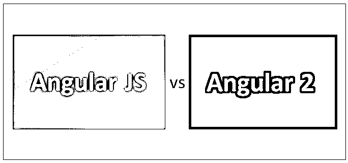

# 角度 JS 与角度 2

> 原文：<https://www.educba.com/angular-js-vs-angular-2/>

## 角度 JS 与角度 2 之间的差异

Angular JS 是一个开源框架，它赋予 web 页面或 web 应用程序以动态特性。Angular JS 使用 HTML 语言来扩展其语法，并帮助更有效地创建应用程序。HTML 主要作为静态语言；角度 JS 用于使其具有动态性。除了 web 应用程序，Angular JS 还可以用于构建移动或桌面应用程序。Angular 2 建立在现代 JavaScript 之上，使用 ES6。Angular 2 是 AngularJS 的继任者。它也是一个用于开发 web 应用程序前端的开源框架。这是用打字稿写的。它还与移动设备兼容，并跨所有平台，如 Windows、Mac 和 Linux。让我们研究一下 Angular JS 和 Angular 2 的区别。

### 角度 JS

*   谷歌在 2010 年开发了 angular JS。它是用 JavaScript 写的。Angular JS 遵循 MVC(模型视图控制器)的概念。MVC 背后的主要思想是区分数据层、逻辑层和视图层。视图从模型接收数据，用于向用户显示。
*   当用户通过执行动作与应用程序交互时，控制器已经改变了模型中的数据。在那个视图之后，它在告诉模型关于变化之后显示信息。在 Angular JS 中，数据存储在对象的属性中，控制器是 JS 类，视图是 DOM(文档对象模型)。Angular JS 具有声明性模板、依赖注入、指令等特性。

### 角度 2

*   在 Angular 2 中，Typescript 具有开发应用程序的强大功能，如模块、类、装饰器、接口、访问修饰符、智能感知，并且编译时错误使编程变得更容易和更好。要从 Angular 2 开始，必须在一台机器上安装 node.js 和 npm install。
*   ES 代表 ECMA 脚本，ES6 于 2015 年发布，新增功能包括对类、模块等的语言支持。它有一个丰富的模板系统，广泛用于开发 Angular 2 的应用程序。
*   Angular 2 主要用于其与后端服务的通信支持的内置特性，使服务器端逻辑变得简单而快速。它具有快速加载页面、数据绑定方法、改进的渲染时间以及更多使用条件语句和局部变量的表达式等特性。

### Angular JS 与 Angular 2 之间的直接比较

下面是 Angular JS 与 Angular 2 的前 8 名对比

<small>网页开发、编程语言、软件测试&其他</small>

### Angular JS 与 Angular 2 的主要区别

以下是描述 Angular JS 和 Angular 2 之间主要区别的要点列表

1.  Angular JS 已经使用控制器和$scope 对象进行开发。在 Angular 2 中，它们已经被用于开发的组件和指令所取代。
2.  Angular JS 使用了过滤器来过滤数据。在 Angular 2 中，过滤器被重命名为管道。
3.  在 Angular JS 中，很难用单页面应用程序来创建搜索引擎。在 Angular 2 中，搜索引擎友好的单页面应用程序更容易创建来呈现服务器端数据。
4.  Angular JS 应用程序不能用于更高版本的 Angular。Angular 2 具有向后兼容性，这也可以用在 Angular 4 中。
5.  Angular JS 和 Angular 2 完全不同。Angular 2 不是 Angular JS 的更新版本
6.  有角度的 JS 应用变得普遍缓慢。Angular 2 比 angular JS 快很多倍。
7.  在 Angular JS 中，“ **ng-repeat** 用于迭代元素。在 Angular 2 中， ***ngFor** 也同样使用。在这种情况下，结构指令的语法发生了变化。
8.  在 Angular JS 中，我们不能定义变量。在 Angular 2 中，开发者可以借助带有变量名的 **hash (#)** 来定义局部变量。
9.  在 Angular JS 中， **ng-bind** 用于处理单向数据绑定。在有角 2 中，**【值】**同样用于处理。
10.  在 Angular JS 中， **ng-model** 用于处理双向数据绑定。在 Angular 2 中， **[(ngmodel)]** 用于处理相同的。
11.  在 Angular JS 中， **ng-click** 用作事件指令。在 Angular 2 中，通过用括号将 HTML 事件和属性括起来，可以直接使用属性和事件。对于属性，使用方括号[]。对于事件，使用括号()。

### 角度 JS 与角度 2 对比表

下面是 Angular JS 与 Angular 2 的详细对比

| **BASIS FOR****比较** | **角度 JS** | **角度 2** |
| **已编程** | Angular JS 是用 JavaScript 写的。 | Angular 2 是用打字稿写的。 |
| **概念** | Angular JS 已经用 MVC 搭建了一个应用。 | Angular 2 使用了基于组件的 UI 构建应用程序。 |
| **路由** | Angular JS 已经使用$routeprovider.when()配置路由。 | Angular 2 已经使用@Route Config{}进行相同的操作。 |
| **并发症** | 这变得复杂，因为同一件事可以用多种方式完成。 | 它定义得非常好，也不太复杂。 |
| **模板系统** | 它有一个很好的模板系统。 | 与 Angular JS 相比，Angular 2 有一个强大的模板系统。 |
| **语法** | Angular JS 语法在记忆指令方面很复杂。 | Angular 2 的语法比 Angular JS 简单。 |
| **支持** | Angular JS 不是为移动支持而构建的。 | Angular 2 主要是为移动支持应用而构建的。 |
| **插件** | Angular JS 不需要任何插件进行开发。 | Angular 2 确实需要插件来构建应用程序。 |

### 结论–角度 JS 与角度 2

Angular JS 和 Angular 2 为在更短的时间内高效地开发 web 应用程序提供了框架。Angular JS 总是可用于单元测试。主要用于 SPA，发展更快。对于 JavaScript 开发人员来说，它很容易理解，也很容易学习。

Angular 2 是在面向移动的应用上概念化的。它提供了改进的依赖注入和简单的路由。它为我们提供了一个用多种语言编写代码的平台。Angular 2 不会被考虑用于创建简单的 web 应用程序。

Angular JS 对于初学者来说仍然有用，因为他们可以很容易地掌握它。这两个角度 JS 和 Angular 2 大部分是不同的。没必要学 Angular JS 您可以直接从 Angular 2 开始，构建您的前端应用程序。Angular 2 采用了移动驱动的方法。

Angular 正在加快前端开发的步伐，因为它使开发速度更快。大型应用程序可以很容易地在角处理。它可以更好地执行组件。每个 Angular 都有自己的优势领域和重要功能。Angular 发布了其更高版本，也具有新的功能和更好的性能。

### 推荐文章

这是 Angular JS 和 Angular 2 之间的区别、它们的含义、直接比较、主要区别、比较表和结论的指南。您也可以阅读以下文章，了解更多信息——

1.  [角度 vs 敲除](https://www.educba.com/angular-vs-knockout/)
2.  [角度 JS 对角度](https://www.educba.com/angular-js-vs-angular/)
3.  [角度与自举](https://www.educba.com/angular-vs-bootstrap/)
4.  [Angular vs JQuery](https://www.educba.com/angular-vs-jquery/)

