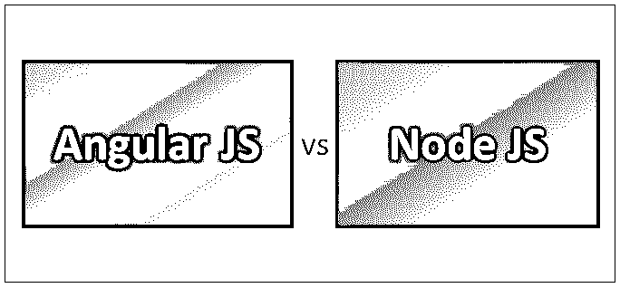

# 角度 JS 与节点 JS

> 原文：<https://www.educba.com/angular-js-vs-node-js/>

## 角度 JS 与节点 JS 的区别

[Angular JS 是基于 JavaScript](https://www.educba.com/what-is-angularjs/) 构建 web 应用前端和[的](https://www.educba.com/careers-in-javascript/)开源框架。它由[谷歌开发者](https://www.educba.com/google-plus-page-for-business/)维护，以解决单页面应用开发过程中面临的挑战。Node JS 是一个跨平台的运行时库和环境，用于在浏览器之外创建运行的 JavaScript 应用程序。它是免费和开源的，用于创建服务器端 JS 应用程序。

**让我们更详细地研究角度 JS 与节点 JS:**

<small>网页开发、编程语言、软件测试&其他</small>

Angular JS 提供了一组特性，可以极大地减少代码量，从而减少使应用程序功能完善所需的工作量。它也被描述为模型-视图-控制器(MVC)框架，因为它的方法是模块化的，可以构建应用程序。

Node JS 允许开发者在服务器端执行他们的代码。它提供了一种更快的方式来编写可伸缩的轻量级脚本。开发者可以编写实时应用，同时也为[移动应用开发](https://www.educba.com/testing-of-mobile-application/)提供了范围。

Angular JS 中有多个 JavaScript 文件。每个希望使用 Angular JS 的应用程序都包含一个核心文件，因为它包含了主要的框架特性。可以将附加文件和模块添加到构建在核心功能之上的功能中。

人们可以很容易地将 Node JS 用于前端和后端开发，因为它允许使用相同的 JavaScript。Node JS 中广泛提供了服务器端功能；开发者可以在计算机上监听并回复 [HTTP 请求](https://www.educba.com/http-methods/)，监听流量网络，同时可以直接从计算机访问数据库。Node JS 使用基于事件的模型来解决可伸缩性问题，并为 JavaScript 模块提供丰富的 JavaScript 库，这有助于简化编码。

Angular JS 在创建动态 web 应用程序时非常有用。使用 Angular JS 的开发人员使用 HTML 作为模板语言，其语法用于简单地表达应用程序的组件。它的体系结构允许模型、视图和组件之间自动平滑的数据同步。对于基于单页面的 web 应用程序，Angular JS 更快更容易编码。它的模板与传统的普通 HTML 相同，并包括扩展的 HTML 术语，这意味着即使是初学者也可以直接使用 Angular JS。

基于[节点 JS 的框架有很多，比如](https://www.educba.com/express-js-interview-questions/) Express JS，Partial JS 等。在构建快速且可伸缩的服务器端应用程序时，Node JS 无疑是赢家。基本上， [Node JS](https://www.educba.com/career-in-node-dot-js/) 赋予了 JavaScript 通过其 API 与 I/O(输入/输出)设备进行交互的能力，并与用各种其他语言编写的其他外部库进行连接。

Angular JS 提供了为动态网站和 web 程序构建 GUI(图形用户界面)的潜力。使用 Angular JS 框架可以流畅地创建单页面应用程序，该框架允许编写定制的 HTML 代码并与其他 UI 工具集成。

### 角度 JS 和节点 JS 之间的直接比较

以下是 Angular JS 和 Node JS 之间的前 8 名比较:

### 角度 JS 和节点 JS 的主要区别

下面解释了一些要点，显示了角度 JS 和节点 JS 之间的差异:

1.  Angular JS 是构建大型项目的绝佳选择，而 Node JS 是开发小型项目的理想选择。
2.  Angular JS 不用单独添加安装；必须像添加任何其他 JavaScript 文件一样添加它，以便在应用程序中使用，而节点 JS 必须安装在机器上。
3.  Angular JS 是一个前端框架，可以用于任何后端编程语言，如 PHP、Java 等。，而 Node JS 只是一种服务器端语言；在像 context 这样的 web 应用程序中，它充当服务器端的 Java。
4.  Angular JS 完全是用 JavaScript 创建的，而 Node JS 是用 JavaScript、C++和 C 语言编写的。
5.  Angular JS 支持实时应用程序，如即时消息或聊天应用程序，而 Node JS 最适合实时协作绘图或编辑应用程序，如 Google Docs。
6.  Angular JS 是应用程序客户端的开源框架，而 Node JS 是用 JavaScript 编写的应用程序的跨平台运行时系统和环境。
7.  Angular JS 运行在客户端浏览器上，而 Node JS 运行在服务器端。
8.  Angular JS 兼容 Chrome、Firefox、Internet Explorer、Safari、Opera 和基于移动的浏览器，如 Android 浏览器、Chrome for Mobile 等，而 Node JS 可用于 Windows、Linux、Sun OS 和 Mac OS。
9.  Angular JS 是一个 web 应用程序框架，而许多框架都是基于 Node JS 的，如 Express JS、Sails JS 等。
10.  Angular JS 最适合交互式单页面 web 应用程序，而 Node JS 用于构建快速的基于服务器的 web 应用程序。

### 角度 JS 和节点 JS 对照表

以下是角度 JS 和节点 JS 的对照表:

| **BASIS FOR**

**比较**

 | **角度 JS** | **节点 JS** |
| **创作** | 完全用 JavaScript 编写 | 用 C，C++，JavaScript 写的 |
| **应用** | 单页客户端 web 应用程序 | 快速和可伸缩的服务器端应用程序 |
| **项目** | 适合高度互动和活跃的 web 项目 | 最适合小型项目 |
| **用途** | 对于即时消息等实时应用非常有用 | [当需要可扩展和更快的应用程序时非常有用](https://www.educba.com/uses-of-node-dot-js/) |
| **安装** | 像任何 JavaScript 文件一样需要 Angular JS 文件 | 需要在系统上安装 Node.js |
| **范围** | 主导客户端交互 | 开发人员可以在客户端和服务器端利用它 |
| **框架** | 它本身就是一个 web 应用程序框架 | 有许多不同的框架，如 Express.js、Sails.js 和 Partial.js |
| **应用** | 使用声明式方法简化应用程序开发 | 更适合像 Google Docs 这样的实时协作绘图/编辑应用 |

### 结论

两者都是开源项目，它们的主要动机是使用 JavaScript 更容易地构建 web 应用程序流程。同时，它们的架构和工作模式也大相径庭。他们的 kitty 都有广泛的功能，可以用来创建各种应用程序。

Angular JS 最适合本质上是动态和交互式的单页应用程序，如聊天应用程序和即时消息，而 Node JS 作为一种服务器端语言，为实时数据密集型和协作编辑或绘图的应用程序(如 Google Docs 或 Dropbox)提供了运行时环境。尽管 Angular JS 和 Node JS 有很多不同，但它们在各种应用程序中都有广泛的用途，但有一点是共同的，那就是 JavaScript。

如果要选择 Angular JS vsNode JS，必须牢记应用要求。Angular JS 只是一个基于客户端浏览器的应用程序，而 Node JS 需要一个运行时环境，并负责应用程序和数据库的交互。他们两人在各自的领域内看起来都是有前途和令人兴奋的选择。

### 推荐文章

这是角 JS 与节点 JS 之间差异的有用指南。在这里，我们已经讨论了角度 JS 与节点 JS 的头对头比较，关键差异，以及信息图和比较表。您也可以阅读以下文章，了解更多信息——

1.  [角度 vs 敲除](https://www.educba.com/angular-vs-knockout/)
2.  [角度与自举](https://www.educba.com/angular-vs-bootstrap/)
3.  [Angular vs JQuery](https://www.educba.com/angular-vs-jquery/)
4.  [角度与反作用](https://www.educba.com/angular-vs-react/)

