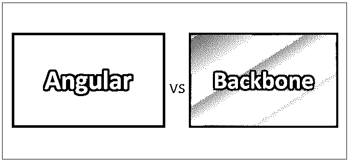
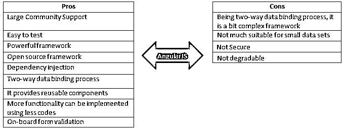
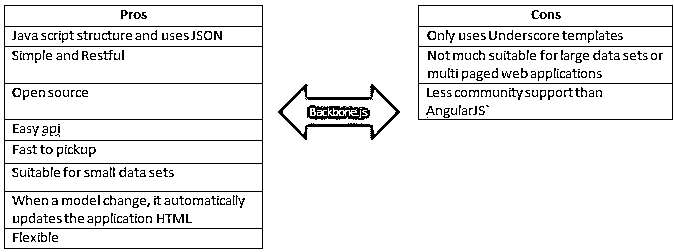

# 棱角与脊背

> 原文：<https://www.educba.com/angular-vs-backbone/>

## 棱角与脊背的区别

AngularJs 和 Backbone.js 是过去几年来前端 web 开发领域的两个流行框架。Backbones vs Angular 都是开源的，用于构建动态网页应用程序。然而，AngularJS 和 Backbone 之间也有许多不同之处。在这里，我们将有一个详细的讨论角与骨干。

AngularJS 是一个基于 [Javascript 的](https://www.educba.com/javascript-vs-ruby/)开源独立框架，旨在支持数据密集型 web 应用的开发和测试驱动的开发。谷歌主要维持这个框架。它诞生于 2009 年，是名为 Get Angular 的大型商业产品的一部分。

### 棱角的特征

AngularJS 的一些重要特征如下:

*   双向数据绑定过程
*   依赖注入
*   易于测试的代码
*   深层链接
*   [路由](https://www.educba.com/routing-algorithms/)
*   控制器
*   用指令扩展 HTML 属性的功能

Backbone.js 是一个轻量级的 Javascript 框架，由 Jeremy Ashkenas 在 2010 年开发。它提供了一个 MVC 框架，将数据抽象成模型，将 DOM 抽象成视图，然后使用事件绑定这两者。它更像是一个紧凑的 MVC Javascript 库，而不是一个成熟的框架。Backbone.js 通过事件进行通信，这确保了代码会更干净、更好、更易于维护。它用于开发结构良好的移动应用程序。

#### 成分

它主要由六个部分组成。

Backbone.js: 1。型号，2。查看，3。收藏，4。事件，5。路由器，6。同步

就像一枚硬币的两面，棱角和脊背都有一些优点和缺点。

#### 利弊

以下是 AngularJs 和 Backbone.js 的优缺点:

**AngularJS(赞成和反对):**

**Backbone.js(正反两面):**

### 角骨和脊椎骨的面对面比较(信息图)

以下是棱角型和骨干型的 8 大对比:

### 角形和骨干之间的主要区别

以下几点解释了角形和主干之间的主要区别:

1.  AngularJS 是一个强大的基于 javascript 的独立框架，而 Backbone.js 是一个轻量级的 Javascript 框架
2.  AngularJS 使用双向数据绑定过程，而 Backbone.js 不提供任何数据绑定过程，因此不适合大型 web 页面开发。主干网主要用于小型网页或小型数据集的开发过程
3.  Angular 比 Backbone.js 有更多的社区支持
4.  在性能方面，对于小型数据集，Backbone.js 比 [AngularJS 更快](https://www.educba.com/angularjs-interview-questions-for-experienced/)
5.  AngularJS 非常容易测试。此外，从开发的角度来看，AngularJS 中的单元测试比 Backbone.js 中的单元测试更加流畅
6.  js 可以根据需要整合到 app 中的不同特性，提供更大的灵活性。
7.  Angular 使用 MVC，而 Backbone 使用 MVP 架构。
8.  AngularJS 主要关注有效的 [HTML 动态](https://www.educba.com/html-vs-css/)元素，而 Backbone.js 依靠直接的 [DOM](https://www.educba.com/javascript-dom/) 操作来表示数据变化。

### 角度和脊柱对照表

角形和骨干之间的主要区别如下:

| **比较依据** | **角度** | **骨干** |
| **定义** | AngularJS 基本上是一个开源的基于 javascript 的前端 web 应用框架。它用新的属性扩展了 HTML。 | js 是一个轻量级的 javascript 库，有一个 RESTful 的 JSON 接口，它提供了一个 MVC 框架。 |
| **性能** | AngularJS 是已知的开源框架之一，它提供了双向数据绑定过程，因此为较大的页面提供了有效的性能。 | 在小数据集或小页面的情况下，Backbone.js 提供了比 AngularJS 更快的性能。但是对于较大的页面来说，它并不是首选，因为它不做任何数据绑定过程。 |
| **架构** | AngularJS 在 MVS 架构上工作，它使用双向数据绑定来驱动应用程序活动。 | Backbone.js 使用 MVP 架构，它不提供任何数据绑定过程。 |
| **模板化** | AngularJS 通过动态 HTML 属性提供给模板，这些属性被添加到文档中，使应用程序在功能层面上易于理解。 | Backbone.js 使用下划线模板。这些模板不像 Angular 提供的那样功能齐全。 |
| **测试** | 单元测试在角度上比在主干上更受欢迎。主要是在大型应用的情况下，通过这个框架测试更顺畅。 | Backbone.js 不提供任何数据绑定过程，因此它主要为单个页面或较小的应用程序提供快速测试体验。对于大型或多页面的应用程序，它不如 AngularJS 好。 |
| **支持** | AngularJS 拥有庞大的社区支持和丰富的文档库。它也得到了谷歌的支持。 | Backbone.js 也有很好的社区支持。但是它只记录下划线模板。 |
| **简单** | AngularJS 实现了双向绑定过程，因此它比 Backbone.js 稍微复杂一些。 | 主干不提供任何数据绑定，并且有一个比 AngularJS 更简单的 API。 |
| **高级功能** | AngularJS 主要关注有效的 HTML 和动态元素，这些元素镜像底层数据，按照指定的规则重建 DOM。然后，它处理更新的数据记录。 | Backbone.js 采用直接 DOM 操作方法来表示数据和应用程序架构的变化。 |

### 结论

在一系列因素上比较了 Angular 和 Backbone 之后，可以得出结论，任何框架的选择完全取决于最适合项目需求的特性，因为每一个都有自己的优点和缺点。

Backbone.js 是一个轻量级的 web 框架，主要专注于一个高性能的 web 应用程序，同时也易于开发。AngularJS 也有这些特性，它增加了一些特性，比如双向数据绑定过程和依赖注入，这些都是 Backbone 中没有的。现在已经这么说了，它实际上使 Angular 比 Backbone 更加困难和复杂。因此，对于小型网页开发，它提供的性能比主干网慢得多。Backbone 不提供任何数据绑定机制，因此对于可以使用 AngularJS 框架顺利处理的大型应用程序来说，它并不是首选。

因此，基于项目需求的类型、工作时间以及主干与角度的其他讨论方面，应该选择这些框架中的任何一个来达到期望的目标。

### 推荐文章

这是一个很有用的角度对比脊柱的指南。在这里，我们已经讨论了角度与骨干头对头比较，关键差异，以及信息图和比较表。您也可以阅读以下文章，了解更多信息——

1.  [角度 vs 敲除](https://www.educba.com/angular-vs-knockout/)
2.  [角度与自举](https://www.educba.com/angular-vs-bootstrap/)
3.  [Angular vs JQuery](https://www.educba.com/angular-vs-jquery/)
4.  [角 js vs view js](https://www.educba.com/angular-js-vs-vue-js/)

