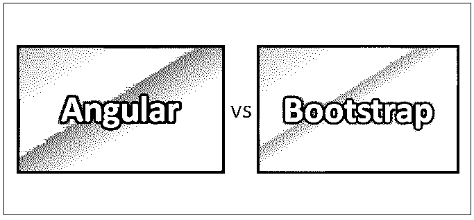

# angularjs 自举

> 原文：<https://www.educba.com/angular-vs-bootstrap/>

## 角度和引导之间的差异

前端开发现在有很多框架。它们有助于使 web 开发更容易，也有助于质量开发。所有这些框架每天都在改进，结果是增加了所有应用程序的可伸缩性。两个著名的框架是 Angular 和 Bootstrap。AngularJS 通常用于单页应用程序项目。它为 MVC 架构提供了数据模型绑定。要编写的代码量较少。另一方面，Bootstrap 速度很快，使用 HTML、CSS 和 JavaScript。它是开源的，有一个 12 列的网格系统。它有随时使用控制器的功能。Angular 和 Bootstrap 各有利弊。让我们来看看角度和引导之间的主要区别。

### Angular 和 Bootstrap 之间的直接比较(信息图表)

下面是 Angular 与 Bootstrap 之间的 4 大比较

<small>网页开发、编程语言、软件测试&其他</small>

### Angular 和 Bootstrap 之间的主要区别

虽然两者都用于网页开发，但是它们在 Angular 和 Bootstrap 之间有一些显著的区别，如下所示:

*   AngularJS 是 Google 开发的一个深入、全面的框架。它为您提供了前端开发所需的一切。它通过扩展 HTML 及其指令来操纵数据对象模型(DOM)。它有一个双向绑定，当数据发生变化时，它会改变视图。另一方面，Bootstrap 最初是由 Twitter 发起的，作为一种风格指南。它是为开发人员设计的，能够以所需的精度和效率进行快速开发。它是开源的，有完整的 HTML、CSS 和 JavaScript 框架。它有一个 CSS 处理器和一个 12 列的网格系统，并预先设计好，随时可以使用 UI 组件。
*   Bootstrap 有各种组件、实用程序和迁移工具。组件包括警告、表单、分页、导航栏、工具提示等。它还提供了诸如边框、颜色、尺寸选项、间距选项等实用工具。有了这些，开发就变得简单而快速。另一方面，AngularJS 的主要特征是指令、可重用组件、本地化和可测试性。这些指令帮助您创建特定于您的应用程序的 HTML 语法。可重用性允许您重用组件，并允许您隐藏复杂的结构及其行为。这有助于保持对应用程序的关注，它看起来是独立的。此外，在 AngularJS 中创建的代码是单元测试就绪的，不需要单独的测试。

### 角度与自举比较表

以下是 Angular 与 Bootstrap 之间的比较表:

| **比较的基础** | **角度** | **自举** |
| **基本区别和历史** | AngularJS 由谷歌开发，在全球范围内使用。它是用于前端开发的顶级框架之一。它提供了一组组件，有助于根据需要构建应用程序和组织项目。 | Bootstrap 由 Twitter 开发，并使其成为开源社区的一部分。它很容易获得，每个人都可以使用。它有非常常见的组件，如 CSS、样式、JavaScript，这使得开发人员可以更快地开发。 |
| **特性** | AngularJS 提供了五种类型的框架，支持流畅的前端开发。它提供 AngularUI 引导、Angular 基础、Ionic 框架和移动 Angular UI。它提供了 JavaScript 和 MVC 架构。它还具有数据绑定和路由功能以及依赖注入。除此之外，AngularJS 还可以用于移动应用程序开发。 | 另一方面，Bootstrap 提供 CSS、样式和结构布局。它有一个使用 JavaScript 的响应框架。它还使用户可以使用除常规 HTML 元素之外的常用界面元素。所有组件都是应用于特定 HTML 元素的 CSS 类。使用 Bootstrap，网页的布局会根据页面或设备的尺寸自动调整。 |
| **控制器和表单** | AngularJS 获取数据，进行处理，然后发送给最终用户。它必须有业务逻辑，这是要实现的。控制器使用数据模型并执行处理。它的主要职责是控制进一步传递给视图的数据。这个视图有双向通信，可以调用函数。视图中出现的事件可以进一步调用方法。 | Bootstrap 使用表单获取用户输入并进行处理。这些表单是收集数据的基于输入的组件。它提供不同种类的形式，如垂直，内联和水平形式。它提供了像<input>、<select>这样的文本表单控件，使用。表单控制类。有调整大小、只读等操作。，这有助于控制数据。</select> |
| **优势** | 以下是 Angular 的几个优点:
1)一个好的 MVC:大多数框架都要求将一个应用分成多个 MVC 组件。开发人员必须分别编写它们，然后将它们集成在一起。这是在 AngularJS 中自动完成的。更直观:AngularJS 很容易学习，因为它使用了 HTML 的大部分组件。HTML 是一种声明性语言；大多数组件都可以被识别，并且需要更少的重新组织。
3)全面:AngularJS 不需要任何额外的插件或框架。它还支持许多附加特性，如 Restful 动作、数据构建、依赖注入、企业级测试等。单元测试就绪:不需要测试 AngularJS 代码，因为它的框架有能力自己测试。 | 以下是 Bootstrap 的几个优点:
1)开发速度快:使用 Bootstrap 时开发过程非常快。它提供 CSS 功能和预定义的代码块，有助于节省精力。
2)一致性:无论开发方式如何，Bootstrap 都能确保一致性。此外，它确保了不同浏览器之间的一致性，并且输出在所有浏览器之间保持相同。
3)响应性:Bootstrap 提供了现成的类，使得在网格系统中查找点变得更加容易，并且还利用了每一列。一旦确定了列，就可以在任意点将数据加载到水平列中。因此，通过 Bootstrap，流体网格布局上的工作变得平滑而容易。可定制:开发者可以很容易地选择设计和定制页面所需的各个方面。您可以轻松删除不需要的组件，并根据您的需求添加任何需要的组件。因此，您可以使用自定义版本的引导。 |

### 结论

这两个框架在前端开发中都很有用。一个提供获取所有组件的速度和便利性，而另一个提供控制器和本地化，这有助于创建包含微小细节的单个网页。

### 推荐文章

这是一个有用的指南，说明了 Angular 和 Bootstrap 之间的区别；我们已经讨论了它们的含义、直接比较、关键区别和结论。您也可以阅读以下文章，了解更多信息——

1.  [有角度或敲除](https://www.educba.com/angular-vs-knockout/)
2.  [角度 JS 对角度](https://www.educba.com/angular-js-vs-angular/)
3.  [Java vs Node JS](https://www.educba.com/java-vs-node-js/)
4.  [角度 JS 对节点 JS](https://www.educba.com/angular-js-vs-node-js/)

