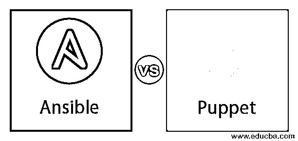

# Ansible vs 木偶

> 原文：<https://www.educba.com/ansible-vs-puppet/>

## Ansible 和 Puppet 的区别

在本文中，我们将看到 Ansible vs Puppet 的概要。这些是配置管理工具(CM 工具)，通过它们可以处理部署和其他任务。如今，DevOps 工程师正在处理多个应用程序，所有复杂的任务都由这些 CM 工具处理。有许多工具，但 ansible 和 puppet 是 IT 走廊中使用最多的。配置管理是一个非常重要的过程，它需要[来支持持续集成](https://www.educba.com/what-is-continuous-integration/)。当管理员试图在多台服务器上工作和部署时，只需点击一下鼠标，这些工具就变得非常方便，并且这可以通过本次讨论中的两种工具来实现。

### Ansible 和 Puppet 的正面比较(信息图)

以下是 Ansible 和 Puppet 的十大对比:

<small>网页开发、编程语言、软件测试&其他</small>

### Ansible 和 Puppet 的主要区别

我们来讨论一下 Ansible 和 Puppet 的顶级对比:

#### 1.Ansible

*   Ansible 由 Red Hat 在 2012 年推出，完全用 python 开发，其目的是支持快速部署特性。与木偶相比，市场份额要小一些，因为木偶更古老，更受欢迎。因为 python 是在基于 Linux 和 Unix 的系统中构建的，所以运行 Ansible 要容易得多。
*   Ansible 可以接受几乎所有可用语言的命令，这是一个很大的好处。Ansible 有许多子模块，可以支持 AWS 等大量集成。Ansible 使用 YAML 语法将更改或配置推送到不同的节点。

#### 2.木偶

*   早在 2005 年就推出了一个 puppet，它已经显著提高了它在配置管理行业的市场份额。它是用 Ruby 语言写的，作者是 Luke Kanies。
*   它是开源的，可以在所有主要平台上运行 Unix、Windows、Mac、Linux 等。大多数大型组织，如 Oracle 和 Google，都在使用 puppet 进行部署。Puppet CM 工具还有一个企业版。

### Ansible 与 Puppet 对比表

下表总结了 Ansible 与 Puppet 之间的比较:

| **类别** | **可回答的** | **木偶** |
| **管理**和**调度(均使用** **推拉** **配置)** | 在 Ansible 中，服务器将配置推送到节点，以便更好、更快地部署代码。it 的免费版本在调度方面没有更好的选择，但企业版提供了一些服务，但效率不如竞争对手的傀儡。 | In puppet, configuration gets pulled by the client from the respective server.

每隔三十分钟，它检查由傀儡代理执行的节点的状态。

 |
| **语言** | Ansible 完全是用 Python 编写的，它使用 YAML 语法来表达或编写配置。 | Puppet 是用 Ruby 编写的，它使用声明性语言。木偶用它来形成配置。 |
| **可扩展性** | 就 ansible 而言，可伸缩性更方便、更简单。 | Puppet 也支持高可伸缩性，但与 ansible 相比有所欠缺。 |
| **设置和使用** | 它有一个主服务器，没有任何代理运行在 Ansible 的客户端机器上，并使用 YAML 语法来编写配置。几乎所有复杂的任务都由这些配置文件管理，命令可以是任何编程语言的。 | 它非常容易安装和使用。它使用客户机-服务器体系结构，它的安装可以在多台服务器上一起完成。 |
| **错误和故障处理** | 在 ansible 的情况下，在任务运行之前，任何语法错误都会通知管理员。一旦任务失败，管理员就可以验证并执行重新运行。需要注意的是，YAML 的调试有点困难。 | 在 puppet 中，尽管与 ansible 相比，它在一些特性上比较复杂，但是它有很多优点。如果出现任何语法错误，在任务运行之前会突出显示错误，这使得管理员可以更容易地进行修改。 |
| **出现故障时的可用性** | 可用性在 ansible 的情况下不太重要，因为在任何节点出现故障的情况下都有备用节点可用。 | 在 puppet 中，会有多个主服务器，即使其中一个原始主服务器出现故障，也不会妨碍任务，故障可以轻松处理。 |
| **储存库** | Ansible 星系是 Ansible 的储存库。 | puppet forge 是 Puppet 的仓库，它有大约 6000 个由 Puppet 支持的模块。 |
| **支持** | Ansible 成立于 2012 年；因此，它限制了开发人员社区，也减少了 web 上用于故障排除的资源。 | 由于 puppet 的可用性是从 2005 年开始的，并且它拥有更广泛的市场份额，所以就拥有更好知识库的开发人员社区而言，可以获得更好的支持。网上还有许多调试场景，可以帮助员工处理故障或错误。还将提供标准和高级专业支持。 |
| **用户界面 UI** | 在开始的时候，Ansible 只能通过命令行使用。后来的用户界面版本增加了，但它并不像木偶那样高效，而且许多人都面临着与 Ansible 的 CLI 和 UI 模式同步的问题。 | 它既有 CLI(命令行界面)选项，用 Ruby 编写，又有 GUI(图形用户界面)选项。在查看和管理复杂任务时，GUI 比 ansible 具有更强的交互性。 |
| **商业定价** | 基本上，ansible 是一个免费的开源 DevOps 工具。但是在企业级别，ansible 有三个级别的定价，第一个是每年 100 个节点的 5000 美元，具有自我支持；第二个是每年 100 个节点的 10000 美元，具有标准支持；最后一个是每年 13000 美元，具有 100 个节点，属于特优类别。 | Puppet 也是一个免费的 DevOps 工具，但是要在企业级使用它，我们需要支付一些费用。最多 10 个节点，它是免费的，但标准版的额外节点需要 100 美元，高级版需要 199 美元。 |

### 结论

DevOps 的 Puppet 和 Ansible 配置工具各有优缺点，并且都被业界用于部署目的，但是前者具有更好的市场份额并且也是高效的。取决于各种约束和所使用的编程语言，业界决定使用哪一种。

### 推荐文章

这是 Ansible 和 Puppet 之间最大区别的指南。在这里，我们还讨论了 Ansible 和 Puppet 的关键区别，包括信息图和比较表。您也可以看看以下文章，了解更多信息–

1.  [可回答的面试问题](https://www.educba.com/ansible-interview-questions/)
2.  [Ansible vs 木偶 vs 厨师](https://www.educba.com/ansible-vs-puppet-vs-chef/)
3.  [Terraform vs Ansible](https://www.educba.com/terraform-vs-ansible/)
4.  [Saltstack vs Ansible](https://www.educba.com/saltstack-vs-ansible/)

