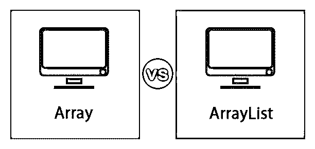
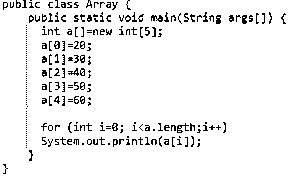
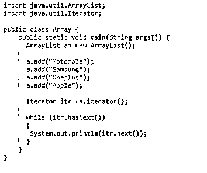
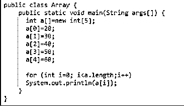
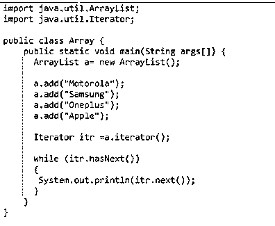

# 数组与数组列表

> 原文：<https://www.educba.com/array-vs-arraylist/>

## 数组和数组列表的区别

数组和数组列表是重要的数据结构，用来存储和处理大量的元素。但是它们之间有一些关键的区别。一个好的程序员必须知道它们之间的比较，以决定什么时候使用什么以及为什么有效。

数组是一种数据结构，我们可以在其中存储给定大小的相似类型的元素。例如整型数组、字符串型数组等。因此，Java 中的普通数组是一种静态数据结构。数组列表是一种动态数据结构，可以在列表中添加和删除条目。因此，如果您不确定数组中有多少个元素，这种动态数据结构将会帮助您。

<small>网页开发、编程语言、软件测试&其他</small>

在本文中，我们将讨论 java 中数组和 ArrayList 的区别。

### 理解数组和数组列表的例子

数组是一种数据结构，我们可以在其中存储给定固定大小的相似类型的元素。

**代码示例:**

让我们创建一个包含五个 int 类型元素的数组。我们将使用 for 循环遍历它们。

数组列表是一种动态数据结构，可以在列表中添加和删除条目。因此，如果您不确定数组中有多少个元素，这种动态数据结构将会帮助您。

**代码示例:**

### **数组和数组列表**的直接差异(信息图)

下面给出了数组和数组列表之间的主要区别:

### Java 中数组和数组列表的主要区别

以下是 Array 与 ArrayList 的主要区别:

#### 1.灵活性

数组是一种静态数据结构。一旦定义了数组的大小，就不能更改其大小值。因此，Java 中的普通数组是静态数据结构，因为数组的初始大小是固定的。

另一方面，数组列表的大小是灵活的。您可以在方便的时候添加或删除列表中的项目。当从 ArrayList 中移除项时，我们将 null 赋给被移除值的索引，整个索引值自动降 1。加法也是如此。

#### 2.履行

数组是一种数据结构，我们可以在其中存储给定固定大小的相似类型的元素。数组列表是一种动态数据结构，可以在列表中添加和删除条目。实际上，ArrayList 是用 Java 中的数组实现的。如果导入 java.util.ArrayList 包来使用 ArrayList()方法创建 ArrayList 对象会有所帮助。

**数组**的示例代码片段

**数组列表的示例代码片段**

#### 3.表演

虽然 ArrayList 基本上是基于数组的，但是我们看到了它们之间的性能差异。这是因为数组列表的存储类型和功能。我们看到了 CPU 时间和内存利用率方面的性能差异。根据所执行的操作，Array 和 ArrayList 的性能会有所不同:

与数组相比，ArrayList 需要更多的内存来存储。这是因为存储相似的对象比存储相似的原始类型变量需要更多的内存。

resize()操作:ArrayList 使用自动调整大小，创建一个临时数组将元素从旧数组复制到新数组。这会降低整体性能。

get()操作:对于基于索引的访问，ArrayList 和 array 具有相同的性能，因为这需要恒定的时间。

add()操作:这里，我们看到了关键的区别，因为在 ArrayList 中添加新元素需要两个内部操作:复制和调整大小。ArrayList 中的加法在后台创建一个新数组，并将元素从旧数组复制到新数组。

#### 4.基元

数组可以存储元素的基本类型和对象类型。另一方面，ArrayList 不能存储基元类型；它只能存储相同类型的对象。

那么我们如何在数组列表中存储整数值呢？

答案是 JVM 的**自动装箱**能力。自动装箱在内部将原语转换为它的等效对象。

**例如:**

因此，自动装箱在内部执行以下操作。

#### **5。类型安全**

一个数组只能存储相似类型的元素。如果要在数组中存储指定元素以外的不同类型的元素，它将在创建该数组的对象时引发 ArrayStoreException。这个异常将在运行时抛出，因为数组不是类型安全的。数组没有编译时检查。

**例如:**

另一方面，ArrayList 是类型安全的，因为它通过泛型来确保类型安全。[泛型允许](https://www.educba.com/c-sharp-generics/)编译器在编译期间检查是否有任何类型不匹配。

#### 6.迭代值

ArrayList 使用 iterator()方法创建集合。然后使用 while 循环，我们将逐个遍历元素并打印值。

另一方面，我们可以使用 for 循环或 for each 循环来迭代数组。

#### 7.长度

在许多用例中，我们可能需要获得整个数组的大小。对于 Arraylist 来说，这个计算非常简单。我们可以通过使用 size()方法来获得数组列表的长度。

另一方面，每个数组对象都有一个 length 变量，它返回数组的长度。

**例如:**

#### 8.添加元素

在 ArrayList 中添加或插入是可能的，因为它是一个动态数据结构。我们可以使用 add()方法在数组列表创建后插入元素。

另一方面，数组的大小是固定的。然而，我们可以通过赋值在数组中插入元素。我们不能动态添加超过数组大小的新元素。

**例如:**

#### 9.尺寸

数组列表是一维的。然而，该阵列可以是多维的。

**例如:**

### 数组和数组列表-对照表

让我们讨论一下 Array 和 ArrayList 之间的主要比较

| **比较的基础** | **数组** | **阵列列表** |
| **灵活性** | 该数组是静态数据结构 | 数组列表是一种动态数据结构 |
| **原语** | 可以存储元素的原始类型和对象类型 | 只能存储相同类型的对象。 |
| **类型安全** | 该数组只能存储相似类型的元素。否则，它将在创建该数组的对象时抛出 ArrayStoreException。 | ArrayList 是类型安全的，因为它通过泛型来确保类型安全。 |
| **迭代数值** | 使用 for 循环或 for each 循环实现迭代。 | 使用 iterator()方法创建集合 |
| **添加元素** | 可以通过赋值在数组中插入元素。 | use add() method to insert elements in an ArrayList |
| **尺寸** | 多维的 | 一维的 |

### 结论

这就是 Java 中数组和数组列表的重要区别。你必须记住的最重要的区别是数组是静态的，而数组列表本质上是动态的。主要基于这个区别，如果你认识到前方的维度，你必须使用一个数组；如果你不确定，那么就使用数组列表。

### 推荐文章

这是一个数组和数组列表的指南。在这里，我们讨论信息图、示例和比较表的主要区别。您也可以浏览我们推荐的其他文章，了解更多信息——

1.  [Java Vector vs ArrayList](https://www.educba.com/java-vector-vs-arraylist/)
2.  [C#数组 vs 列表](https://www.educba.com/c-sharp-array-vs-list/)
3.  [C vs Java](https://www.educba.com/c-vs-java/)
4.  [阵列的优势](https://www.educba.com/advantages-of-array/)

