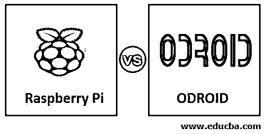
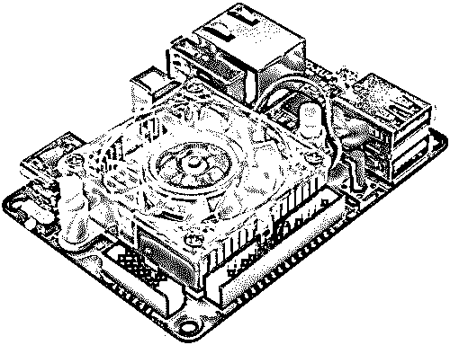
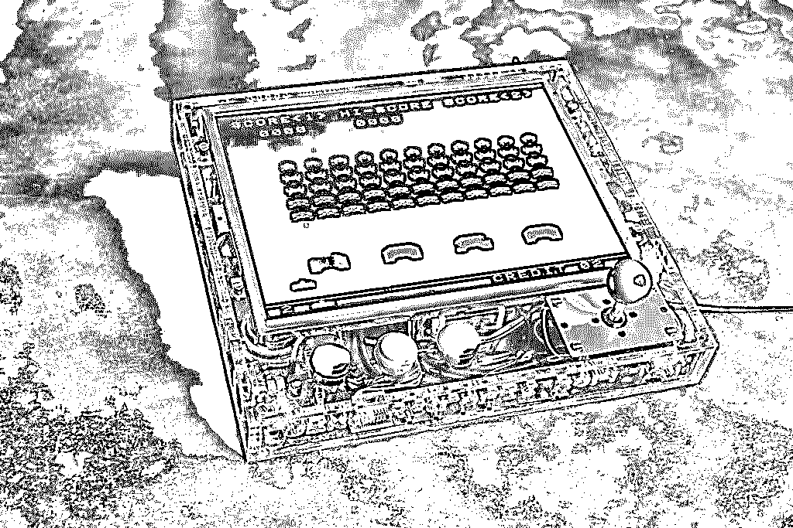

# 树莓派 vs ODROID

> 原文：<https://www.educba.com/raspberry-pi-vs-odroid/>

## Raspberry Pi vs ODROID 简介

在本文中，我们将讨论树莓 Pi 与 ODROID。这个博客不仅仅是关于编程的。这是关于臭名昭著的树莓派。不，这不是你吃的那种馅饼。这是目前这个星球上最受欢迎的微型计算机，几乎和你的信用卡一样大。从今以后，我会在博客中称它为拉斯皮。

因此，如果你对你的正常编程和编码感到厌倦，那么你就在正确的地方。是的，这是关于编程的，但不是你在日常生活中做的无聊的编码。[树莓派编程](https://www.educba.com/what-is-raspberry-pi/)好玩。不确定它如何适合你的杯子，那么让我们来看看它。

<small>网页开发、编程语言、软件测试&其他</small>

那么，现在我们知道什么是树莓派了…让我们看看它的配置。在我继续之前，到目前为止，已经发布了多个版本的 Raspberry，但是在这篇博客中，我将专门讨论 Raspberry 2。

原因是，它是城里最新的，最好的部分是，尽管它比它的前身更快，配置更好，但树莓 Pi 制造商实际上设法保持价格完全相同，不像 ODROID，价格实际上需要很长一段时间。但是这个东西的讨论将会在这个博客的后半部分。现在，回到我们离开的地方，让我们看看 Raspberry Pi 的配置:

### 树莓酱的配置

RaspPi 拥有一个四核 900MHz 处理器，这是一个基于 ARM Cortex-A7 的芯片组，支持 1 GB 的 RAM。但不是这样。在一个像样的散热器和冷却系统的帮助下，你可以将其超频到 1.2 GHz。见鬼，人们甚至将其超频到每核 1.5 MHz。这是图表的一部分。此外，它有 4 个 USB 2.0 端口和 40 个 GPIO 引脚输出。

它支持完整的 HDMI 端口，可用于在 LCD/LED 显示器或电视上输出显示。它有一个以太网端口，可以用来直接连接到互联网，或者通过 LAN 电缆连接到 CPU/笔记本电脑，这是一种间接的方法，但它仍然受支持。如果不是这样，它有一个音频插孔结合 3.5 毫米的复合视频。

简而言之，它有一个单独的音频和视频输出插孔。它有一个插头，可以播放摄像头接口(CSI)。就连拉斯皮的相机也一点都不贵。它有一个显示接口，如果你不想把它连接到显示器上，并打算通过增加一个 340×480 的显示器把这个微处理器转换成一个便携式手机。

是的，这是可能的。如果你查看 Github，你可能会看到人们已经通过给它添加 10.1 英寸的屏幕制作了一款名为 PiPad 的平板电脑。此外，它还有一个官方支持 32g 的 micro-sd 卡插槽；但事实是，非官方的，它支持高达 64g 的 class 10 sd 卡，这是我亲自检查过的。它还有一个 VideoCore IV 图形核心，是 3D 的，如果你问我，我觉得这已经足够了。

现在我们已经看到了 RaspPi 的纸上配置，让我们看看 OROID 的配置:

### ODROID 的配置

既然我拿了 RaspPi 中最好的，那就让我们也拿 ODROID 中最好的:不那么出名的 ODROID-XU4。

XU4 是一款功能极其强大、高能效的硬件，是 ODROID 系列中体积最小的产品。说到硬件，它有一个 2 GHz 的 Cortex A15 处理器。ODROID 的处理器和今天小米或者 Micromax 包装的手机差不多。它拥有 Mali-T628 的图形处理器，开箱即可支持 [OpenGL](https://www.educba.com/opengl-in-android/) 和 OpenCL。

有了 Gig DDR3 的 RAM，你永远不会感到无能为力。它有一个 eMMC 5.0 闪存，这实际上是 RaspPi 上缺少的重要东西。ODROID 还有一个 USB 3.0、单千兆以太网端口和用于 LCD 和 led 的 HDMI 1.4a。制造商 HardKernel 也正式销售冷却风扇。

### 有什么条件？

实际上，我正等着写我整个博客的这一部分。这是最大的区别。你可以花 35 美元或者 100 卢比买一个 RaspPi。如果你在印度，2300 美元，但如果你打算购买 ODROID，它的价格约为 75 美元，实际上是 RaspPi 价格的两倍。合乎逻辑的问题是，如果我们想要一个便携小巧的东西，我们不会希望它非常强大。

对于那些东西，我们有我们的手机。例如，如果你像我一样对渗透测试感兴趣，那么你可能想要一次性的东西。当“一次性”这个词出现时，它会自动附带一个词，那就是预算。所以，像我这样的人显然会买一个拉斯皮。实际上，我会给我的女朋友买两个 RaspPis 和一个 5 美元的 Cadbury，相当于一个 ODROID 的数量。

### 支持操作系统–Raspberry Pi 与 ODROID

这是下一个重要的问题。它支持哪些开箱即用的功能？现在先来看看 ODROID:

*   Ubuntu 15.04
*   安卓 4.4.2
*   安卓 5.0
*   安卓 5.1

酷，还不错。现在，让我们来看看树莓派:

*   新手
*   RASPBIAN
*   人的本质
*   WINDOWS 10 IOT
*   OSMC
*   [离开 LINUX](https://www.educba.com/kali-linux-vs-ubuntu/) 2.0
*   皮内特
*   scratch(涂鸦)
*   OPENELEC
*   LINUX 作为
*   ARCH LINUX

嘘…这不是它…还有 10-20 个，可能我不能在这里列出来，因为我的限制。因此，与 ODROID 相比，RaspPi 的配置较弱，但它在开发人员、程序员和黑客社区中更成熟。

好吧，我问你点事。你看过电视连续剧《机器人先生》吗？如果你没有，那么你可能错过了一件很棒的事情。其实是根据一个黑客改编的连续剧。所以，你可能想知道我要说什么。问题是,《机器人先生》中展示的所有黑客行为 90%都是基于现实的。

有一集，他用拉斯皮黑进了某个组织。实际上，我后来尝试过，将一个 [telnet](https://www.educba.com/what-is-telnet/) 客户端安装到 RaspPi 中，然后通过远程访问进入 shell，猜猜发生了什么？它非常有效！!

看，重点是，Raspberry Pi 是灵活的，其中 ODROID 是你不做实验时需要的东西。当你刚接触电子计算时(这是我创造的一个词，意思是编码和电子学的结合)，或者如果你像我一样是一名研究人员，喜欢对一切进行实验，而不是以奇特的方式构建一些东西，那么 RaspPi 是不错的。

电影《黑暗骑士崛起》中有一句名言:“蝙蝠侠这么做是因为他能承受”。这里的情况也是如此。RaspPi 有一个强大的基础，购买它非常便宜，并且有一个庞大的社区支持它。

ODROID 就不是这样了。具体来说，我并不是想贬低 ODROID，因为它有自己的完美之处。ODroid 更适合心中有一套特定目标的人。如果你想构建一些东西，你可能想用 ODroid 而不是 RaspPi，原因是它更强大，虽然它没有更大的社区，但在不久的将来它会有。我们生活在一个科技的世界里，总有更好的地方。

### 互联网上的顶级项目——Raspberry Pi 与 ODROID

最后，它实际上从来不是关于更好的事情；正好符合你的需求。如果你是一个像我一样的 pentester，你可能会想要一个 RaspPi，因为它相当便宜并且非常灵活，但是如果你是一个开发人员，或者你喜欢构建服务器或者一些计划长期使用的东西，你可能会想要一个像 ODROID 这样的东西，它功能强大并且对 Linux 有很好的社区支持，尽管它有点贵。

此外，在所有这些关于 RaspPi 和 ODROID 的嘘和 fush 之后，让我们来看看我认为你可能应该在互联网上检查的顶级项目:

#### 1.皮帕德

#### 2.Pi 游戏机

#### 3.Pi 服务器

### 推荐文章

这是树莓派和 ODROID 的对比指南。这里我们已经介绍了 Raspberry Pi & ODROID 的配置，对操作系统的支持，以及互联网上的顶级项目。您也可以阅读以下文章，了解更多信息——

1.  [混合 Python 的树莓派](https://www.educba.com/raspberry-pi-with-a-mix-of-python/)
2.  [Python 编程的绝对初学者](https://www.educba.com/python-programming-for-the-absolute-beginner/)
3.  [Android 开发职业](https://www.educba.com/careers-in-android-development/)
4.  [树莓派 vs Arduino](https://www.educba.com/raspberry-pi-vs-arduino/)

