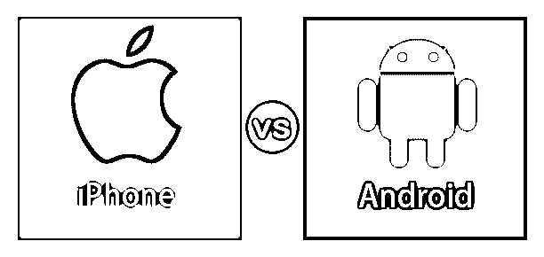

# iPhone vs Android

> 原文：<https://www.educba.com/iphone-vs-android/>

## iPhone 与 Android 的区别

在本文中，我们将看到 iPhone vs Android 的一个轮廓。iPhone 是史蒂夫·乔布斯和他的团队在 2007 年 6 月开发的，它支持使用 Safari 引擎的其他应用程序。iOS 是独一无二的，只用于苹果设备。现在，iPhone 被许多人视为身份的象征。iPhone 最近发布了 iPhone 11。Android 是许多手机中使用的移动操作系统，最初于 2008 年 9 月发布。它是在谷歌和手机联盟开发的。Android 是用 Java、C、C++、XML、Python 等多种语言编写的。Android 发布了其新版本 Android 10.0。

### iPhone 和 Android 的直接对比(信息图)

以下是 iPhone 与 Android 之间的 33 大对比:

<small>网页开发、编程语言、软件测试&其他</small>

### iPhone 与 Android 的主要区别

让我们来讨论一下 iPhone 和 Android 之间的一些主要区别。

*   当我们对比 iPhone 和 Android 时，Android 更受欢迎，用户更倾向于相同。
*   iOS 是一个封闭的系统，而 Android 更像是一个开放的系统。因此，用户不容易识别 iPhone 中的许多功能。
*   iOS 只在苹果设备上使用，因此质量丝毫没有受到影响。但是安卓被用于许多设备和各种公司，因此，不能保证质量。
*   iOS 应用可以在苹果商店下载，Android 应用可以在 Google play 商店下载。
*   安卓系统的语音助手 Google Assistant 比 iPhone 的语音助手 Siri 更强大。
*   在 iPhone 中构建应用程序时，使用了 Swift 语言。在 Android 中，使用的是 Java 语言，开发者花更多的时间用 Java 编码。但是，现在 Kotlin 语言被用作 Java 的替代语言。
*   在 iPhones 中，导航栏放在顶部，在 Android 设备中，导航栏在左侧。
*   iPhone 中的环境是 XCode，这有助于发现错误，而在 Android 中，Google Studio 用于相同的目的。
*   iphone 中的菜单放在底部，而 Android 手机菜单放在左侧，通过点击和拉动手势显示。
*   Android 用户熟悉应该给出同意/不同意或同意/取消操作的警告。在 iPhones 中，这些提醒和动作表可以用来完成这些任务。
*   iPhones 没有返回上一个应用程序的后退按钮，而 Android 手机有后退按钮。iPhone 没有后退按钮，而是在左上角有一个按钮，可以转到以前的应用程序。
*   与 iPhone 应用程序相比，Android 应用程序的利润更低，构建更耗时。
*   在 iPhones 中，设计理念是灵活的，但在 Android 中，设计是基于特定需求的。
*   iPhone 应用程序开发起来并不复杂，而 Android 应用程序非常复杂。

### iPhone 与 Android 对比表

下表总结了 iPhone 和 Android 之间的比较:

| **iPhone** | **安卓** |
| 定制并不容易。 | 定制很容易。 |
| iPhone 软件不容易得到。 | Android 软件很容易获得。 |
| 集成更好。 | 集成度不如 IOS 设备。 |
| 速度随时间保持一致。 | 速度随着时间而下降。 |
| Swift 代码更快。 | Java 代码比 Swift 慢。 |
| 在两种或三种分辨率的 iPhone 中，屏幕尺寸总是相同的。 | Android 有不同的屏幕尺寸。 |
| iPhone 有其图标的颜色，蓝色或灰色。 | Android 的屏幕上有彩色图标。 |
| 汉堡菜单不是定制的。 | 汉堡包菜单或抽屉菜单在 Android 设备上定制。 |
| 开发成本相对较少。 | 开发成本很高。 |
| 申请的审查时间较长，平均为 7 天。 | 申请在短时间内得到审查。 |
| 设计元素更加用户友好。 | 设计元素不是用户友好的。 |
| iPhone 的文件和媒体传输非常困难。 | 文件传输在 Android 设备上很容易完成。 |
| 除了通知中心之外，iPhone 中没有 widgets。 | 小工具是存在的，并且除了在 Android 手机锁定时是可见的。 |
| Safari 是互联网浏览器，其他浏览器不能设为默认。 | 任何浏览器都可以设为默认，谷歌 chrome 就是常用的。 |
| 默认地图是苹果地图。 | 默认地图是谷歌地图。 |
| 视频聊天是通过 Face Time 和其他第三方应用完成的。 | 视频聊天是通过 Google Duo 和其他第三方应用完成的。 |
| iPhone 不允许使用 Apple store 以外的任何其他应用程序商店。 | 除了谷歌 Play 商店，还有很多应用商店可以下载应用。 |
| 电池比安卓电池小。 | 电池更大。 |
| 虽然有文件管理器，但是浏览不同的文件是没有用的。 | 文件管理器存在并由所有人使用。 |
| 只有 5 GB 的备份是在 iCloud 中完成的。 | 使用 Google 相册可以无限制地备份照片。 |
| 安全更新并不频繁。 | 安全更新每月进行一次。 |
| 该软件比安卓安全。 | 由于应用程序可以从任何来源下载，该软件并不安全。 |
| 操作系统只运行更新的软件。 | 操作系统运行的大多是过时的软件。 |
| 无法完全控制 iPhone。 | 完全控制权交给了用户。 |
| iCloud 提供 5 GB 的免费存储空间。 | Google Drive 提供 15 GB 的免费存储空间。 |
| 制造商为 iPhone 提供终身支持。 | 安卓手机终身不支持，厂商可能会撤销支持。 |
| RAM 管理做得很好。 | RAM 管理做得不好，导致崩溃。 |
| iPhone 不会将用户数据出售给外部任何人以获取利润。 | 自从谷歌开发安卓系统以来，许多广告存储了消费者的数据。 |
| 操作系统是 OS X 和 Unix。 | 操作系统是 Linux。 |
| 市场份额更少。 | 市场份额更多。 |
| 源代码不对外公开。 | 源代码对外开放。 |
| iPhone 使用 Cocoa 框架。 | Android 使用 Java 框架。 |
| iPhone 不允许其应用程序从其他应用程序收集信息。 | 在 android 中，应用程序可以相互通信并收集信息。 |

### 结论

IOS 和 Android 的功能在打电话、发信息、浏览等方面都很相似。这两个应用程序中的状态栏给出了关于设备的信息，如电池、电源等。两者都有隐私设置，因此可以防止数据泄露。两款手机都支持 4G。

### 推荐文章

这是 iPhone vs Android 的指南。在这里，我们还分别用信息图和比较表讨论了 iPhone 和 Android 的主要区别。您也可以看看以下文章，了解更多信息–

1.  [支尔格对汇合](https://www.educba.com/jira-vs-confluence/)
2.  [安卓替代品](https://www.educba.com/android-alternatives/)
3.  [Android 开发者 vs Web 开发者](https://www.educba.com/android-developer-vs-web-developer/)
4.  [安卓面试问题](https://www.educba.com/android-interview-questions/)

