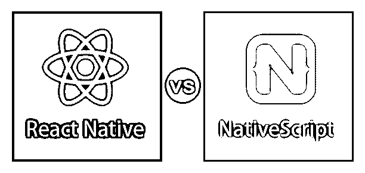

# 反应本地与本地脚本

> 原文：<https://www.educba.com/react-native-vs-nativescript/>

## React Native 与 NativeScript 的区别

React Native vs NativeScript 是一个用于为 iOS 和 Android 开发原生应用的框架。React native 是由脸书创建的，主要目标是“一次学习，随处使用”。React Native 将本机开发的最佳部分与 React 集成在一起，最好的 JavaScript 库有助于构建更好的用户干扰。React Native 可以轻松地在现有的 Android 和 iOS 应用程序上使用。JavaScript 和 JSX 用于编写 React Native 的代码，由于使用了 JavaScript，React Native 在本质上非常快。React Native 是开发移动应用程序最常用的框架。在 React Native 的帮助下，人们可以创建具有良好用户体验的高性能本机应用程序。

NativeScript 是一个开源框架，用于使用 Angular、Vue.js、TypeScript 或 JavaScript 构建真正的原生移动应用程序。NativeScript 是由 Progress 开发的，它主要关注现代商业应用程序。在 NativeScript 的帮助下，人们可以开发优雅的跨平台原生移动应用程序。NativeScript 旨在为开发人员提供在任何平台上重用代码的优势。由于下一代业务应用程序将是智能的、连接的和自适应的，因此 NativeScript 具有一些高级功能，可以帮助您在移动设备上提供如此丰富的用户体验。NativeScript 正式支持与 Visual Studio 代码的集成，社区努力使用 Webstorm/IntelliJ 提供集成。有对 NativeScript 的企业支持，用户可以在预算内按时交付项目，并通过由核心 NativeScript 团队支持的 Progress 提供的支持来支持任务关键型部署。

<small>网页开发、编程语言、软件测试&其他</small>

### React Native 与 NativeScript 的直接比较(信息图表)

以下是 React Native 与 NativeScript 之间的 8 大区别:

### React Native 与 NativeScript 的主要区别

让我们讨论一下 React Native 与 NativeScript 之间的一些主要区别:

*   根据 2018 年 JavaScript 状况调查，与 NativeScript 相比，React Native 更受欢迎。
*   NativeScript 有一个正在积极扩展和更新的插件官方市场，这是应对本机滞后的主要功能，因为它必须依赖第三方插件和库。
*   React Native 有一组非常基本的 API 模块，可以帮助开发人员访问本机设备功能。正因为如此，React 原生开发者不得不求助于第三方模块。同时，NativeScript 将所有 iOS 和 Android APIs 注入到 JavaScript 虚拟机中。它使得对本地 API 的访问变得容易，并且不需要任何特定于平台的语言专业知识。
*   在 React Native 中，每个独立平台的组件样式更受重视，而在 NativeScript 中，开发人员只需编写一次代码，就可以在任何地方运行。因此，它有更多的代码共享。
*   React Native framework 被许多全球知名的品牌和公司使用，如脸书、Instagram、Tesla，而 NativeScript 在移动应用程序开发中不太受欢迎，不得不使用 NativeScript 构建应用程序的流行品牌有 PUMA、Deloitte Digital 和 Sennheiser。
*   要构建一个具有复杂业务逻辑的跨平台移动应用程序，React Native 是最佳选择，而对于相同的任务，如果使用 NativeScript，则会导致应用程序变得非常大。
*   NativeScript 使用 Angular 和 TypeScript 进行编程，而 React Native 使用 JSX。
*   React Native 比 NativeScript 更快，因为 React Native 使用 VirtuaDOM，这使得开发人员可以轻松呈现在使用 native SDKs 编写的应用程序中常见的动态元素。
*   React 创建单个文件，而 NativeScript 将每个组件分开。

### React Native 与 NativeScript 对照表

让我们讨论一下 React Native 与 NativeScript 之间的主要比较:

| **功能** | **反应原生** | **原生脚本** |
| **人气** | 根据状态
JavaScript 2018 调查 React Native 最受欢迎，这使得它成为常用框架。 | NativeScript 并没有那么受欢迎。 |
| **性能** | React Native 速度更快，因为它使用 VirtualDOM，这有助于它处理单个文件。 | NativeScript 比较慢，因为它保持每个组件都是分开的。 |
| **使用的编程语言** | JSX 是用于编程反应原生的。 | NativeScript 使用 TypeScript、
Angular 和 JavaScript 进行编程。 |
| **应用规模** | React Native 被证明是创建具有复杂业务逻辑的跨平台移动应用程序的最佳平台，因为它可以制作非常小的应用程序。 | NativeScript 为具有复杂业务逻辑的跨平台移动应用程序制作大型应用程序。 |
| **代码共享** | React Native 更强调为每个平台单独设计组件
,这减少了代码共享的机会。 | 在 NativeScript 中，开发人员只需编写一次代码，他们就可以在任何地方运行它，因此，它有更多的代码共享。 |
| **与本地 API 集成** | React 原生开发者不得不求助于第三方模块
，因为它有一套非常基本的 API 模块。 | 因此，NativeScript 不需要任何特定于平台的语言专业知识。NativeScript 将所有 iOS 和
Android API 注入到 JavaScript 虚拟机中，从而可以轻松访问本地 API。 |
| **插件市场** | React Native 没有任何官方市场，因为它必须依赖第三方插件和库。 | NativeScript 有一个插件官方市场，正在积极扩展和更新。 |
| **复杂业务逻辑的应用规模** | 尺寸非常紧凑。 | 尺寸非常大。 |

### 结论

基于上面的讨论，我们知道这两个框架都可以被基于业务的具有广泛功能的移动应用程序使用。使用哪个框架完全取决于项目的需求。当我们从性能的角度来看，React Native 是一个赢家，它也是全世界流行和非常受欢迎的商业选择，而 NativeScript 则用于我们需要单个组件的样式和插件的巨大扩展和更新市场的时候。要为具有复杂业务逻辑的跨平台移动应用程序构建小型应用程序，React Native 是最佳选择。使用 React Native 构建的应用程序有脸书、Instagram、Pinterest，而 NativeScript 用于构建 PUMA、德勤数字和森海塞尔等移动应用程序，这清楚地表明了 React Native 在基于业务的移动应用程序开发中的受欢迎程度。

### 推荐文章

这是一个反应 Native vs NativeScript 的指南。在这里，我们讨论 React Native 与 NativeScript 之间的差异、主要差异和比较表。您也可以浏览我们推荐的其他文章，了解更多信息——

1.  [反应自然 vs 颤动](https://www.educba.com/react-native-vs-flutter/)
2.  [反应原生 vs 迅捷](https://www.educba.com/react-native-vs-swift/)
3.  [React Native vs React](https://www.educba.com/react-native-vs-react/)
4.  [Xamarin vs React Native](https://www.educba.com/xamarin-vs-react-native/)

