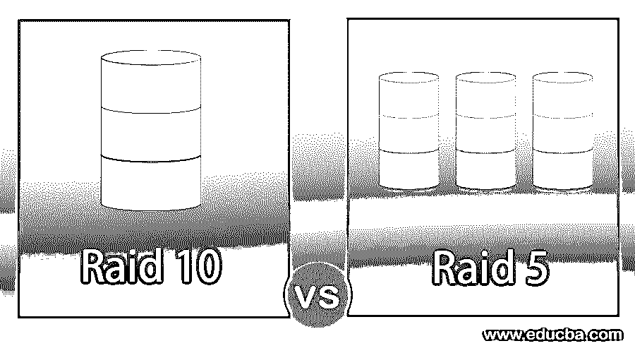

# Raid 10 与 Raid 5

> 原文：<https://www.educba.com/raid-10-vs-raid-5/>

## Raid 10 与 Raid 5 的区别

在本文中，我们将看到 Raid 10 与 Raid 5 的概要对比。RAID 代表独立磁盘冗余阵列。它将相同的数据存储在不同磁盘的不同位置，以防止驱动器出现故障。“突袭”一词是由大卫·帕特森、加斯·a·吉布森和兰迪·卡茨在 1987 年创造的。计算机存储中有标准的 RAID 级别。各种 Raid 级别保护数据，是以前的升级。容错是在 Raid 级别 5 中完成的，数据分布在多个磁盘中，而 Raid 10 结合了磁盘镜像和磁盘条带化，以确保数据的安全。Raid 5 需要一些时间来构建配置。

### Raid 10 与 Raid 5 之间的直接比较(信息图表)

以下是 Raid 10 与 Raid 5 之间的 17 大比较:

<small>网页开发、编程语言、软件测试&其他</small>

### Raid 10 与 Raid 5 的主要区别

让我们从以下几点来讨论 Raid 10 与 Raid 5 之间的一些关键差异:

*   Raid 10 结合了 Raid 0 和 Raid 1 的功能，而 Raid 5 将数据平均分布在多个磁盘中。
*   有关数据和磁盘的信息存储在 Raid 5 中，因此即使硬盘出现故障，数据也可以恢复。如果 Raid 10 的两个磁盘出现故障，数据将无法恢复。
*   Raid 10 的容错性非常好，而 Raid 5 只允许 1 个磁盘的容错。
*   就写入速度而言，Raid 10 的工作方式类似于 Raid 0，与 Raid 5 相比，Raid 10 的写入速度较慢。
*   Raid 10 使用逻辑镜像和块级条带化，而奇偶校验磁盘在 Raid 5 中使用得很好。
*   如果信息只写在 1 个磁盘上，那么在 Raid 10 中数据丢失是无法管理的，也是不可接受的。Raid 5 具有良好的抗故障能力和更好的安全性。
*   Raid 10 的性能很好，但在 Raid 5 中，由于磁盘冗余，性能很慢。
*   Raid 10 需要 4 个磁盘来写入数据，Raid 5 需要 3 个磁盘来写入数据。
*   Raid 10 的读取性能比 Raid 5 高 2 倍。
*   与 Raid 5 相比，Raid 10 的存储效率较低。Raid 5 有三分之二的存储效率，而 Raid 10 只有一半的存储效率。
*   RAid 5 被设计为存储效率很高的存储服务器。Raid 10 用于生产和托管服务器。
*   与 Raid 5 相比，Raid 10 的性能和数据安全性更高。安全数据使用户经常检查 Raid 10。
*   当有更多的数据库时，最好使用 Raid 10。在 Raid 5 中，奇偶校验为丢失的数据块创建数据块，并且不经常使用数据库。
*   Raid 1 是高端应用程序的选择，而 Raid 5 则是中等应用程序的选择。
*   Raid 5 需要很长时间来重建应用程序。重建时，我们也无法使用应用程序。Raid 10 解决了这个问题，因为它重建时间更短，而且在重建期间，我们可以使用应用程序。
*   如果在 Raid 5 中重建时，数据中出现不可纠正的读取错误(URE ),数据将会丢失且无法恢复。这个问题在 Raid 10 中不会发生。

### Raid 10 与 Raid 5 的比较表

下表总结了 Raid 10 与 Raid 5 之间的比较 **:**

| **Raid 10** | **Raid 5** |
| 数据存储在一个驱动器中，并在其他驱动器中镜像，因此不会发生数据丢失。 | 数据平均存储在 3 个驱动器中，这提高了 Raid 5 的性能。 |
| 所需的最小物理磁盘数量为 4 个。但是它也可以使用两个磁盘。 | 所需的最小物理磁盘数量为 3 个。 |
| Raid 10 考虑的是性能而不是存储。 | 存储在 Raid 5 中被赋予了最重要的地位。 |
| 它在结构上是灵活的。 | 它在结构上不灵活。 |
| 对于与随机存取读写相关的应用程序，Raid 10 速度更快。 | 与 Raid 10 相比，Raid 5 的速度并不快。 |
| Raid 10 不适合备份，因此有可能丢失数据。 | 使用 Raid 5 进行备份是很好的[,因为与其他 Raid 相比，它具有更大的存储空间和效率。](https://www.educba.com/what-is-raid-5/) |
| Raid 10 不需要奇偶校验，因此不需要花费时间来管理奇偶校验。 | Raid 5 有一个奇偶校验磁盘，因此大多数操作都需要时间来运行，这会影响性能。 |
| 虽然 Raid 10 的可靠性非常好，但我们不能说数据分条后的数据是准确的。 | 由于存储和低性能导致的低可靠性。 |
| 这项技术非常简单，因为只有磁盘，没有用于存储的奇偶校验磁盘。 | 由于驱动器和奇偶校验的存在，该技术非常复杂。 |
| 使用 Raid 10 可以轻松完成任何使用数据库的关键应用程序。 | 由于安全性较低，因此不建议在 Raid 5 中使用关键应用程序。 |
| Raid 10 不太经济，因为它有许多驱动器。 | Raid 5 具有成本效益，因为它具有较少的驱动器，并且存在奇偶校验磁盘。 |
| Raid 10 中的阵列较小，因此只能执行少量操作。 | Raid 5 具有大的阵列，因为存储发生在它的磁盘中。 |
| Raid 10 的每个子阵列中可能有一个磁盘出现故障。当它发生时，它会在应用程序中抛出一个主要错误。 | Raid 5 中可能会出现单个驱动器故障。 |
| 单个驱动器故障是不可容忍的。 | Raid 5 可以容忍单个驱动器故障。 |
| 在 Raid 10 中只能执行单个磁盘的数据恢复。 | 在 Raid 5 中进行数据恢复既好又容易。 |
| 当需要高数据冗余时，我们使用 Raid 10 进行配置。 | 数据冗余不需要 Raid 5，它存储数据的副本。 |
| Raid 10 可以在任何硬件控制器上工作，并不具体相同。 | Raid 5 有一个特定的卡用于检查数据存储。如果控制器被 Raid 5 自动占用，系统会变慢，从而降低性能。 |

### 结论

大多数 Raid 级别提供数据保护和恢复，但不能防止用户丢失数据。还有软件错误和恶意软件攻击，Raid 无法保护数据。Raid 不能替代备份计划。我们可以说 Raid 是防止严重数据丢失的一个构造块。

### 推荐文章

这是 Raid 10 与 Raid 5 的对比指南。在这里，我们还将通过信息图和比较表来讨论 Raid 10 与 Raid 5 的主要区别。您也可以看看以下文章，了解更多信息–

1.  [什么是 Raid 存储？](https://www.educba.com/what-is-raid-storage/)
2.  [Raid 1 与 Raid 5 的对比](https://www.educba.com/raid-1-vs-raid-5/)
3.  [RAID 0 与 RAID 1 的对比](https://www.educba.com/raid-0-vs-raid-1/)
4.  [Raid 5 与 Raid 6 的对比](https://www.educba.com/raid-5-vs-raid-6/)

