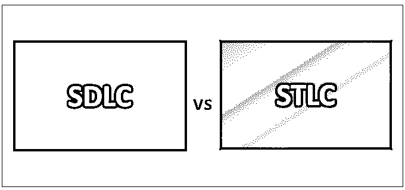

# SDLC 与 STLC

> 原文：<https://www.educba.com/sdlc-vs-stlc/>

## SDLC 和 STLC 的区别

需求驱动兴趣，并使其成为启动任何过程的唯一理由。后来，这种兴趣驱使相关的资源、涉众、客户、CEO、经理和开发团队在一个成功的项目(在我们的例子中是软件开发)结束后运行。金钱(利益)是这些人行为背后的唯一目的，而时间和品牌价值(会叫得更关键)。

这就是文章主题，是的，SDLC 与 STLC 的关系。SDLC 和 STLC 在某种程度上都是相互关联的，或者可以说一个是其他的前身。原因很简单，如果某个东西是为了服务(客户需要)而开发的，那么它必须在部署之前进行测试。这是几十年来的行业标准和责任，因为客户已经投入了巨额资金。

<small>网页开发、编程语言、软件测试&其他</small>

这是幕后的故事，引导我们进入本文的主要部分——SDLC 与 STLC。让我们详细看看这些 SDLC vs STLC 到底是什么。每一项下的操作顺序是什么？SDLC 和 STLC 有什么区别？什么样的活动需要有一个成功的结局？

### SDLC 意味着软件开发生命周期

生命周期意味着一个人一生中的一系列变化。有生命的、无生命的或任何具有一系列步骤或操作顺序的过程。这些序列是一种迹象，表明它有一个明确的起点和终点。相反，我们可以说给定的过程中包含了一些子过程。这就是生命周期。弄清楚什么是真正的生命周期让我们在讨论软件开发时向前迈进。所以，SDLC 的意思是 *s "* 软件开发过程的生命周期"*。*

关于开发模型，没有明确的规则来支持一个比另一个更好，或者一个特定的模型比另一个更好(敏捷是个例外)。让我们看看一些模型:

1.  [瀑布模型](https://www.educba.com/waterfall-model/)——最古老的一种
2.  v 型车
3.  螺旋模型
4.  重复的
5.  敏捷——最新、最适合任何项目类型

**Note –** I must say that [Agile scrum model](https://www.educba.com/agile-scrum-interview-questions/) practices are good to work, but a team can prefer any one of these models in the IT industry. E.g. If the requirement is clear and guarantees not to change at a later stage team will surely go with Waterfall and not with Agile.

#### SDLC 讨论的阶段

这些过程也可以列举如下

1.  **策划**——先说第一件事，在任何物证出现之前，背后总有策划。规划先于文书工作。在这个阶段，从项目的角度来看，只考虑高层次的细节。这个阶段背后有一个专门的成员小组。所有与项目相关的利弊都考虑到了，如何最大化投资回报率和如何做到这一点也考虑到了。这里有大量的返工和评审来克服任何阻碍项目成功的因素。底线是在想法变成现实之前，它应该有具体的理由去运行并取得成功。计划再次取决于结果的种类。如果正在开发新软件，规划将会有所不同，因为市场研究对其至关重要，但是如果相同的软件在几年后更新，那么，在这种情况下，将不会有任何市场研究(因为软件是成功的，所以需要软件功能更新开发)。
2.  **分析**–一旦规划部分完成，接下来就是分析，在分析中，专门的团队在获得具体的解决方案之前要完成几项任务。在这里，完成项目的可行性研究、评估工作、成本计算、需求引出和进度安排。在工作实际开始前做最后检查的意图很明显。假设存在任何缺点，然后通过与开发团队和涉众的交流来消除它们。找出利弊。
3.  **设计**——现在需求很明确，团队希望在工作之前有一些参考；设计师起着至关重要的作用。软件将工作(功能方面)，每个部分将有多少屏幕，用户交互性，以及在这一阶段设计的每一点细节。假设一位客户[要求使用手机软件](https://www.educba.com/mobile-app-development-software/)来预订机票，需求很明显，设计者将设计屏幕来涵盖该软件将处理的功能。设计师将会设计出布局图、工作计划、流程图、伪代码和其他几种设计文档。负责人会选择最好的搭配。
4.  **编码**——在这个阶段，大部分的重大决策都已经决定了。这个阶段的目的是将设计作品复制到软件的工作部分。在这里，开发人员扮演着重要的角色，他们努力开发可重用的代码。许多关于框架和创建一个工作软件的最佳合适方法的讨论受到了关注。开发团队使用的编程工具包括编译器、调试器和解释器。我想让我的读者注意到，开发完整的工作软件并不容易，也不小。有一大块工作，因此开发团队将它们分成较小的可交付成果，并根据需求或紧急程度对它们进行优先排序(也可以根据功能的重要程度进行评级，即特定功能的评级有多高)。记住，这是开发周期中最长的阶段。
5.  **测试**——该阶段由 STLC 负责。这个阶段主要是在将开发的工作软件发送给客户或最终用户之前对其进行测试。测试人员执行几种类型的测试方法来找出软件中任何可能的缺陷。
6.  **维修**——这是一种售后服务。就像我们购买任何自行车或汽车一样，一年后，有一个问题会阻碍正常工作。这类问题一次又一次地出现。在这里，当客户使用软件时出现的所有错误都得到解决，未来需要的任何升级或增强功能(如果有的话)。

### STLC 意味着软件测试生命周期

stlc 阶段——

1.  需求分析
2.  测试计划
3.  测试用例开发
4.  环境设置
5.  测试执行
6.  测试周期结束

1.  **需求分析**——STLC 流程的第一步。这是整个过程中 QA 团队了解需求(意味着测试什么)和可测试需求的部分。为了更好地理解需求，测试人员可以跟踪客户(但是这很少发生，只有在需要测试而不是开发的时候)。这是 STLC 这一阶段的图表。

| 入围标准 | 开展的活动 | 可交付成果 |
| 准确的需求与完整的描述，以确定测试程序遵循。 | 本节列出了各种测试 | 本节列出了取得的成果 |

2.  测试计划-STLC 中最关键的阶段。在这里，每个估计和时间都是在测试实际开始之前计算的。其结果将测试计划或战略文件。一旦这个阶段完成，QA 团队就可以开始测试用例开发活动。上一阶段绘制的同一张图表在修改后再次使用。
3.  **测试开发**–测试用例的实际开发在测试计划阶段完成后进行。这里是测试用例的测试团队。不仅测试用例，而且包含测试数据的完整报告都被包含和记录。一旦完成，这些将由同行成员或 QA 领导进行交叉验证。在这里，还准备了 RTM(需求跟踪矩阵)。这些文档以两种方式跟踪需求(向前和向后)。
4.  **环境设置**–一般来说，这是不实际的，因为在开发阶段(在 SDLC 中)已经决定了环境。一般来说，环境不会发生任何变化。
5.  **测试执行**–这里，测试用例是根据最初准备的测试计划来执行的。如果案例正常，则标记为通过；否则，他们会失败。在这一阶段准备一份完整的错误列表，并在软件最终发布之前提交给开发团队进行修复。
6.  **测试周期结束**–团队从测试角度决定什么是对的，什么是错的讨论。在这次会议中，我们将讨论在正确的方向上可以节省时间和精力的未来需要改进的地方。从发展的角度来看，这些都是有帮助的。

### SDLC 和 STLC 的直接比较(信息图表)

下面是 SDLC 与 STLC 的 9 大区别

### SDLC 和 STLC 的主要区别

两者都是市场上的热门选择；让我们讨论一些主要的区别:

*   SDLC 是一种开发方法，而 STLC 是一种测试方法
*   多个不同的阶段组合起来形成 SDLC，而多个测试阶段或实践组合起来形成 STLC。
*   SDLC 涵盖了整个软件开发周期，而 STLC 涵盖了整个测试周期
*   SDLC 从计划阶段开始，涵盖整个开发过程，而 STLC 从测试计划开始，涵盖测试的每个方面或类型
*   CEO、高级业务分析师、高级经理和开发人员是 SDLC 下负责几个阶段的人。另一方面，QA 领导、测试分析师是管理正在进行的过程的人。
*   SDLC 在实际应用程序尚未创建时启动，但 STLC 在实际应用程序存在或大量工作软件存在时启动。
*   SDLC 是 STLC 的超集，而 STLC 是 SDLC 的子集

### SDLC 与 STLC 对比表

让我们来看一下 SDLC 与 STLC 之间的主要对比——

| **比较的基础** | **SDLC** | **STLC** |
| **原点** | 开发生命周期 | 测试生命周期 |
| **阶段** | Six Phases

1.规划

2.分析

3.设计

4.发展

5.测试

6.维护

 | Six Phases1.需求分析2.测试计划

3.测试开发

4.环境设置

5.测试执行

6.测试结束

 |
| **关系** | SDLC 可以被认为是父或前身。 | STLC 是 as 的后继者，因为它属于 SDLC。 |
| **关于** | 这是关于软件的完整开发，包括测试和其他阶段。 | 这与测试阶段和 QA 部分有关。 |
| **需求收集阶段** | 在 SDLC 中，业务分析师收集需求；开发团队执行开发。 | 在 STLC 中，测试团队在分析测试文档后进行工作评审，从功能和非功能的角度进行评审。 |
| **意向** | SDLC 旨在克服成功软件开发过程中的任何障碍。 | STLC 旨在仅在测试阶段发现任何缺陷或不足。 |
| **设计阶段** | In the SDLC, a technical architect is there to ensure the quality of the software. Here in SDLC Business Analyst may assist him in understanding the requirements in a better way. | 在 STLC 中，测试架构师是管理活动的人；他做测试计划和高级测试点的识别。 |
| **编码阶段** | 按照所强调的设计结构开发真实代码，并形成实际工作。 | 测试团队致力于开发测试计划并检查软件的工作行为。需要注意的一点是，在 SDLC 中，开发代码，而在 STLC 中，只开发测试用例。 |
| **测试阶段** | 测试实际代码，这可以由同行开发人员来完成。在这个阶段中，执行单元测试、集成测试和系统测试。 | In STLC, the test execution plus reporting work happens. One thing to note is that unlike code testing in SDLC here, there is functional behavior, and non-functionality testing of the software is done. |

### 结论

关于 SDLC 和 STLC 的讨论是清楚的。一个是开发方法，另一个是整体测试方法。虽然测试属于 SDLC 的一个部分，但重要的是要注意它是一个非常不同的功能。需要注意的是，STLC 在 SDLC 之下。每个部分涉及的活动是不同的。

### 推荐文章

这是 SDLC 和 STLC 之间最大区别的指南。在这里，我们还将讨论信息图和比较表的主要区别。你也可以看看下面的文章来了解更多-

1.  [SDLC 与敏捷](https://www.educba.com/sdlc-vs-agile/)
2.  [PL SQL vs SQL](https://www.educba.com/pl-sql-vs-sql/)
3.  [敏捷 vs 开发运维](https://www.educba.com/agile-vs-devops/)
4.  [SDLC 方法](https://www.educba.com/sdlc-methodologies/)

