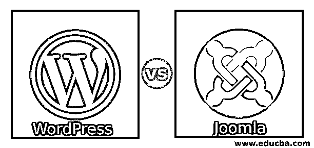

# WordPress vs Joomla

> 原文：<https://www.educba.com/wordpress-vs-joomla/>

## WordPress 和 Joomla 的区别

WordPress 是一个用 PHP 语言编写的在线开源网站创建工具。它是最流行的开源内容管理系统。

马特·莫楞威格和迈克·利特尔最初在 2003 年发布了 WordPress。它在 2009 年被宣布为开源。WordPress 是一个强大的博客和内容管理系统(CMS ),允许用户构建动态网站，并通过其后端组件方便地定制、更新和管理网站。WordPress 独家支持 MySQL 只存储数据。

<small>网页开发、编程语言、软件测试&其他</small>

如前所述，WordPress 还允许人们创建博客，即建立社区、分享想法和他们自己的一些故事，这有助于其他人做出正确的决定。

下面列出了一些 WordPress 的特性:

*   **用户管理:**该功能主要是管理用户的角色、创建、删除、修改用户密码等用户信息。
*   **媒体管理:**这是用于管理媒体文件和文件夹的工具。
*   主题系统:该主题系统功能允许站点查看其功能。
*   **多语言:**这是一个非常有用的功能，有助于将网站的全部内容翻译成用户喜欢的语言。
*   **Importers:** Importers 帮助以张贴到网站的形式导入数据。
*   **搜索引擎优化。**

Joomla 是一个免费的、可扩展的开源内容管理系统(CMS ),用于发布网络内容，构建动态的、健壮的网站和在线应用程序。Joomla 是由开源公司和 Joomla 社区在 2005 年推出的。

Joomla 是用 PHP 语言编写的，它使用面向对象编程(OOP)技术和软件设计模式。数据将存储在不同的数据库中，如 MySQL、MS SQL、PostgreSQL 等。Joomla 非常有能力，这意味着它可以执行从企业级网站和博客到社交网络和电子商务网站的任务。

Joomla 与市场上的许多竞争对手相比有许多优势。它不仅是一个功能齐全的 CMS，而且易于学习，易于设置，价格也较低。Joomla 中有许多可用的特性，比如博客、页面缓存、RSS 提要、新闻快讯、页面的可打印版本、搜索以及对该语言的支持。

### WordPress 和 Joomla 的正面比较(信息图)

下面是 WordPress 和 Joomla 的 6 大对比

### WordPress 和 Joomla 的主要区别

让我们讨论一下 WordPress 和 Joomla 之间的一些主要区别:

1.  WordPress 是用 PHP 语言编写的在线开源网站创建工具，而 Joomla 是用 PHP 语言编写的，它使用面向对象编程(OOP)技术和软件设计模式。
2.  WordPress 只支持 MySQL，但 Joomla 支持许多其他数据库，如 MySQL、MS SQL、PostgreSQL 等。
3.  WordPress 不支持开箱即用的多语言功能，而 Joomla 将支持开箱即用的功能来处理多语言网站。
4.  WordPress 的插件目录中有非常好的默认插件。插件目录中有免费的 WordPress 插件(超过 38000 个)和付费服务的高级插件。但是 Joomla 并没有默认提供允许用户从管理区搜索和安装扩展或模板的功能。
5.  WordPress 的安装非常简单，只需要五分钟，而 Joomla 的安装比 WordPress 要多花一点时间。

### 对比表 WordPress vs Joomla

以下是 WordPress 和 Joomla 的对比表

| **比较的基础** | **WordPress** | **Joomla** |
| **安装和易用性** | WordPress installation are very easy with a five-minute install.

WordPress 的后安装，用户体验比 Joomla 更方便，用户看到一个简单的用户界面和菜单来利用所有的 WordPress 特性。

 | The installation of Joomla takes a little more time compared to WordPress.一旦安装完成，用户将能够看到一个控制面板，它包括太多的菜单选项，无法点击和自定义它，这不像 WordPress 那样直观。 |
| **主题** | WordPress facilitates a few default themes, which are pre-installed, which makes users change their website’s appearance using themes.除了默认主题，WordPress 还有其高级主题，这是由第三方开发的付费服务，提供高级支持选项。 | Joomla 使用一些默认模板和扩展来创建电子商务商店网站。但是数量没有 WordPress 多；这使得用户很难找到正确的镜腿和延伸部。 |
| **附加组件/插件** | WordPress have very good plugins in its plugin directory.插件目录中有免费的 WordPress 插件(超过 38000 个),也有付费服务的高级插件。 | By default, Joomla does not provide the feature that would allow users to search and install extensions or templates from the administration area.但是有些扩展允许用户通过添加他们的 URL 来添加从 web 安装的功能，而这应该是手动完成的。 |
| **本地化&多语言支持** | WordPress does not support multiple languages features out of the box, but some excellent plugins are available which allow a user to create a WordPress multilingual site easily.WordPress 有超过 53 种不同的语言版本。 | Joomla supports out of the box capability to handle a multilingual facility for a website, and there is no need of installing any extension.

Joomla 的管理界面也提供了多种语言的翻译。

 |
| **安全** | 使用 WordPress 建立的网站将继续成为黑客的攻击目标。然而，WordPress 是建立在非常安全的代码之上的，它对安全威胁和攻击的反应非常迅速。WordPress 还有一个自动更新的功能，允许网站在发布新的安全补丁时自动更新。 | Joomla is also similar to WordPress in Security. But Joomla team quickly and actively responds to any security attacks and also send a patch to security attacks.在 Joomla 中，一些扩展可以从 Joomla 站点恢复。 |
| **数据库和编程语言** | WordPress exclusively supports only MySQL.WordPress 是一个用 PHP 语言编写的在线开源网站创建工具。 | Joomla supports many other databases like MySQL, MS SQL, PostgreSQL, etc.Joomla 是用 PHP 语言编写的，它使用面向对象编程(OOP)技术和软件设计模式。 |

### 结论

WordPress 和 Joomla 都是开源的，都是出色的内容管理系统。Joomla 拥有比 WordPress 更多的内置特性。但是 WordPress 以其用户友好、全球化和大型社区、许多默认插件和主题站在第一线。

WordPress 是最用户友好的 CMS，特别是对于非开发人员，但是 Joomla 为开发人员提供了更多显示不同类型内容和管理用户的灵活性。

### 推荐文章

这是 WordPress 和 Joomla 之间最大区别的指南。这里我们讨论信息图和比较表的主要区别。您也可以看看以下文章，了解更多信息–

1.  [WordPress vs Tumblr](https://www.educba.com/wordpress-vs-tumblr/)
2.  [WordPress vs Weebly](https://www.educba.com/wordpress-vs-weebly/)
3.  [WordPress vs Squarespace](https://www.educba.com/wordpress-vs-squarespace/)
4.  [WordPress vs Shopify](https://www.educba.com/wordpress-vs-shopify/)

