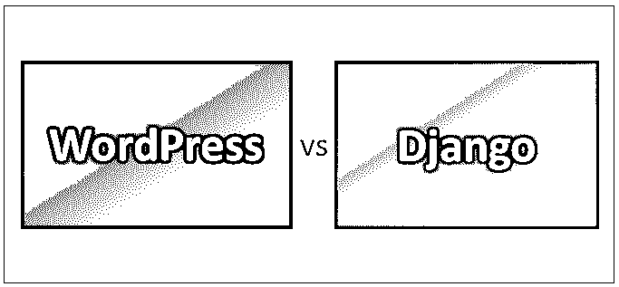
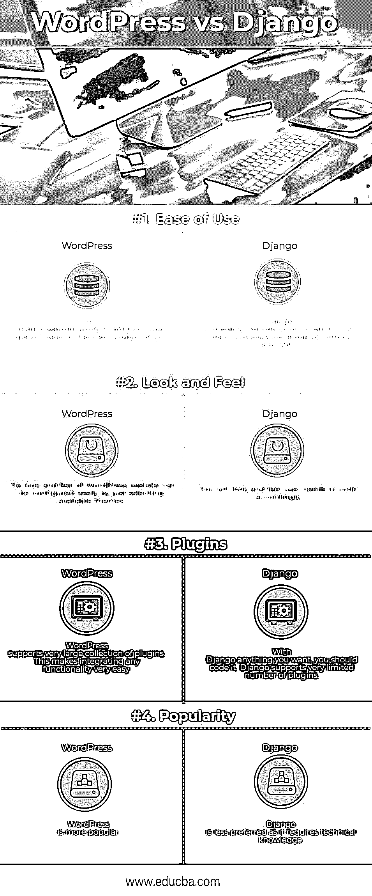

# WordPress vs Django

> 原文：<https://www.educba.com/wordpress-vs-django/>

## WordPress 和 Django 的区别

WordPress 是一个用于构建动态网站和博客的开源内容管理系统。内容管理系统是一种存储文本、照片、音乐等所有数据的软件，可在网站上获取。它有助于编辑、修改和发布网站内容。Django 是一个[网络开发框架](https://www.educba.com/top-10-web-development-tools/)，帮助建立和维护网站。它是一个高级 Python web 框架，有助于消除重复任务，使 web 开发变得容易。

### WordPress

WordPress 有两个主要版本，WordPress.com 和 WordPress。

<small>网页开发、编程语言、软件测试&其他</small>

**WordPress.com**

*   对于构建简单的网站，当你不关心它使用什么技术时。
*   我开始了一个博客服务，并为建立网站发展了多年。
*   WordPress.com 没有持续的维护，因此不需要更新软件。此外，所有数据都已备份，因此不会有数据丢失的问题。

**WordPress.org**

*   org 是完全可定制的。
*   可以使用在 WordPress.org 可用的任何预定义主题。
*   在 WordPress.org 上运行的网站需要用户更新。
*   用户还负责备份数据。

**开始使用 WordPress 的步骤**

*   打开链接[https://wordpress.org/download/](https://wordpress.org/download/)下载 WordPress 的最新版本。
*   WordPress 需要一个 MYSQL 数据库。在数据库中创建一个帐户，所有的网站数据将被存储。
*   提取下载的 WordPress 文件夹并上传到本地主机。
*   打开浏览器，导航到 localhost 的路径。
*   选择您想要的语言，然后单击继续。下一个屏幕将有 WordPress 的数据库细节。点击我们走。
*   在下一个屏幕中，您需要为您的网站配置一个数据库。为此，输入数据库名称、MYSQL 帐户的用户名和密码、数据库主机(默认为 localhost)和表前缀。
*   WordPress 检查数据库设置；如果正确，它会将您带到确认屏幕。点击运行安装按钮。
*   输入管理详细信息，如网站标题(您网站的名称)、用户名(用于登录网站)、密码(输入两次密码以保护您的网站)、电子邮件(帮助恢复密码)，然后单击隐私(搜索引擎会对网站进行索引)
*   安装成功后，网站会要求您使用您的用户名和密码组合登录。

### 姜戈

Django 足够强大，足以被世界上最大的网站使用，如 Instagram、Pinterest、bitbucket 等。Django 还带有一个内置的轻量级 web 服务器，用于开发和测试移动应用程序。它还支持 Apache 和其他流行的 web 服务器。

**安装 Django**

*   Django 是用 Python 写的。因此你需要先安装 Python。最新的 Django 版本需要 Python 2.6.5 或更高版本。你可以从 http://www.python.org/download 的[下载最新版本的 Python。](https://www.python.org/downloads/)
*   你可以从链接[http://www.djangoproject.com/download](https://www.djangoproject.com/download/)安装 Django
*   [假设你在 windows](https://www.educba.com/windows-interview-questions/) 上安装 Django，安装 python 和下载 Django 之后的第一步就是路径验证
*   验证 Path 系统变量是否设置为 Python 版本并指向 Django 归档文件 bin。
*   然后在命令提示符下，将目录更改为 Django exe 所在的文件夹。假设它在 c 上:

`C:\>cd c:\Django-x.xx`

*   通过执行以下命令安装 Django

`C:\Django-x.xx>python setup.py install`

*   要测试您的安装，请打开命令提示符并键入以下命令

`C:\>python  –c  ”import  Django;  print(django.GetVersion())”`

如果您看到 Django 的当前版本，那么 Django 安装成功。

*   Django 支持许多数据库。可以设置以下任何数据库。
    *   关系型数据库
    *   一种数据库系统
    *   SQLite3
    *   神谕
    *   MongoDB
    *   GoogleAppEngine 数据存储

安装完成后，进入命令提示符，导航到您想要创建项目的路径并编写它。

`$django-admin start project myproject`

项目建立后，需要进行一些重要的设置

`DEBUG = true`

此模式帮助您导航项目错误。此模式仅在开发模式下设置为 true。

`DATABASES = { ‘default’ :
{ ‘ENGINE’ : ‘      ’,  ‘NAME’  :’       ‘ , ‘USER’ : ‘         ‘ , ‘PASSWORD’ : ‘            ‘ , ‘HOST’ : ‘         ‘, ‘PORT’: ‘                ‘,}}`

在开始任何新网站之前设置数据库。现在项目已经创建并配置好了，可以开始工作了。

### WordPress 和 Django 的正面比较(信息图)

以下是 WordPress 和 Django 的四大区别:

### WordPress 和 Django 的主要区别

以下几点解释了 WordPress 和 Django 之间的主要区别:

*   WordPress 和 Django 都是开源软件。
*   Django 通过其内置的国际化系统提供多语言支持。而 WordPress 将全部内容翻译成用户喜欢的语言。
*   WordPress 附带了几个插件，可以根据用户的需求进行定制。Django 内置了对 Ajax、RSS、缓存和各种其他框架的支持，这使得它变得轻量级。
*   Django 是 100% Python 写的；因此，您需要首先下载 Python 来运行 Django。一旦下载完毕，你就可以安装 Django 了。
*   WordPress 有一个社交登录，提供了一个简单的方法来整合你网站的社交媒体登录功能。一些你在 Django 中手工编码的东西。
*   WordPress 已经有了搜索引擎优化功能。你可以安装搜索引擎优化和网站速度插件来帮助你在谷歌搜索中排名。

### WordPress 和 Django 的正面比较

下面是 WordPress 和 Django 的对比

| **WordPress** | 姜戈 |
| **Ease of Use**

使用 WordPress 创建一个网站，用户不需要任何编码技能。

 |  Django 正在从零开始建立网站。用户需要具备 Python 和 MVC 的知识。 |
| **Look and feel**WordPress 网站的外观和感觉可以通过选择可用的主题来轻松配置。 |  对于丰富的外观和感觉，用户需要相应地编码。 |
| **Plugins**WordPress 支持大量的插件。这使得集成任何功能都非常容易。 |  有了姜戈，任何你想要的东西，你都应该编码。Django 支持的插件数量非常有限。 |
| **人气**
WordPress 更受欢迎。 |  Django 不太受欢迎，因为它需要技术知识。 |

### 结论

*   如果你想用任何基础技术知识创建一个网站，使用 WordPress。Django 需要学习，需要时间来创建一个外观漂亮的网站。
*   对于一些 WordPress 网站来说，用户需要支付很少的托管费用。
*   如果创建一个网站需要在很短的时间内完成，那么 WordPress 是一个选择。
*   WordPress 提供了一个非常大的插件集合。在你的网站上使用大量插件可能会使它变得沉重和缓慢。
*   Wordpress 和 Django 平台都是免费的，但是为了开发和维护，Django 很贵。

### 推荐文章

这是 WordPress 和 Django 之间主要区别的指南。我们还讨论了 WordPress 和 Django 的直接比较、主要区别、信息图表和比较表。您也可以看看以下文章——

1.  [WordPress 和 Tumblr](https://www.educba.com/wordpress-vs-tumblr/)
2.  [WordPress 或 Weebly](https://www.educba.com/wordpress-vs-weebly/)
3.  [WordPress vs Squarespace](https://www.educba.com/wordpress-vs-squarespace/)
4.  [WordPress vs Shopify](https://www.educba.com/wordpress-vs-shopify/)

