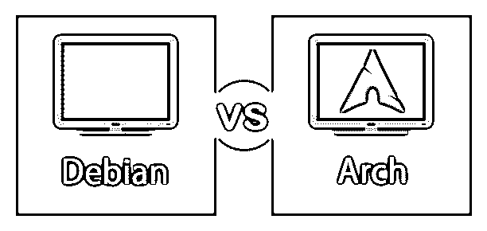
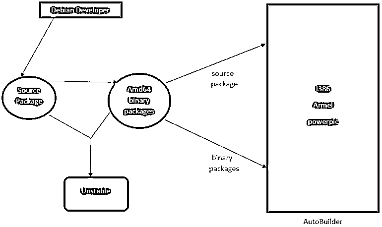

# Debian vs Arch

> 原文：<https://www.educba.com/debian-vs-arch/>

## Debian 和 Arch 的区别

在本主题中，我们将通过简介、主要差异和下表来了解 Debian 与 Arch 的区别。

### 一种自由操作系统

Debian 是 GNU/Linux 发行版，开源，是基于 Linux 内核的操作系统。它于 1993 年 8 月发行。Debian 可以访问包含超过 50000 个包的在线仓库。你也可以下载免费或不免费的软件并安装到 Debian。APT 是前端的包管理器，内核类型是单片的。Debian 安装程序是模块化和通用的。开发者社区为 bug 修复提供了适当的支持，从修复到上传补丁有一个适当的渠道。

<small>网页开发、编程语言、软件测试&其他</small>

下图显示了所采用的方法

### 拱门

Arch Linux 是 x86-64 通用 GNU/Linux 发行版。它很简单，没有添加不必要的修改或添加；避免上游不支持的补丁。仅当存在令人信服的优势时，才拆分包装。不鼓励使用 GUI 配置实用程序，用户必须从 shell 编辑器中执行系统配置。Arch 维护稳定的发布版本，直到没有记录到包中断。Arch 包括 init 系统、现代文件系统、LVM2、udev 支持和 initcpio。

### Debian 和 Arch 的正面比较(信息图)

下面是 Debian 和 Arch 的 12 大对比

### Debian 和 Arch 的主要区别

以下是要点列表，描述 Debian 与 Arch 之间的主要区别:

1.  Debian 比 arch 简单，对于新手来说，坚持使用 Debian 比使用 arch 更容易和有利。
2.  Debian 安装步骤如下

*   通过任何 CD/DVD 引导并启动安装程序；您可以选择安装或图形安装，或者基于英特尔或 AMD 处理器的机器；该消息将显示为 64 位安装或 64 位图形安装。
*   然后选择语言。
*   选择国家
*   选择键盘布局
*   然后，安装程序将进行硬件检测，并将模块加载到各种硬件组件中。
*   硬件网络检测，这也是一个自动步骤，硬件网卡被识别，模块被加载到其中。
*   然后通过 DHCP 完成网络配置；这也是一个自动的过程。
*   管理员密码，root-系统询问密码。
*   然后可以配置用户。
*   然后是分区，RAID 等。，任务是要完成的。
*   然后进行基础安装，安装 apt 工具和 dpkg 工具；然后必须配置 apt 包管理器。
*   然后 GRUB 引导装载程序的安装就完成了。
*   然后它结束，重启后，你就有了你的 Debian 设置。

如果你去 https://www.debian.org/releases/看安装手册了解详细信息，会有所帮助；它们以多种语言出现。

更多详情，请访问-

[https://www.debian.org/](https://www.debian.org/doc/user-manuals#install)

3.拱门安装步骤如下

*   从官方网站下载 ISO
*   创建 Arch 的 USB
*   从 USB 启动
*   然后磁盘分区和时钟设置是下一步。
*   然后键盘布局就设置好了。
*   将验证引导模式。
*   连接到互联网以检查网络接口并配置网络连接
*   格式化分区并挂载文件系统。
*   选择要安装的镜像
*   然后安装基础包。
*   配置 fstab，Chroot，时区，本地化，网络配置，initramfs，root 密码，引导加载程序。

剧本请参考官网。

4.  Arch 是一个实用的分布。
5.  在 arch 中，用户可以从数以千计的高质量包中进行选择，从而构建一个定制系统
6.  Debian 发布了 CD、DVD 和 USB 的实时安装镜像，并提供桌面环境选择
7.  在拱门中，有以下储存库

*   核心
*   额外的
*   社区
*   多库
*   测试
*   社区测试
*   侏儒-不稳定

### Debian vs Arch 比较表

下面是 Debian 和 Arch 之间的比较:

| **序列号** | Debian | **拱门** |
| **1。** | Debian Linux 可以安装在 x86、ARM、MIPS 等任何架构中。 | Arch 只支持 x86，而且 arch 声称这样做是为了获得最佳性能。 |
| **2。** | 在 Debian 中，你可以安装 synaptic 来管理软件。 | 必须下载二进制源代码，并自行编译，以便他们以 Pacman 方式安装和管理软件。 |
| 3. | Debian 是最大的 Linux 上游发行版，拥有超过 50000 个软件包。 | 阿奇没有这么多号码。 |
| **4。** | 开发的焦点是 Debian 社会契约。 | Arch 让事情变得简单，并对图片做了最小的改动。与 Debian 的软件包相比，Arch 更稳定。 |
| 5. | 一个包管理系统是好的。 | 这也有一个很好的包管理系统。 |
| 6. | Debian 安装方法提供了一种自动配置的安装方法。 | arch 安装提供了透明的系统配置。 |
| 7. | 将安装软件包的头文件。 | 头部与包装结合在一起；他们是其中不可分割的一部分。 |
| 8. | Debian 适合初学者。 | Arch 对初学者不好；一些必备的知识应该已经有了。 |
| 9. | 它不遵循任何类似拱吻原理的东西。 | 拱门遵循亲吻原则，这代表保持简单愚蠢，所以你可以得到一个接近拱门的想法，正如我们上面所描述的 |
| 10. | 它也有很好的文档，你可以在官方门户找到大量关于 Debian 的文档。 | 它提供了一个很好的 wiki，带你走出你有时陷入的场景。 |
| 11. | 在将 Debian 设置为基础操作系统时，总是安装很少的公共包，这使得管理员的工作变得有些轻松 | Arch 只是提供一个基础，并不像 Debian 那样添加任何公共包 |
| 12. | Debian 始终专注于稳定性。 | 有了拱门，你可以进行实验。 |

### 结论

我们分析了 Debian 和 arch 系统之间的主要区别，上面提到的几点可以根据你所拥有的专业知识给出足够的想法，让你可以期待适应哪种系统。

尽管新手可以使用 Debian，并且在 Linux 方面有多年的经验，你也可以使用 arch，因为它提供了多种定制方式。

### 推荐文章

这是 Debian 和 Arch 之间最大区别的指南。在这里，我们还讨论了信息图的主要区别。你也可以看看下面的文章来了解更多-

1.  [CentOS 与 Debian 的差异](https://www.educba.com/centos-vs-debian/)
2.  [Ubuntu 与 Centos 的最大差异](https://www.educba.com/centos-vs-ubuntu/)
3.  [Linux 与 FreeBSD–有用的比较](https://www.educba.com/linux-vs-freebsd/)
4.  RedHat 和 Debian 哪个更好？

