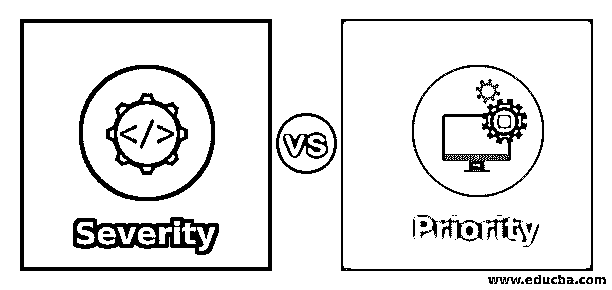

# 严重性与优先级

> 原文：<https://www.educba.com/severity-vs-priority/>

## 严重性和优先级之间的差异

在学习软件工程的概念时，我们都遇到过“严重性”和“优先级”这两个词，并且总是面临着它们之间的混淆。如果我们问任何一个非技术人员，他们之间的区别是没有的。对他来说，两者具有相同的意义。但是从技术上来说，按照软件工程师的说法，上面两个是不同的词，有不同的意思，用在不同的上下文中。让我们逐一了解。

### 严重

在测试执行过程中，当测试人员发现缺陷并将其记录在任何缺陷记录工具中，如 JIRA、Testrail 等。为了提交给开发人员，测试人员需要根据缺陷的关键程度和复杂性来决定优先级和严重性，以便开发人员能够相应地处理。通俗地说，严重性被定义为“任何事情可能造成的影响程度”。因此，缺陷的严重程度表明了特定缺陷对软件/应用程序的影响程度。它意味着缺陷会在多大程度上影响应用程序。通常，严重程度是根据经济损失、声誉和生命损失来定义的，具体取决于具体应用。

<small>网页开发、编程语言、软件测试&其他</small>

根据缺陷对应用程序的影响，严重性分为不同的类别:

1.  **严重:**阻碍整个应用程序并阻止用户继续使用应用程序的缺陷，因为它被认为是严重的**。**考虑到应用程序的 UI，如果应用程序的登录屏幕挂起，不允许用户登录并继续。
2.  **重大:**如果一个应用程序的主要/重要特性没有像预期的那样工作，那么这个缺陷就被认为是重大的。应用程序中实现的任何重要特性都与它的预期行为完全不同，那么这个缺陷将被认为是重大的。例如，在进行在线购物时，用户无法使用添加到购物车功能将产品添加到购物车。
3.  **轻微/中度:**任何已实现的功能和工作方式与预期行为不同，但其影响是可容忍的，不会对应用程序造成太大损害，并且应用程序的整体功能不受影响。一个小的缺陷可以等待一段时间来解决，或者可以在应用程序的下一个版本中解决。例如，在“条款和条件”页面上，其中一个链接不起作用。
4.  **低:**任何不损害功能，但属于有效缺陷，需要纠正的缺陷。像拼写错误和字体轻微错位这样的修饰性错误就属于这一类。网页上的一些拼写错误是低严重性缺陷的一个例子。

### 优先

简单英语中的 Priority 用于比较两个事物，并强调其中一个事物的重要性。类似地，就缺陷而言，优先级是缺陷被修复的紧急程度。它指的是缺陷需要被修复的顺序，记住它的严重性和业务需求。

开发人员无法同时修复这么多缺陷，因此对他们将要修复的缺陷进行优先排序是很重要的。通常，高严重性缺陷具有高优先级，因为它们需要快速修复。缺陷的优先级分为:

1.  **高:**任何需要立即关注并需要尽快修复的缺陷(最多 24 小时)。严重影响最终客户和业务的缺陷属于这一类。当整个应用程序被阻塞时，测试人员不能继续进行进一步的[软件测试](https://www.educba.com/software-testing-principles/)是由于这些高优先级的问题。
2.  **中:**可以等待修复的缺陷，因为它们不影响应用程序的主要功能，也不妨碍业务和客户，属于这一类。
3.  **低:**为改善客户体验而对现有设计进行变更的缺陷被视为低优先级缺陷。这些缺陷需要较少的关注，因此当所有其他优先的缺陷都被修复后，它们才被考虑。

### 严重性和优先级之间的直接比较(信息图表)

以下是严重性与优先级之间的 6 大差异:

### 严重性和优先级之间的主要区别

以下是要点列表，描述了严重性与优先级之间的主要区别:

*   缺陷的严重性决定了对应用程序的影响，而优先级决定了缺陷需要修复的顺序。
*   严重性处理应用程序的技术方面，而优先级处理业务需求和缺陷对客户需求的影响。
*   任何缺陷的严重性都不会改变，因为它对应用程序的影响保持不变，而如果业务需求发生变化或者遇到任何更优先的缺陷，优先级会发生变化，这需要更多的关注。

### 通过示例了解严重性和优先级之间的差异

以下几点有助于理解严重性和优先级之间的区别:

#### 高优先级和高严重性

在应用程序中，如果登录屏幕出现问题，用户无法登录，那么该缺陷属于高优先级和高严重性，因为这需要首先解决，因为用户被阻止，无法进一步访问应用程序。

#### 高优先级和低严重性

如果在应用程序的主页或任何其他经常使用的网页上有一些拼写错误，这是一个高优先级和低严重性的例子，因为拼写错误不会妨碍应用程序的功能，但会对公司的声誉产生不良影响。

#### 低优先级和高严重性

在在线购物网站中，如果用户试图在购物车中添加超过 500 件商品，而“添加到购物车”按钮停止工作，则缺陷被视为高严重性，因为主要功能没有按预期工作，但优先级较低，因为用户在购物车中添加超过 500 件商品的情况非常罕见。

#### 低优先级和低严重性

如果在用户很少打开的页面段落中有一些拼写错误，它被认为是低优先级和低严重性的，因为它既不会对应用程序的功能造成影响，也不会对公司的声誉造成任何损失。

### 严重性与优先级对照表

下面是严重性和优先级之间的最高比较

| **Sr 号** | **严重性** | **优先级** |
| 1. | 严重性由应用程序的功能或标准决定。 | 优先级由业务价值驱动。 |
| 2. | 严重性定义了缺陷对应用程序的影响程度。 | 优先级定义了开发人员修复缺陷的顺序。 |
| 3. | 严重性由记录缺陷的 QA 工程师决定。 | 虽然测试人员可以决定优先级，但是最终的决定是由产品经理在考虑产品的整体情况下做出的。 |
| 4. | 严重性值是客观的，不太可能随时间而改变。 | 优先级值是主观的，可以随着时间的推移而改变，这取决于其他缺陷和项目需求。 |
| 5. | 严重性分为:

*   critical
*   great
*   Mild/moderate
*   minuent

 | 优先级分为:

*   tall
*   middle
*   low

 |
| 6. | 在高优先级缺陷被解决之后，低优先级的高严重性缺陷被考虑。 | 高优先级缺陷比高严重性缺陷先被修复，因为它们会妨碍业务。 |

### 结论

对于一个测试人员来说，了解严重性和优先级之间的区别，并正确地将它们分配给一个缺陷是非常重要的，因为在分配严重性时，即使是一个很小的错误也会导致应用程序和公司声誉的巨大损失。错误的优先级分配会导致解决需要优先注意的缺陷的延迟，因此会妨碍产品需求和财务损失。作为一名测试人员，在记录一个缺陷时，重要的是要深入并理解这个缺陷对最终用户的影响，然后为一个缺陷分配正确的严重性和优先级。

### 推荐文章

这是严重性和优先级之间区别的指南。在这里，我们还通过例子讨论了信息图的主要区别。您也可以看看以下文章，了解更多信息–

1.  [什么是 CLI？](https://www.educba.com/what-is-cli/)
2.  [Redux 是什么？](https://www.educba.com/what-is-redux/)
3.  [系统测试](https://www.educba.com/system-testing/)
4.  [安装 CorelDraw](https://www.educba.com/install-coreldraw/)

