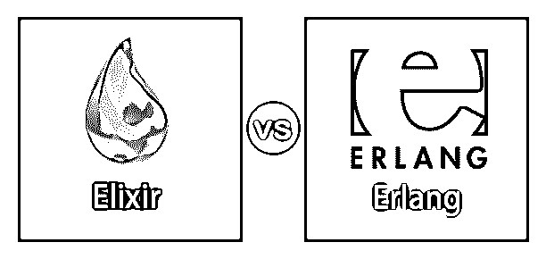
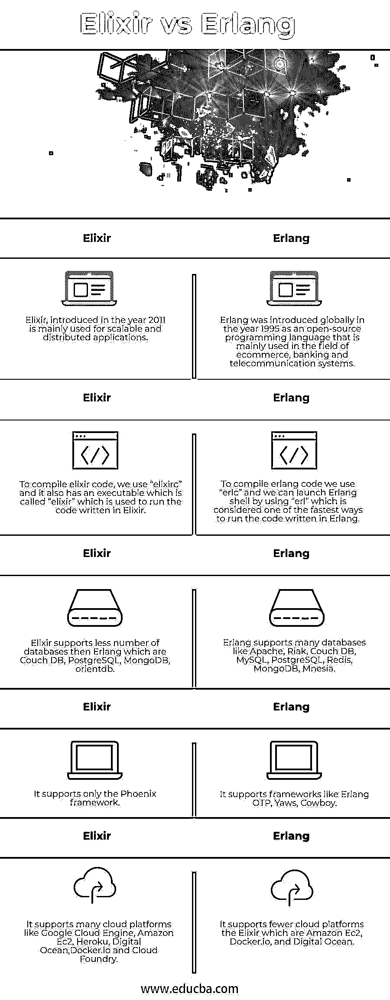

# 仙丹 vs 二郎

> 原文：<https://www.educba.com/elixir-vs-erlang/>




## 仙丹 vs Erlang 简介

在过去的几年中，Elixir 和 Erlang 编程语言已经在全球范围内流行起来。这两种编程语言都有各自的特点，并且在不同的领域使用。Erlang 于 1998 年在全球推出，而 Jose Valim 于 2011 年开发了一种长生不老药。Erlang 主要应用于电信、银行、电子商务等领域。Elixir 是一种函数式语言，旨在开发本质上可伸缩的应用程序。它们主要用于处理分布式应用程序。许多公司如 WhatsApp、谷歌、优步、Pinterest、Medium、Slack 都使用 Elixir 和 Erlang 编程语言。在本主题中，我们将了解 Elixir vs Erlang。

### 什么是仙丹？

Elixir 是一种函数式编程语言，主要用于维护分布式和可伸缩的应用程序。它建立在 Erlang 之上，有助于支持故障和低容错系统。与 Erlang 相比，它具有相同的性能，但在某些特性上有所变化。Elixir 编程语言的特点是它的容错特性，高度可伸缩性，提供了一套工具来帮助开发人员使用它自己的测试特性和管理项目来轻松快速地编写代码，与 Erlang 兼容，因此 Erlang 开发人员可以轻松地在 Elixir 环境中工作。两种编程语言的安装过程根据所使用的操作系统而有所不同。

<small>网页开发、编程语言、软件测试&其他</small>

### 什么是二郎？

Erlang 本质上是一种函数式语言，它也有一个运行时环境。它支持各种容错系统和应用程序。在使用 Erlang 开发应用程序之前，有一些应用程序应该具备的要求，比如应用程序应该是分布式的、可伸缩的、容错的、易于升级的和可重新配置的。在任何机器上安装 Erlang 之前，都应该考虑一些特定的要求，比如 RAM 大小应该是 2 GB，磁盘大小应该足以存储将要创建的应用程序。它可以在 Mac OS、Windows 和 Ubuntu/Debian 等各种操作系统上运行。不同的操作系统有不同的安装步骤和指南。

### Elixir 与 Erlang 的面对面比较(信息图)

以下是 Elixir 和 Erlang 的 5 大区别。




### Elixir 与 Erlang 的主要区别

让我们讨论一下 Elixir 和 Erlang 之间的一些主要区别。

*   某些运算符在 Erlang 中可用，但在 Elixir 中不可用。例如:逻辑 AND 和逻辑 or 操作符在 Erlang 中可用，但在 Elixir 中不可用。
*   在 Erlang 中，为了标记表达式的结束，我们使用。(点)和(逗号)，而在酏剂中，我们用；(分号)和换行符来标记行或表达式的结束。

**例如:**

在二郎，

```
a=3, b=2.
a*b,
```

在药剂中，

```
a=2; b=1
a*b
```

*   在 Erlang 中，我们不能多次给变量赋值。如果我们多次尝试赋值变量，那么它会在执行过程中抛出一个错误，而在 Elixir 中，我们可以多次赋值变量。
*   在 Erlang 中，为了调用任何函数，我们使用与 Elixir 不同的语法。在 Erlang 中，我们使用:(冒号)来调用任何使用相应模块的函数，而在 Elixir 中，我们使用。(点)来调用函数。
*   Elixir 和 Erlang 使用的数据类型几乎相同，有一定的区别。在 Erlang 中，原子是不以大写字母开头的标识符，以大写字母开头的是变量。而在酏剂中则完全相反，原子总是以(:)冒号开头。
*   在 Elixir 中，任何参数的默认值都是定义好的，但是在 Erlang 中，没有定义默认值。
*   Erlang 和 Elixir 都用于发送和接收语言等功能，但是在编写代码时，它们的语法会有很大不同。
*   就并发支持而言，开发人员比 Erlang 更喜欢使用 Elixir。
*   就应用程序的易用性、容错机制和分布式应用程序而言，Elixir 在当前环境下是首选。
*   Erlang 的主要目标是云计算产业、游戏产业、分布式和嵌入式系统。Elixir 面向云计算、企业、web 开发和嵌入式系统领域。
*   与 Erlang 编程语言相比，Elixir 的文档级别非常高。
*   在 Elixir 中，我们可以添加或定义特定文件的模块数量，而在 Erlang 中，我们可以定义多个函数，并根据需要将它们链接到各个模块。

字符串函数、正则表达式、循环语句、条件语句、递归函数、用户定义函数、不同的库、web 编程方法、并发支持，在 Erlang 和 Elixir 编程语言中都有涉及。

### Elixir 与 Erlang 对比表

我们来讨论一下 Elixir 和 Erlang 的 5 大区别。

| **仙丹** | **二郎** |
| 2011 年推出的 Elixir 主要用于可伸缩和分布式应用程序。 | Erlang 于 1995 年作为开源编程语言在全球推出，主要用于电子商务、银行和电信系统领域。 |
| 为了编译 elixir 代码，我们使用“elixirc ”,它还有一个名为“elixir”的可执行文件，用于运行用 Elixir 编写的代码。 | 要编译 erlang 代码，我们使用“erlc”，我们可以使用“erl”启动 Erlang shell，这被认为是运行用 Erlang 编写的代码的最快方式之一。 |
| Elixir 支持的数据库比 Erlang 少，分别是 Couch DB、PostgreSQL、MongoDB 和 orientdb。 | Erlang 支持许多数据库，如 Apache、Riak、Couch DB、MySQL、PostgreSQL、 [Redis](https://www.educba.com/redis-alternatives/) 、MongoDB、Mnesia。 |
| 它只支持 Phoenix 框架。 | 它支持 Erlang OTP、Yaws、Cowboy 等框架。 |
| 它支持许多云平台，如 Google Cloud Engine、Amazon Ec2、Heroku、Digital Ocean、Docker.io 和 Cloud Foundry。 | 它支持更少的云平台，即 Elixir，即亚马逊 Ec2、Docker.io 和数字海洋。 |

### 结论

Elixir 和 Erlang 是开发人员根据业务需求使用的两种不同的编程语言。Elixir 是在 Erlang 之上开发的，它也与 Erlang 兼容，一些特性和工作方式与 Erlang 编程语言相似。这两种编程语言都是可靠的，并且在并发支持下性能良好。在最近的场景中，开发人员更喜欢使用 Elixir 编程语言，因为它提供了高级的支持、具有简单语法的环境，并且可以以更好的方式扩展应用程序，从而提高生产率。

### 推荐文章

这是仙丹 vs Erlang 的指南。在这里，我们用信息图和比较表来讨论 Elixir 和 Erlang 的主要区别。您也可以看看以下文章，了解更多信息–

1.  [二郎 vs 哈斯克尔](https://www.educba.com/haskell-vs-erlang/)
2.  [围棋 vs 二郎](https://www.educba.com/go-vs-erlang/)
3.  [哈斯克尔 vs 二郎](https://www.educba.com/haskell-vs-erlang/)
4.  [微服务 vs 整体服务](https://www.educba.com/microservice-vs-monolithic/)


