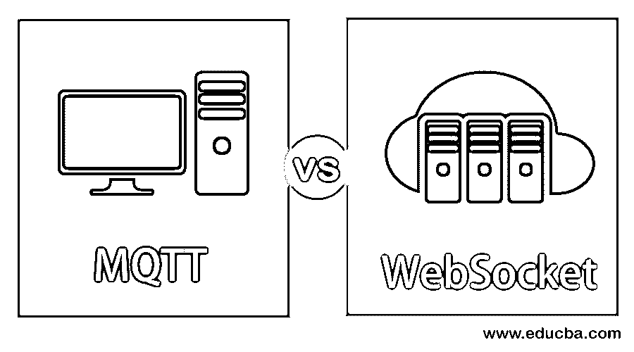

# MQTT vs WebSocket

> 原文：<https://www.educba.com/mqtt-vs-websocket/>

## MQTT 与 WebSocket 的区别

MQTT vs WebSocket 在这里，MQTT 是一个轻量级的发布/订阅网络协议，用于在 web 浏览器中直接在设备/机器之间传输消息。这个协议非常适合像 Alexa 这样的 IOT 应用程序，因为它们没有网络浏览器来发送或接收数据。它是传输信号的理想选择，主要用于低带宽、高延迟或网络不可靠的受限设备。它还能让你发送命令来控制动作，发布数据等等。

另一方面，WebSocket 是一种计算机通信协议，它在 web 浏览器和服务器之间创建了一个双向通道。它运行在单个 TCP 连接上，解决了 HTTP 限制，允许低延迟双向通信。通过 Web socket 使用 MQTT 有助于激活所有 MQTT 特性，这些特性可用于许多用例，例如:

<small>网页开发、编程语言、软件测试&其他</small>

*   显示实时信息
*   启用推送/提醒通知
*   借助保留的信息检查设备的当前状态。
*   非常容易地与移动和网络应用程序通信

### MQTT 与 WebSocket 的直接比较

以下是 MQTT 与 WebSocket 的 7 大对比:

### MQTT 与 WebSocket 的主要区别

下面给出了 MQTT 和 WebSocket 之间的主要区别:

*   MQTT 代表 MQ 遥测传输，它是小型设备上消息传递的关键协议。MQTT 和 Websockets 是两种不同的协议，位于不同的层，如 TCP、IP。因此，这些不应该进行比较。
*   但是为了理解这些协议的使用之间的区别，我们可以清楚地说，WebSockets 不是发布/订阅媒介，而是在支持发布/子架构的环境中使用。它们通过 HTTP 协议为双向传输邮件系统提供了替代解决方案。WebSockets 打开一个 TCP 连接，让数据流要么来自客户端，要么来自服务器，这是同一级别的 RESTful HTTP 的单向特性所不能提供的。
*   WebSocket 服务器可以向客户端/客户端组发送消息。它们始终是双向数据传输的开放通道，无需像 HTTP 那样请求打开和关闭。
*   虽然 MQTT 定义了不同的机器如何相互通信，但是它们可以与同一个通道通信。MQTT 是一个典型的发布/子系统。发布者机器可以在通道上发布带有已定义主题的任何消息，订阅这些主题的机器可以接收这些消息。
*   WebSockets 是专门为客户端和服务器之间的点对点连接而设计的。然而，MQTT 在基本消息发送机制的基础上增加了额外的抽象，这样多个感兴趣的机器可以订阅它们感兴趣的主题。因此，有时消息可以按主题路由，这样多台机器可以共享一个共同的兴趣，其中服务器可以选择按主题过滤消息，但可以接收所有消息。
*   WebSockets 最初是为浏览器和服务器之间的全双工通信通道开发的。它可以用于嵌入式设备的连接，或者你可以说是 IOT 设备，但它不能很好地保持信号。MQTT 是专门为 IOT 设备设计的。它的设计原则是最小化网络带宽并提供交付保证。
*   这些原理非常适合 IOT 设备，因为它们的带宽和电池电量非常低。

在嵌入式系统的环境中，MQTT 比 WebSocket 更适合:

1.  MQTT 在协议级别提供了发布/订阅。
2.  MQTT 提供服务质量。
3.  MQTT 带来的通信开销最小。
4.  MQTT 基本上用于小波段通信通道和有限数量的设备。

*   MQTT 和 web socket 的一个相似之处是两个协议都基于 TCP。为了更好地理解，MQTT 就像我们的快递服务，经常帮助传递我们的消息，而我们可以将 web 套接字想象成帮助传递我们的快递服务的道路，这反过来又帮助传递我们的消息。
*   MQTT 的一个关键优势是，它有很多支持所有物联网设备的特性，并且在客户端和服务器端有很多实际的实现。
*   基本上 MQTT 是这样工作的；最初，客户端-服务器将订阅一个通道，当该通道接收新数据时，它将直接向设备发送该数据。
*   MQTT 的另一个出色的特性是我们可以设置优先级，也称为 QoS(服务质量)，即 0(消息在没有任何确认的情况下传输)、1(消息传输需要确认)和 2(它利用握手过程来传递消息)。
*   另一方面，web 套接字本质上通常是标准化的；这是实现完全推或拉通信的最佳方式之一，我们无法通过使用 HTTP 协议来实现。由于有大量物联网设备可用，它们成为了一种开销。我们在使用这些 web 套接字时面临的另一个缺点是设置我们自己的协议。

### MQTT 与 WebSocket 比较表

我们来讨论一下 MQTT 和 WebSocket 的顶级对比:

| **MQTT** | **Websockets** |
| MQTT 是典型的 pub/子系统，主要用于小型设备。 | 主要在支持发布/子架构的环境中工作。 |
| 我们有设置优先级的工具。 | 没有可用于设置优先级的功能。 |
| 主要用于客户端和服务器应用程序。 | 用于完整的 web 客户端应用程序，因为它们是标准化的，并且实现了完全的推/拉通信。 |
| 它在通信期间产生最小的开销。 | 当我们在通信过程中有很多 IOT 设备时，会有很多开销。 |
| 专为 IOT 设备设计，旨在减少带宽并提供交付保证。 | 主要为全双工/双向通信通道开发。 |
| MQTT 和 Websockets 类似于 TCP 和 IP 协议；基本上，它们是一层在另一层之上。 | 它们是底层协议。 |
| 多方能够订阅和发布消息。 | 主要设计用于点对点通信。 |

### 结论

我希望这篇文章能够帮助我们理解 MQTT 和 Websockets 的基础知识以及它们之间的主要区别。我们还需要考虑我们在处理什么样的设备，并以此为基础；我们可能不得不选择 MQTT 这样的选项，而不是使用两者的 web socket。

### 推荐文章

这是 MQTT vs WebSocket 的指南。在这里，我们讨论 MQTT 和 WebSocket 之间的区别，以及主要区别、信息图和比较表。您也可以浏览我们的其他相关文章，了解更多信息——

1.  [WebSockets vs WebRTC](https://www.educba.com/websockets-vs-webrtc/)
2.  [WebSocket vs REST](https://www.educba.com/websocket-vs-rest/)
3.  [移动应用与网络应用](https://www.educba.com/mobile-apps-vs-web-apps/)
4.  [肥皂 vs 休息](https://www.educba.com/soap-vs-rest/)

