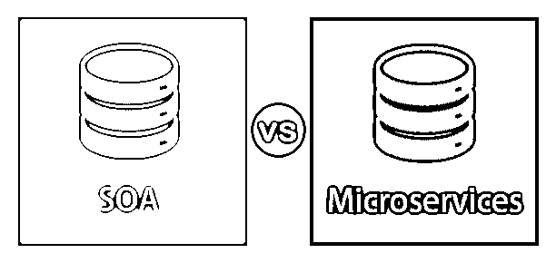

# SOA 与微服务

> 原文：<https://www.educba.com/soa-vs-microservices/>

## SOA 与微服务的区别

在本文中，我们将看到 SOA 与微服务的概要。两者都是分布式应用程序开发体系结构，与单一应用程序体系结构相比有很多优点；这两种架构是构建企业应用程序或满足特定行业需求的主要且广泛使用的架构。单个整体应用程序被划分/分解成多个小型/小型服务；每项服务都是相互独立的，并且是独立的可管理组件；我们可以把它看作是 [SOA(面向服务架构)](https://www.educba.com/what-is-soa/)的扩展版本。SOA 是一种面向服务的架构，它是定义良好的业务服务的集合，每个服务都定义了其核心业务功能，其重点是业务功能的可重用性；这些服务集合通过使用公共集中管理服务或企业服务总线(例如 mule soft ESB)相互通信。

### SOA 与微服务的直接比较(信息图表)

以下是 SOA 与微服务之间的 12 大对比:

<small>Hadoop、数据科学、统计学&其他</small>

### SOA 与微服务的主要区别

让我们讨论一下 SOA 和微服务之间的一些关键区别:

*   SOA 是定义良好的面向业务的服务的集合，这些服务使用集中式托管服务或企业服务总线相互通信。在服务之间建立通信需要某种媒介，这种服务主要用于开发非常大的、可伸缩的企业项目。微服务架构是 SOA 的一种分布式形式，其中系统专注于将服务解耦为一个微小的可管理的服务，该服务可以通过使用简单的消息传输或 REST/SOAP 相互通信。
*   基于 SOA 的服务分为四个主要类别:功能服务——业务用户的目标；企业服务——团队之间共享的服务；应用程序服务—应用程序开发团队的目标，基础架构服务—基础架构团队的目标。鉴于[微服务架构](https://www.educba.com/what-is-microservices-architecture/)以分布式格式工作，它尽可能共享最少的服务。对开发应用程序所需的服务进行分类没有明确的标准。
*   在 [SOA 架构](https://www.educba.com/soa-architecture/)中，单个服务的工作范围可以从小服务到企业的整个应用子系统，甚至有时 SOA 服务将整个应用产品表示为服务，由其他基于 SOA 的服务使用企业服务总线来消费。而在微服务架构中，服务的目的是明确的，只做好一件事。每个服务组件都足够小，可以管理和开发以满足特定的服务器。
*   组件共享是企业的主要目的；这就是 SOA 出现的原因；它专注于尽可能地共享服务，并增强系统之间的服务共享或将整个系统表示为服务，而微服务架构最大限度地减少了与另一个服务的组件/服务共享，微服务基于有限上下文原则，根据这一原则，数据是具有最小依赖性的单个单元，这使得服务之间的通信非常快。在 SOA 中，服务依赖于其他服务，这使得服务之间的通信流动。因此，与基于微服务的架构相比，基于 SOA 的系统速度较慢。
*   SOA 通信基于消息中间件组件，这在微服务架构中是找不到的。这个中间件组件增加了各种服务通信功能，如路由、网关、消息增强、协议转换、具有负载平衡的代表性状态转移。鉴于微服务架构基于 API(应用程序编程接口)进行通信，该 API 层在生产者和消费者服务之间工作。
*   SOA 架构基于 MSMQ(微软消息队列)活动 MQ 和 RebbitMQ，有时通过使用 SOAP(简单对象访问协议)进行消息通信，而在微服务架构中，主要使用基于 REST (XML/JSON)的通信进行消息通信或访问远程服务。

### SOA 与微服务的对比表

下表总结了 SOA 与微服务之间的比较 **:**

| **SOA** | **微服务** |
| 它基于服务共享原则，尽可能地共享分布式服务。 | 每个服务都是一个单一的实体，只能做一件事，这是基于一个单一的数据单元；因此，它尽可能地减少共享。 |
| 它基于业务功能重用的概念。 | 它基于有界的上下文。 |
| 所有的服务都有一个通用的开发标准。 | 开发标准取决于人们的合作和需求。 |
| 它将整个子系统作为服务使用，并专注于耦合以重用服务。 | 它侧重于服务解耦和逻辑分离。 |
| 使用企业服务总线或消息队列进行通信。 | 使用 REST/SOAP API 层进行通信。 |
| 用于大型/可扩展的企业项目。 | 用于从小规模到大规模的项目。 |
| SOA 支持在多个子系统中使用的异构协议的传播。 | 它减少了集成子系统/服务的选择；它支持使用公共通信协议的服务集成。 |
| DevOps 和 CICD 在 SOA 中很流行，但是在基于 SOA 的架构中还没有被积极地使用。 | 它侧重于 DevOps，基于云、基于容器的 CICD 管道部署。 |
| 传统的关系型 SQL 数据库更多地用于持久层， | 现代关系/非关系数据库在持久层很流行。 |
| 支持多线程和多个并行 IO 操作。 | 相对而言，大多数应用程序都是单线程的(每个请求)，IO 操作较少。 |
| SOA 的一个原则是基于模型编程。 | 微服务的一个原理是基于基于组件的编程。 |
| 可以使用 MuleESB，MS BizTalk 作为中间件组件进行开发。 | 可以使用 NETTY 或者 Spring 云库来开发。 |

### 结论

没有任何特定的答案说架构比另一个更好，它取决于应用程序构建的企业需求，SOA 是最好的 fir，更适合于需要在基于不同协议和通信介质的大量服务之间集成或协调的大型和可伸缩的应用程序，SOA 对小型应用程序开发没有用处，因为不管需要开发 SOA 的应用程序的大小如何，都需要所有那些需要在服务之间建立通信的组件或中间件。另一方面，微服务是可管理的，并为开发基于 web/API 的应用程序提供了更好的控制。

### 推荐文章

这是 SOA 与微服务的对比指南。这里我们分别讨论信息图和比较表的主要区别。您也可以看看以下文章，了解更多信息–

1.  [SOA 诉案件](https://www.educba.com/soa-vs-cas/)
2.  [微服务与整体式| 8 大对比](https://www.educba.com/microservice-vs-monolithic/)
3.  [微服务与网络服务|主要差异](https://www.educba.com/microservices-vs-webservices/)
4.  [SOA 与微服务](https://www.educba.com/soa-vs-microservices/)

