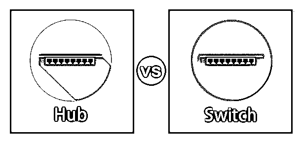

# 集线器与交换机

> 原文：<https://www.educba.com/hub-vs-switch/>

## 集线器与交换机的区别

集线器是指设备连接并聚集在某个物理位置，而交换机是指多个设备的网络连接集中在某个特定位置。集线器通常使用无源设备类型实现，而交换机通常使用有源设备类型实现。集线器的传输模式和速度分别为半 mbps 和 10mbps，而交换机的全模式或模式传输模式和速度高达 1Gbps。

**什么是枢纽？**

<small>网页开发、编程语言、软件测试&其他</small>

该集线器也称为中继器，它将放大的信号传输到除接收信号的端口之外的每个端口。集线器用于物理连接网络设备，并成功生成多个工作站层次结构。集线器不能智能地传递和处理第 2 层和第 3 层的信息。它在物理基础上而不是硬件和逻辑方法上做出决定。

**什么是开关？**

交换机只不过是提供更好桥接的网桥。从广义上讲，交换机是一种根据要求建立和终止连接的设备。它具有过滤、泛洪和帧传输等多种功能。该函数需要从原始 MAC 地址中获知的帧的目标地址。

### 集线器与交换机的直接比较(信息图表)

以下是集线器与交换机的 13 大对比 **:**

### 集线器与交换机的主要区别

让我们从以下几点来讨论集线器与交换机之间的一些关键区别:

**1。**集线器工作在 OSI 物理层，而交换机[工作在 OSI 数据链路层](https://www.educba.com/data-link-layer/)。
**港口间枢纽股 2。带宽**。另一方面，专用带宽由交换机提供给端口。
**3。**可以链接到计算机的端口数量要多得多，而节点上的端口数量要少得多。
**4。**单个冲突域可以是一个集线器，而不同的冲突域可以用于不同的端口。因此，集线器会导致交换机发生冲突。
**5。**在 hub 中使用的是半双工模式。然而，在全双工模式下，交换机传输数据。
⑥**⑥。**交换机过滤帧，只向专用设备提供重定向帧。另一方面，在集线器中不使用过滤概念，帧被传输到每个端口。
**7。**为了消除交换环路的问题，交换机使用生成树协议。然而，集线器无法避免交换环路。

### 集线器与交换机对照表

下表总结了集线器与交换机 **:** 之间的比较

| **Sr 号** | **集线器** | **开关** |
| **1。** | 它在物理层工作。集线器被归类为 OSI 模型第 1 层。 | 它工作在数据链路层。OSI 模型的第 2 层用于网络交换机。 |
| **2。** | 它们可以通过一个中枢连接起来，形成一个个人电脑网络。 | 允许多个系统连接，管理端口，管理 VLAN 保护配置。 |
| **3。** | 在集线器中，传输数据以位或电信号的形式存在。 | 在交换机中，传输数据的形式是数据包(L3 交换机)或帧(L2 交换机)。 |
| **4。** | 另一方面，集线器的端口是 4/12 集线器。 | 该交换机有多个端口桥 24/48。 |
| **5。** | 帧泛洪总是可以通过集线器、单播、广播或多播来完成。 | 第一，必要时单播和组播。 |
| **6。** | 集线器的设备类型是被动设备。 | 网络设备和主动设备是一种交换机。 |
| **7。** | 网络网关无法识别或保存 MAC 地址。 | 开关使用通常由 ASIC 访问的 CAM 表，可由内容存储器访问。 |
| **8。** | 一个集线器的传输模式是半。 | 开关的传输模式是半/全。 |
| **9。** | 连接其它网络设备以允许它们交换信息的电子设备。 | 网络交换机是计算机网络上用于将许多设备连接在一起的计算机网络设备。交换机被认为比集线器更先进，因为交换机向它需要或请求的设备发送消息。 |
| 10。 | 集线器的速度是 10 Mbps。 | 交换机的速度是 10 Mbps 到 1Gbps。 |
| **11。** | 集线器的传输使用 MAC 地址。 | 交换机使用 MAC 地址进行传输。 |
| **12。** | 在集线器中，不需要互联网连接。 | 没有必要连接互联网。 |
| 13。 | 集线器不是智能类别设备。 | 开关是一种智能分类设备。 |

### 结论

集线器和交换机是网络设备，它们提供了连接多台设备进行通信的机制。然而，集线器是物理的，而交换机操作数据连接层。交换机克服了集线器的限制，提供帧、硬件地址和环路避免智能传输。

### 推荐文章

这是集线器与交换机之间最大区别的指南。在这里，我们还将通过信息图和比较表来讨论集线器与交换机的主要区别。您也可以看看以下文章，了解更多信息–

1.  [交换机 vs 路由器](https://www.educba.com/switch-vs-router/)
2.  [桥 vs 开关](https://www.educba.com/bridge-vs-switch/)
3.  [交换机 vs 路由器 vs 集线器](https://www.educba.com/switch-vs-router-vs-hub/)
4.  [网关 vs 路由器](https://www.educba.com/gateway-vs-router/)

