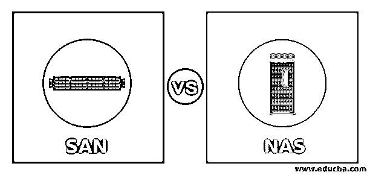

# SAN 与 NAS

> 原文：<https://www.educba.com/san-vs-nas/>

## SAN 与 NAS 的区别

在本帖中，我们将看到 SAN 与 NAS 之间的主要区别。作为公司资产的信息或数据是所有计算过程所依赖的基础资源。有不同的企业和客户的产品用来存储这些数据。数据可以存储在不同类型的存储设备中:

*   **磁存储设备:**硬盘驱动器和磁带。
*   **光存储设备:**蓝光、光盘、DVD、CD。
*   **基于闪存的存储设备:**固态硬盘、存储卡、u 盘。

存储设备组装在存储系统中，提供高容量、可扩展性、性能和安全性。网络是用于硬盘和其他设备(如企业和中央存储库)中的本地存储的客户端(笔记本电脑、台式机)的集合，通过通信通道相互连接。由于这些信道或网络，用户/企业服务提供商可以在网络中有效地共享资源、服务和信息。

<small>网页开发、编程语言、软件测试&其他</small>

### 什么是 SAN 和 NAS？

对 SAN 和 NAS 的详细解释如下:

#### 存储区域网

SAN 是一种特殊的高速网络，它存储并提供对大量数据的访问。它是数据块级存储，因此本质上是原始存储，这意味着我们不能直接装载 LUN(包含 iSCSI 命令的逻辑单元号，它也可以表示一个磁盘，不像 RAID，它是多个磁盘的组合)并读取其中的内容。因此，LUN 无法与 LUN 连接，LUN 在 SAN 上的配置方式与在 NAS 中的配置方式相同，即//您的 SAN/文件夹的名称 1，因为它使用的是数据块级存储解决方案。因此，这种共享内存的基本存储设备群集，用户不会意识到他们正在使用哪个特定的存储设备。

#### 美国国家科学院（National Academy of Sciences）

NAS 中有一个中央存储库，我们可以使用 LAN 访问不同客户端和企业产品的数据，即[局域网](https://www.educba.com/types-of-lan/)上的用户可以通过中央存储库访问数据。所以数据传输只有一条线，随时可能出现故障，任何组织都可能失去业务。

*   例如。小型 NAS 的: Qnap(个人云使用的媒体服务器)Synology(个人云使用的家庭备份)。
*   例如。大规模: EMC ISIlon 或 NetApp，其中有巨大的机架来计算不同大小的磁盘。

NAS 的好处是可以通过 IP 地址或 DNS 名称直接访问它。因此，我们可以像配置我的 NAS 01/ Folder 1 一样配置 DNS 名称，它可以在我们的任何平台(如 windows、Linux、Mac 等)的计算机中映射。]

### SAN 与 NAS 之间的直接比较(信息图表)

以下是 SAN 和 NAS 之间的 10 大区别:

### SAN 与 NAS 的主要区别

让我们看一下 SAN 与 NAS 之间的主要区别，如下所示:

*   NAS 是一个中央存储库，我们可以从这里访问所有文件；另一方面，存储设备组装在提供高容量、可扩展性、性能和安全性的存储系统中。
*   NAS 中只有一条数据传输线路，故障几率很高；另一方面，在 SAN 的情况下，失败的机会非常低，因为它是存储设备的集群。
*   NAS [使用 TCP 协议](https://www.educba.com/what-is-tcp-protocol/)；另一方面，SAN 使用光纤通道。
*   NAS 没有使用 iSCSI 命令来传输数据，而 SAN 使用 iSCSI 命令来访问存储设备，以块的形式传输数据。
*   NAS 是文件级存储；另一方面，SAN 是块级存储。
*   ]在 NAS 中，数据传输失败的几率很高，而在 SAN 中，数据传输失败的几率很低。
*   在 NAS 中，我们可以装载 LUN 来读取内容，但在 SAN 中，我们不能装载 LUN 来读取内容。
*   NAS 内存大小从 500 GB 到 10 TB 不等，但 SAN 内存大小可以增加到任何数量，如 100 TB。

### SAN 与 NAS 的比较表

下表总结了 SAN 与 NAS 之间的比较:

| **三** | **NAS** |
| SAN 代表存储区域网络。本质上，它是一个我们仅为存储而配置的网络。 | NAS 代表网络连接存储。 |
| 它连接到网络光纤通道。 | 它通过以太网或网络电缆连接到网络。 |
| 它通过光纤通道或 iSCSI 命令经由带有光纤通道连接器的 HBA 卡进行通信，所有 SAN 流量都通过光纤通道连接器传递。 | 它通过 TCP/IP 网络进行通信，所有 NAS 流量都通过该网络。 |
| 在 SAN 中，我们不能为了读取内容而装载 LUN。 | 在 NAS 中，我们可以装载 LUN，以便读取内容。 |
| SAN 内存大小可以增加到任何数量，例如 100 TB。 | NAS 内存大小从 500 GB 到 10 TB 不等。 |
| 它基于块级别。 | 它基于文件级。 |
| 在 SAN 中，没有中央存储库的概念，所有的存储设备共享它们的内存。 | NAS 中有一个中央存储库，我们可以在其中使用 LAN 访问不同客户端和企业产品的数据。 |
| 在所有存储设备和用户访问数据的源之间有一个网络。 | 数据传输只有一条线，随时可能出故障。 |
| 它是一个负责存储或传输分组(即块形式)数据的地方。 | 它是一个管理所有文件的地方，这些文件位于这些共享或文件夹中，可以通过//Ip 地址或 NAS 的 DNS 或主机名进行访问。 |
| 在 SAN 中，存储产品共享它们的内存空间，因此用户不会知道不健康的存储设备。 | 在 NAS 中，用户将了解不正常的存储设备。 |

### 结论

为了保持或确保任何企业都能交付预期的结果，他们必须能够访问准确的信息，并且没有任何低延迟。管理和保护这些业务信息对于实现预期的结果和业务增长也很重要。

### 推荐文章

这是 SAN 与 NAS 的对比指南。在这里，我们将通过信息图和比较表详细讨论 SAN 与 NAS 的主要区别。您也可以浏览我们推荐的其他文章，了解更多信息——

1.  [WebLogic vs WebSphere](https://www.educba.com/weblogic-and-websphere/)
2.  [主键 vs 外键](https://www.educba.com/primary-key-vs-foreign-key/)
3.  [围棋 vs 红宝石](https://www.educba.com/go-vs-ruby/)
4.  [iSCSI vs NFS](https://www.educba.com/iscsi-vs-nfs/)

