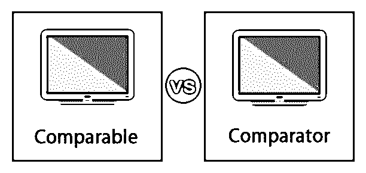

# 可比与比较

> 原文：<https://www.educba.com/comparable-vs-comparator/>

## 可比和比较方之间的差异

在下面的文章中，我们将讨论可比较的和比较器的区别。我们首先需要了解它们是什么，为什么使用它们？比较两个值像 2 个整数，2 个浮点值在 [Java 编程语言中使用简单的](https://www.educba.com/java-programming-language-features/)算术运算符是很容易的，但是我们如何比较像两个学生，两个雇员等 2 个对象的值呢？在 Java 中比较集合的对象有点困难，可以通过简单的算术和比较操作符来完成。对于 Java 中集合对象的比较，使用 Comparable 和 Comparator 接口。Comparable 和 Comparator 是两个不同 Java 包中的两个接口，用于对对象集合进行排序。通过在类中实现这些接口，我们可以使用它们的各种方法。

### 有什么可比性？

可比接口有一个方法 compareTo()，用于比较对象的值和方法中提供的值。可比接口定义了类对象的自然或默认顺序。

<small>网页开发、编程语言、软件测试&其他</small>

在类中定义 compareTo()方法时，我们需要确保返回值可以是:

*   **负值:**如果要比较的对象小于提供的对象值，则返回负值。
*   **正数:**如果要比较的对象大于提供的对象值，则返回正数。
*   **Zero:** 如果比较的对象等于提供的对象值，则返回零。

### 什么是比较器？

比较器接口用于我们不想使用自然排序，而希望根据特定需求对元素进行排序的场景。由于我们不能对 Comparable 接口的 compareTo()方法进行任何更改，Comparator 接口提供了一个 compare()方法，用于对集合的对象进行排序。

它在方法中采用两个参数，返回值可以是:

*   **负值:**如果第一个参数的值小于第二个参数的值，则返回负值。
*   **正数:**如果第一个参数的值大于第二个参数的值，则返回一个正值。
*   **Zero:** 如果第一个参数的值等于第二个参数的值，则返回零值。

### 可比公司和比较公司之间的直接比较(信息图表)

以下是可比产品与比较产品之间的 6 大差异:

### 可比公司和比较公司的主要区别

可比接口和比较器接口之间的一些主要差异如下:

1.  Comparator 接口提供了多种对集合对象进行排序的方法，而 Comparable 接口只提供了一种对对象进行排序的方法。
2.  如果 comparable 接口需要使用它的方法，它需要由类来实现，而对于 Comparator，在原始类中不需要做任何事情。
3.  基本上，Comparable 用于自然排序的对象；例如，在 Employee 类中，雇员需要根据他们的 Employee_id 进行排序，而在 Comparator 接口中，排序需要通过一个单独的类来完成。
4.  在 Comparable 接口中，只有一个对象作为参数传递，而在 Comparator 接口中传递了两个参数，这意味着 Comparable 接口将此引用与方法中指定的对象的值进行比较，而在 Comparator 中，比较是通过方法的一个参数中提供的两个不同的对象来完成的。
5.  默认情况下提供 Comparable，因为它存在于 java.lang 包中，而 Comparator 作为一个实用程序提供，存在于 java 中。util 包。
6.  如果类正在实现 Comparable 接口，则不需要使用 Arrays.sort()、Collections.sort()方法，因为它使用 compareTo()方法自动对 Array 和 List 的对象进行排序，而在 Comparator 接口的情况下则不是这样。
7.  使用比较器允许我们不在原始类中添加额外的代码，而使用 Comparable，我们必须添加代码。
8.  comparable 接口只允许我们使用一个排序序列，这意味着我们可以根据单个元素对集合进行排序，比如在 Employee 表中，可以根据姓名、员工 id、加入日期等进行排序。而 Comparator 接口提供了多种排序序列，这意味着我们可以根据姓名、员工 id、加入日期等对集合进行排序。
9.  如果用户没有访问原始代码的权限，只需要编写排序函数，Comparable 就不能用于那些场景，Comparator 是这类情况的唯一选择。

### 可比与比较器对照表

让我们来讨论一下可比性与比较性之间的主要比较:

| **可比** | **比较器** |
| 为了对集合中的对象进行排序，Comparable 为程序员提供了一个 compareTo()方法。 | 为了对集合中的对象进行排序，比较器向程序员提供了 compare()方法。 |
| 使用 Comparable，我们可以根据单个元素对集合中的元素进行排序。 | 使用 Comparator，我们可以一次根据集合中的多个元素进行排序。 |
| java.lang 包中有一个类似的接口 | java 中存在比较器接口。util 包 |
| 比较器界面中的排序基于自然顺序，例如，学生班级中的学生人数。 | 可比较的接口中的排序是通过一个单独的类来完成的。 |
| 使用 Comparable 时，使用它的原始类会受到影响，即修改是在实际类上完成的。 | 使用比较器，原始类不会受到影响，也就是说，不会对实际的类进行修改。 |
| 使用比较器对列表进行排序的语法是 Collections.sort(List) | 使用比较器对列表进行排序的语法是 Collections.sort(List，Comparator) |

### 结论

集合是 Java 语言编程中最重要和最常用的部分之一。因此，深刻理解它的每一个概念是非常重要的，无论是排序、搜索、在控制台上打印等。上面的描述清楚地解释了什么是 Comparable 和 Comparator 接口，为什么使用它以及它们之间的主要区别。因为两者都是在特定的场景中使用的，所以在程序中使用它们之前，程序员必须彻底了解情况。

### 推荐文章

这是一个可比与比较的指南。这里我们讨论信息图和比较表的主要区别。您也可以浏览我们推荐的其他文章，了解更多信息——

1.  [谷歌云 vs AWS](https://www.educba.com/google-cloud-vs-aws/)
2.  [可比](https://www.educba.com/comparable-in-java-example/) [用 Java 举例](https://www.educba.com/comparable-in-java-example/)
3.  github vs SVN
4.  [Z 分数 vs T 分数](https://www.educba.com/z-score-vs-t-score/)

