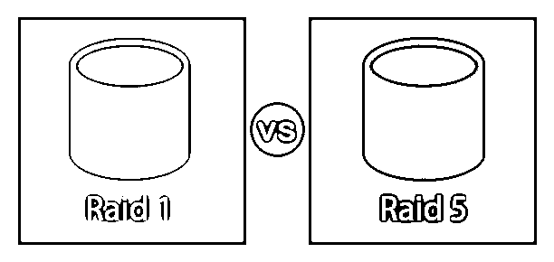

# Raid 1 与 Raid 5

> 原文：<https://www.educba.com/raid-1-vs-raid-5/>

## Raid 1 与 Raid 5 的区别

RAID 代表独立磁盘冗余阵列。它将相同的数据存储在不同磁盘的不同位置，以防止驱动器出现故障。“突袭”一词是由大卫·帕特森、加斯·a·吉布森和兰迪·卡茨在 1987 年创造的。计算机存储中有标准的 RAID 级别。各种 Raid 级别保护数据，是以前的升级。容错是在 Raid 级别 5 中完成的，数据分布在多个磁盘中，而 Raid 1 只是数据存储的镜像配置。Raid 5 需要一些时间来构建配置。在本主题中，我们将了解 Raid 1 和 Raid 5。

### Raid 1 与 Raid 5 的直接比较(信息图表)

以下是 Raid 1 与 Raid 5 之间的主要区别

<small>网页开发、编程语言、软件测试&其他</small>

### Raid 1 与 Raid 5 的主要区别

以下是 Raid 1 与 Raid 5 之间的主要区别

*   Raid 1 的主要功能是镜像数据，而 Raid 5 将数据平均分布在多个磁盘中。
*   有关数据和磁盘的信息存储在 Raid 5 中，因此即使硬盘出现故障，数据也可以恢复。Raid 1 中没有此功能。
*   Raid 1 可以容忍 1 个以上的磁盘故障，而 Raid 5 只允许 1 个磁盘的容错。
*   与 Raid 5 相比，Raid 1 的写入速度较慢。
*   Raid 1 中不使用奇偶校验磁盘，而 Raid 5 中很好地使用了奇偶校验信息。
*   在 Raid 1 中，数据丢失是无法管理的，也是不可接受的。Raid 5 具有良好的抗故障能力，安全性更好。
*   Raid 1 的性能很好，但在 Raid 5 中，由于磁盘冗余，性能很慢。
*   无法从 Raid 1 中的故障驱动器访问数据，而可以从 Raid 5 中的故障驱动器访问数据。
*   在 Raid 1 中，存储容量减少了一半，因为存储了两份数据。这在 Raid 5 中不会发生。
*   从故障中恢复数据时，应关闭 Raid 1。在 Raid 5 中，当 Raid 工作时，可以恢复数据。
*   Raid 1 中的恢复速度更快。由于奇偶校验和重建数据存储的计算，Raid 5 中的恢复速度很慢。
*   Raid 1 不做任何错误纠正和检测，而 Raid 5 有许多错误纠正和检测技术。
*   如果数据块丢失，它会在 Raid 1 中抛出一个错误。在 Raid 5 中，奇偶校验为丢失的数据块创建一个数据块。
*   Raid 1 是高端应用程序的选择，而 Raid 5 则是中等应用程序的选择。
*   当我们想要存储 300GB 的数据时，我们必须在 Raid 1 中获得 600 GB 的存储，而 Raid 5 只需要相同数量的存储空间。
*   每个读/写事务都需要写入 Raid 5 中的奇偶校验磁盘。在 Raid 1 中，由于没有可用的奇偶校验磁盘，事务处理速度比 Raid 5 快。

### 对比表

我们来讨论一下 Raid 1 与 Raid 5 之间的 28 大区别

| **Raid 1** | **Raid 5** |
| 数据没有被分割存储在磁盘中。 | 数据在所有磁盘中平均分配。 |
| Raid 1 具有镜像和冗余功能。 | Raid 5 不支持镜像和冗余。 |
| 读取性能更好。 | Raid 5 中的读取性能非常快。 |
| 文件和应用程序服务器中不使用 Raid 1。 | [Raid 5 用于](https://www.educba.com/what-is-raid-5/)驱动器数量较少的文件和应用服务器。 |
| 所需的最小物理磁盘数量为 2 个。 | 所需的最小物理磁盘数量为 3 个。 |
| 数据访问速度更快。 | 数据访问速度较慢。 |
| 恢复期间无法访问数据。 | 恢复期间可以访问数据。 |
| 没有针对存储进行优化。 | 存储得到优化，并且放置了高效的数据。 |
| 由于镜像间距，Raid 1 需要更多空间。 | Raid 5 不需要更多空间。 |
| Raid 1 中没有可用的奇偶校验磁盘。 | 一个磁盘充当奇偶校验磁盘。磁盘的奇偶校验不是固定的，在某些情况下，奇偶校验数据在磁盘之间共享。 |
| Raid 1 不需要时间来重建。 | Raid 5 需要时间来重建。 |
| 操作系统不能安装在 Raid 1 中。 | 可以在 Raid 5 中安装操作系统。 |
| Raid 1 更多地基于硬件。 | Raid 5 更多的是基于软件的。基于硬件的也可以。 |
| 可靠性高。 | 可靠性低。 |
| Raid 1 有停机时间。 | Raid 5 的停机时间为零。 |
| 不如 Raid 5 划算。 | 经济高效的设置。 |
| 基于存储进行选择。 | 用于更多读取操作的情况。 |
| 该技术非常简单，因为只有一个驱动器，没有奇偶校验。 | 由于驱动器和奇偶校验的存在，该技术非常复杂。 |
| 故障驱动器的热交换并不总是允许的。硬件控制器可用于热插拔。 | 热插拔总是允许的，奇偶校验也是如此。 |
| Raid 1 主要用于会计系统。 | 会计系统不使用 Raid 5。 |
| 当只使用两个驱动器时，Raid 1 最适合。 | Raid 5 适用于有许多驱动器的系统。 |
| 更多数量的驱动器使系统变得复杂。 | Raid 5 中的最大驱动器数量是 16 个。 |
| 不使用高速缓存，Raid 1 本身就是一个硬件绑定的系统。 | Raid 5 中使用额外的高速缓存来控制硬件。 |
| 单个驱动器故障是不可容忍的。 | Raid 5 可以容忍单个驱动器故障。 |
| 在 Raid 1 中不容易重建数据。 | 存储控制器可以轻松地在新驱动器上重建数据。 |
| 只要更换了驱动器，驱动器故障就不会影响性能。 | 驱动器故障接受性能，应注意奇偶校验控制。 |
| 恢复数据的速度比 Raid 5 快。 | 由于控制器和驱动器中的数据负载，恢复数据可能需要一天或更长时间。 |
| Raid 1 的安全性不好。 | Raid 5 中的数据安全性更好，并且它提供了不错的性能。 |

大多数 Raid 级别提供数据保护和恢复，但不能防止用户丢失数据。还有软件错误和恶意软件攻击，Raid 无法保护数据。Raid 不能替代备份计划。我们可以说 Raid 是防止严重数据丢失的一个构造块。

### 推荐文章

这是 Raid 1 与 Raid 5 的对比指南。在这里，我们通过信息图和比较表来讨论 Raid 1 与 Raid 5 的主要区别。您也可以看看以下文章，了解更多信息–

1.  [Debian vs Arch](https://www.educba.com/debian-vs-arch/)
2.  [SAS vs RapidMiner](https://www.educba.com/sas-vs-rapidminer/)
3.  [Raid 5 与 Raid 6 的对比](https://www.educba.com/raid-5-vs-raid-6/)
4.  [RAID 0 与 RAID 1 的对比](https://www.educba.com/raid-0-vs-raid-1/)

